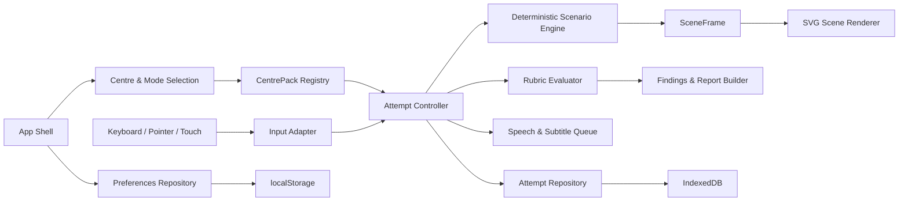
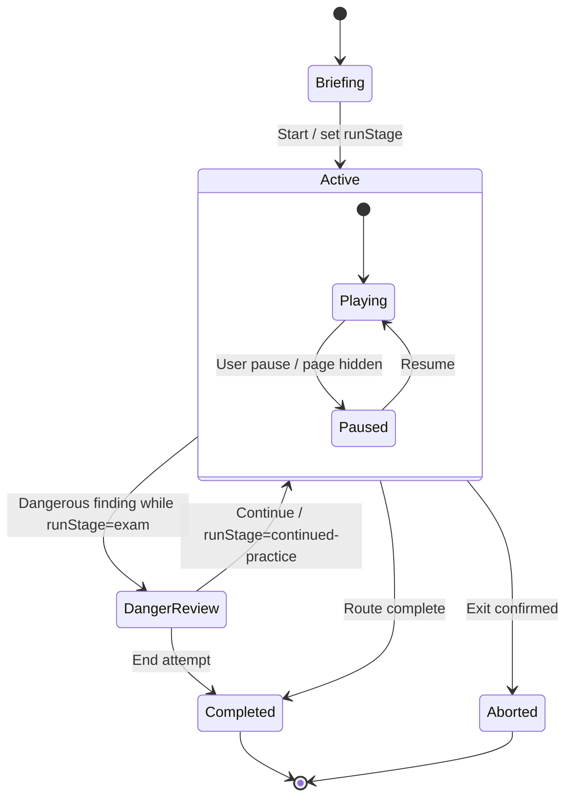

# Design: Ontario G Test 互动驾驶备考游戏 MVP

**日期**: 2026-08-12
**Owner**: nieyuanyuan
**状态**: Locked
**源项目 / 分支**: `nieyy/ontario-g-test / main @ 4a3923a`
**相关调研 / 代码讲解 / review**: [Ontario G Test 真实路况互动驾驶游戏调研 v1.1](../research/2026-08-12-ontario-g-test-interactive-driving-game-research-zh.md)

## 修订记录

| 版本 | 日期 | 作者 | 摘要 |
|---|---|---|---|
| v0.1 | 2026-08-12 | nieyuanyuan | 初版设计：锁定产品流程、模块边界、确定性场景引擎、内容契约、评分复盘、本地存储、分阶段实现与验收标准。 |
| v0.2 | 2026-08-12 | nieyuanyuan | 明确 Phase 1 的 Newmarket 道路事实核验交付物、证据分级和 `authored` 教学抽象边界。 |
| v0.3 | 2026-08-12 | nieyuanyuan | 明确 Phase 2 的 SVG 视觉验收对象、Mac/手机可判定标准，以及未通过时优先调整视觉编码而不扩大为实景或 3D。 |
| v0.4 | 2026-08-12 | nieyuanyuan | 明确 Phase 3 的六类场景教学验收、反馈结构，以及危险记录不可被后续表现抵消的继续练习流程。 |
| v0.5 | 2026-08-12 | nieyuanyuan | 明确 Phase 4 在公开 GitHub Pages 上的端到端 smoke test、手机与网络检查，以及通过后发布 `1.0.0` 的动作。 |
| v1.0 | 2026-08-12 | nieyuanyuan | 正式版收口：修正反馈与继续练习状态契约，拆分 Phase 3 教学完成和本地数据里程碑，明确逐阶段交付证据、CI/E2E 命令与 release candidate 发布顺序，关闭开放问题。 |

## 1. 摘要

- 这个设计解决什么问题: 把 Ontario G Test 的规则、考官指令和考点周边道路类型转化为可操作、可重放、可复盘的网页训练，而不是继续依赖容易遗漏上下文的长篇文字总结。
- 选择的方向: 在纯静态 React/Vite 应用中，以 Newmarket 为首个 `CentrePack`，使用 SVG 2.5D 第一视角场景、固定步长的确定性事件引擎、统一输入事件、规则评分器和本地事件记录实现考试、练习、复盘三种模式。
- 预期结果: 用户可先选择 Newmarket，完成一场 15–20 分钟的模拟考试，听到常见英文考官指令，通过鼠标、触摸或 Mac 键盘完成观察、信号、速度、车道和 gap 决策，并得到按事件时间线组织的前三项改进建议和弱项短练习。
- AI Agent 应该能根据本文直接实现什么: 按第 7 节四个阶段，在 `/Users/nieyuanyuan/Desktop/ccproj/nieyy/ontario-g-test` 中建立内容包、播放器、输入/计时/评分状态机、本地存储、报告和完整 Newmarket MVP，不需要临时决定产品边界或核心数据模型。
- 实现起点: `nieyy/ontario-g-test` 的 `main @ 4a3923a`；后续若实现起点发生变化，先核对本设计第 3 节和实际 diff，不重新解释已锁定的产品边界。

## 2. 背景和目标

### 当前状态

- 实现仓库已经使用 Vite 8、React 19、TypeScript 6、Vitest 和 Testing Library 初始化，并通过 GitHub Actions 发布到 `https://nieyy.github.io/ontario-g-test/`。
- 当前页面仅显示 Newmarket 首个考点占位卡片；`Start practice` 仍禁用。
- `src/domain/centres.ts` 已有最小 `CentreProfile`，尚无路线、场景、事件引擎、评分、复盘和持久化。
- 调研 v1.1 已锁定表现路线、用户范围、考点策略、隐私、措辞、部署和非官方路线免责声明。

### 痛点 / 动机

- 单纯文字总结会丢失“当时速度、车距、灯色、观察顺序和其他车辆反应”等决定答案的上下文。
- 把规则记成“高速必须 110”“黄灯一定停/一定冲”等绝对句，会在真实动态场景中产生错误判断。
- 个人考试经历只能提供高价值场景种子，不能代表所有考生或预测下一次路线。
- 实景或 3D 并非学习闭环的必要条件，还会引入费用、授权、性能和内容制作负担。

### 目标

1. 面向已通过 G2 的所有 Ontario G 考生，训练 G Test 语境下的观察、速度、空间、信号、车道和路权判断。
2. 首版只开放 Newmarket，但从第一天支持独立考点内容包，后续新增考点无需修改播放器和评分核心。
3. 用 5–8 分钟垂直切片验证完整闭环，再扩展到 15–20 分钟模拟考试。
4. 考试模式不提示答案；练习模式允许提示、暂停和重做；复盘模式给出可追溯时间线。
5. 任意 attempt 在相同内容版本、种子和动作事件下得到相同世界状态和评分结果。
6. 鼠标/触摸可完成全部操作，Mac 键盘提供方向化默认键位并支持改键。
7. 所有个人数据仅留在本地浏览器；静态站点不依赖后端、付费地图、第三方瓦片或分析服务。

### 非目标

- 不复刻 DriveTest 官方评分算法，不输出“官方分数”、真实通过概率或通过保证。
- 不宣称任何路线是官方、固定或下一次必考路线。
- 不训练方向盘手感、真实制动距离、碰撞物理或自由驾驶。
- 不使用 Street View、Google Maps 内容、实景录制、WebGL 3D、在线地图瓦片或远程 AI 判分。
- 不实现账号、云同步、排行榜、多人、评论、内容后台或遥测。
- 不在 MVP 中开放 Newmarket 之外的考点；`planned` 不能进入考试。
- 不从缺失的四份评分表推测个人扣分详情。
- 不在本设计中安排真实道路驾驶、驾驶教练活动或绕过 Newmarket 教学限制区规定。

### 约束

- 运行与部署必须兼容 GitHub Pages 项目子路径 `/ontario-g-test/`。
- 内容与运行时都不得含密钥；浏览器网络请求不得依赖收费服务。
- 场景道路结构必须保存证据来源、核验日期和证据等级；视觉外观可以教学化抽象。
- 考官英文指令必须来自受控词条，中文只作可关闭的辅助字幕。
- Canvas 或动画不可用时必须保留静态 SVG/HTML 和文本等价信息。
- 用户切换标签页或页面不可见时自动暂停模拟时钟，不允许后台补算导致错过事件。

### 成功标准

- 一名首次访问者可在 60 秒内理解产品非官方定位、选择 Newmarket 并开始训练。
- 桌面 Chrome/Safari/Firefox 和移动触控均可完成 15–20 分钟流程；核心动作不依赖 hover、右键或数字小键盘。
- 红灯右转、黄灯、多车道左转、高速并入、跟慢车和高速驶离六类场景均至少有 3 个参数变体。
- 严重单次行为和普通错误累计是两条独立结果路径；报告首先显示前三个可操作改进点，再显示完整时间线。
- 相同 fixture 重放 100 次，世界状态摘要和 `Finding[]` 深度相等。
- 刷新页面后可读取已完成 attempt；清除本地数据后无远端副本。
- `npm run check`、内容校验、Playwright 核心流程和 GitHub Pages 部署全部通过。

## 3. 当前系统对齐

| 区域 / 模块 | 当前行为 | 对设计的影响 |
|---|---|---|
| `src/App.tsx` | 单页 Newmarket 占位页面 | 保留品牌和免责声明，但拆成应用壳、考点选择和模式入口；不在一个组件中堆叠游戏逻辑 |
| `src/domain/centres.ts` | 一个 TypeScript 常量，字段较少 | 迁移为版本化 `CentrePack` 入口；`CentreProfile` 增加来源、支持状态、内容版本和路线引用 |
| 测试 | 两个首页组件测试 | 继续使用 Vitest；新增纯领域单测、内容契约测试、重放测试，并引入 Playwright E2E |
| 本地数据 | 无 | 偏好/键位使用 `localStorage`；attempt、事件和复盘使用 IndexedDB；失败时退化为内存会话和 JSON 下载 |
| 路由 | 无路由依赖 | MVP 使用应用状态和 hash 深链，不引入 React Router；只支持 `#/centre/newmarket`、`#/attempt/:id/report` 等有限入口 |
| GitHub Pages | Actions 构建 `dist`，Vite base 已正确设置 | 保持纯静态部署；内容包随构建产物发布，不在运行时抓取 DriveTest 网站 |
| 可观测性 | 只有浏览器控制台 | 增加本地 debug 模式、attempt JSON 导出和内容校验，不增加远程日志 |

### 调研锁定决策追溯

| 调研 v1.1 决策 | 本设计落点 |
|---|---|
| 面向所有已通过 G2 的 Ontario G 考生 | 第 2 节目标/非目标；公共规则与个人历史分离 |
| MVP 只开放 Newmarket，支持未来考点 | `CentrePackManifest`、`supportStatus`、registry 和 Phase 1 |
| SVG/Canvas 2.5D，不用实景/付费地图/3D | 方案 A、`SceneFrame`/SVG renderer 和网络验收 |
| 考试、练习、复盘三种模式 | 顶层页面流、`AttemptMode`、关键流程和 Phase 2/3 |
| 评分不是官方评分 | `Finding`/报告输出约束、非目标和文案测试 |
| 鼠标/触摸完整操作，Mac 键盘可改键 | 输入映射、InputAdapter、preferences 和 E2E |
| 常见英文考官措辞，中文辅助 | Prompt/RuleSource 契约、speech 降级和快照测试 |
| 本地保存，不收集匿名数据 | IndexedDB/localStorage、无远程指标和网络 smoke |
| 独立仓库 + GitHub Pages 子路径 | 当前系统对齐、发布流程和 Pages 验收 |

## 4. 候选方案

| 方案 | 核心思路 | 优点 | 缺点 / 风险 | 判断 |
|---|---|---|---|---|
| A. React UI + 纯 TypeScript 确定性引擎 + SVG | 固定步长推进世界状态，React 管页面/HUD，SVG 根据只读场景帧渲染 | 可测试、可重放、易做低动态和无障碍；与当前栈一致 | 需要明确区分模拟状态和 React 状态；视觉不是实景 | **选择** |
| B. React 组件直接持有定时器和评分 | 每个场景组件自行移动车辆、监听输入并扣分 | 垂直切片看似快 | 时间、输入、画面和评分耦合；暂停、重放、参数化和跨场景复用困难 | 不选 |
| C. Canvas 游戏循环承载全部逻辑和界面 | 用单一 Canvas 每帧绘制并处理命中/评分 | 动画控制集中，适合大量对象 | 无障碍、文本、触控、测试和报告开发成本高；当前场景规模不需要 | 不选；Canvas 仅可作为将来局部优化 |
| D. XState/专业游戏引擎 | 用外部状态机或 Phaser 等管理流程 | 复杂状态可视化或物理能力强 | 增加依赖和学习成本，MVP 状态规模可由显式 reducer 覆盖 | 暂不选；状态复杂度显著增长时重新评估 |

## 5. 选择

**选择的方案**: 方案 A。使用 React 负责应用壳、语义控件、HUD 和报告；使用无 React 依赖的 TypeScript `AttemptEngine` 负责固定步长时钟、世界状态、事件归一化、场景推进和评分；使用 SVG 渲染 `SceneFrame`，CSS/HTML 提供控件和文本替代。

**为什么选它**:

- 调研目标是判断训练和证据化复盘，决定正确性的状态必须可以单测和重放，不能藏在动画组件内部。
- MVP 场景对象数量有限，SVG 足够表达车道、车辆、信号和距离，并能直接支持高对比、缩放和静态降级。
- 当前仓库已采用 React/TypeScript；无需更换工程底座或引入游戏引擎。
- 事件溯源只保存种子、内容版本和离散动作，既能复盘又避免逐帧快照快速撑满浏览器存储。

**为什么不选其他方案**:

- B: 难以证明暂停/恢复、不同帧率和重放会得到相同结论。
- C: 把文字、按钮和无障碍语义塞进 Canvas 与产品要求冲突。
- D: 当前明确的顶层状态和场景状态可由 discriminated union + reducer 表达，引入框架收益不足。

**后果 / 取舍**:

- 什么会变简单: 规则单测、参数化内容、跨考点复用、失败重放、静态降级和报告生成。
- 什么会变困难: 内容作者必须理解严格 schema；引擎与渲染器之间需要稳定的 `SceneFrame` 边界；动态效果不能随意读取 DOM 作为评分事实。
- 可能引出的后续决策: SVG 对象过多时是否把车辆层迁到 Canvas；attempt 数量增长后是否增加存储压缩；第二个考点上线前是否建立独立内容制作工具。

## 6. 详细设计

### 6.1 架构 / 流程



顶层页面流：

```text
[Home / 非官方声明]
  -> [CentreSelect: Newmarket available]
  -> [ModeSelect: Exam | Practice]
  -> [Briefing + 输入检查 + 开启语音]
  -> [AttemptPlayer]
       -> [Segment 依次推进]
       -> [危险事件: 结束 | 标记后继续]
  -> [AttemptReport: Top 3 + 时间线]
  -> [WeaknessPractice: 同规则不同参数]
```

目录建议：

```text
src/
  app/                    # AppShell、页面状态、hash 深链
  content/
    registry.ts           # CentrePack 注册表
    schema.ts             # JSON 类型守卫与语义校验
    prompts/              # 受控英文措辞和中文辅助字幕
    rules/                # 官方规则摘要、来源与 checkedAt
    centres/newmarket/    # centre、routes、scenarios、SVG 道路模板参数
  domain/
    attempt/              # AttemptEngine、状态、固定时钟、重放
    input/                # ActionEvent 和键盘/触控映射
    scoring/              # Rubric evaluator、Finding、优先级
    scene/                # WorldState、SceneFrame、模板接口
  features/
    centre-select/
    briefing/
    player/
    report/
    settings/
    history/
  rendering/svg/          # 道路、车辆、信号、镜面和标志
  services/
    speech/
    storage/
  test/fixtures/
scripts/
  validate-content.ts
e2e/
```

依赖方向必须是 `features/rendering/services -> domain -> content schema`；`domain` 不得 import React、DOM、SpeechSynthesis、IndexedDB 或 SVG 组件。

### 6.2 数据 / 状态模型

#### 内容包

```ts
type SupportStatus = 'available' | 'planned' | 'retired'
type RouteStatus = 'preview' | 'playable' | 'retired'
type EvidenceLevel =
  | 'official-rule'
  | 'municipal-boundary'
  | 'community-reported'
  | 'authored'

interface CentrePackManifest {
  schemaVersion: 1
  contentVersion: string       // 例如 "newmarket-2026.08.1"
  centre: CentreProfile
  routeIds: string[]
  scenarioIds: string[]
  rubricIds: string[]
}

interface CentreProfile {
  id: 'newmarket' | string
  name: string
  address: string
  officialRoadTests: string[]
  supportStatus: SupportStatus
  checkedAt: string            // YYYY-MM-DD
  sourceUrl: string
  roadFeatures: string[]
}

interface RouteDefinition {
  id: string
  centreId: string
  contentVersion: string
  status: RouteStatus
  title: string
  evidence: EvidenceRef[]
  estimatedDurationSeconds: number
  segmentIds: string[]
  disclaimer: string
}

interface SegmentDefinition {
  id: string
  roadTemplateId: string
  roadFacts: RoadFacts
  promptId?: string
  scenarioId: string
  completion: CompletionCondition
}

interface RoadFacts {
  roadNames: string[]
  topology: 'straight' | 'signalized-intersection' | 'multi-lane-turn' |
    'freeway-merge' | 'freeway-mainline' | 'freeway-exit'
  lanes?: { sameDirection: number; opposingDirection: number }
  speedLimitKph?: number
  signs: string[]
  evidenceRefs: string[]
}

type CompletionCondition =
  | { type: 'elapsed-ms'; value: number }
  | { type: 'distance-m'; value: number }
  | { type: 'world-event'; event: string }

interface ScenarioDefinition<P = Record<string, unknown>> {
  id: string
  kind: 'commercial-road' | 'signalized-intersection' |
    'multi-lane-turn' | 'freeway-merge' | 'freeway-cruise' | 'freeway-exit'
  parameters: P
  rubricIds: string[]
  variants: ScenarioVariant<P>[]
}

interface ScenarioVariant<P> {
  id: string
  weight: number
  parameters: P
}

interface EvidenceRef {
  id: string
  level: EvidenceLevel
  title: string
  url?: string
  checkedAt: string
  note: string
}

interface PromptDefinition {
  id: string
  intent: 'turn-left' | 'turn-right' | 'lane-change' |
    'freeway-enter' | 'freeway-exit' | 'continue' | 'pull-over'
  en: string
  zh?: string
  wordingBasis: string        // 来源或采用依据，不宣称官方逐字稿
}

interface RubricDefinition {
  id: string
  dimension: Finding['dimension']
  evaluator: RubricEvaluatorId
  parameters: Record<string, number | string | boolean>
  evidenceRefs: string[]
  feedback: {
    situationTemplate: string
    impactTemplate: string
    improvementTemplate: string
  }
}

type RubricEvaluatorId =
  | 'complete-stop-before-right-turn'
  | 'yellow-light-decision'
  | 'multi-lane-turn-continuity'
  | 'freeway-merge-safety'
  | 'freeway-following-decision'
  | 'freeway-exit-sequence'
```

内容规则：

- 所有跨文件 ID 唯一且可解析；`route.centreId` 必须与内容包一致。
- `available` 中心可以进入详情页；只有引用至少一条 `playable` 路线时才可开始 attempt。`preview` 只用于 Phase 1 briefing/内容预览，`planned/retired` 中心和 `retired` 路线永远不能开始 attempt。
- 证据引用包含 `level`、`url`、`checkedAt`、`note`；不能使用 `official` 描述社区路线。
- 参数范围在构建时验证，例如速度非负、gap 大于 0、灯色时序有序、路线时长处于允许范围。
- 运行时不访问 `sourceUrl`；来源只用于维护、免责声明和内容审查。
- JSON 不保存 JavaScript 表达式或可执行字符串。`evaluator` 只能引用代码中穷举的 `RubricEvaluatorId`（例如 `complete-stop-before-right-turn`、`freeway-merge-safety`）；未知 evaluator 使内容包校验失败。
- Prompt 的 `wordingBasis` 记录常见措辞的采用依据；`en` 是唯一语音正文，中文不得反向生成英文指令。

#### Attempt 与事件

```ts
type AttemptMode = 'exam' | 'practice'
type AttemptStatus =
  | 'briefing'
  | 'running'
  | 'paused'
  | 'danger-review'
  | 'completed'
  | 'aborted'

interface AttemptRecord {
  schemaVersion: 1
  id: string
  centreId: string
  routeId: string
  mode: AttemptMode
  contentVersion: string
  engineVersion: string
  seed: string
  startedAt: string
  completedAt?: string
  status: AttemptStatus
  firstDangerAtMs?: number
  continuedForPracticeAtMs?: number
  actions: ActionEvent[]
  findings: Finding[]
  summary?: AttemptSummary
}

interface AttemptSummary {
  result: 'completed' | 'dangerous-event' | 'aborted'
  topFindingIds: string[]
  repeatedRubricIds: string[]
  repeatedDimensions: Finding['dimension'][]
  findingCountByDimension: Partial<Record<Finding['dimension'], number>>
}

interface ActionEvent {
  sequence: number
  atMs: number                 // 模拟时钟，不是 Date.now()
  type: ActionType
  source: 'keyboard' | 'pointer' | 'touch' | 'system'
  payload: Record<string, string | number | boolean | null>
}
```

`ActionType` 至少包括：

- `control.accelerate` / `control.brake`: `pressed: boolean`，只记录边沿，不逐帧记录。
- `signal.set`: `direction: left | right | off`。
- `observe.mirror` / `observe.shoulder`: `direction: left | right`。
- `lane.request`: `direction: left | right`，同时表达安全时进入 gap 的意图。
- `attempt.pause` / `attempt.resume` / `attempt.continue-after-danger` / `attempt.end`。

`sequence` 在一个 attempt 内严格递增；同一 `atMs` 按 `sequence` 排序。输入适配器只负责归一化和防止按键自动重复，不直接改世界状态或评分。

#### 引擎、场景帧与评分

```ts
interface EngineState {
  attemptStatus: AttemptStatus
  runStage: 'exam' | 'practice' | 'continued-practice'
  simulationMs: number
  segmentIndex: number
  world: WorldState
  activePromptId?: string
  findings: Finding[]
}

interface SceneFrame {
  simulationMs: number
  road: RenderRoad
  ego: RenderVehicle
  traffic: RenderVehicle[]
  signals: RenderSignal[]
  mirrors: MirrorFrame
  hud: HudFrame
  textAlternative: string
}

interface Finding {
  id: string
  rubricId: string
  dimension: 'observation' | 'speed' | 'space' | 'signals' | 'lane-right-of-way'
  severity: 'minor' | 'serious' | 'dangerous'
  atMs: number
  segmentId: string
  situation: string
  action: string
  impact: string
  improvement: string
  evidenceRefs: string[]
}
```

- 模拟以 100 ms 固定步长推进；`requestAnimationFrame` 只插值画面，不改变评分事实。
- 随机参数只从 attempt 的 seed 派生，禁止在场景中直接调用 `Math.random()`。
- 暂停、页面隐藏和 `danger-review` 状态不推进 `simulationMs`。
- Rubric 只读取世界事实和时间窗口内事件，不读取 DOM、CSS 动画或真实墙钟。
- `impact` 必须区分已发生后果和风险：只有世界状态记录了其他车辆减速/避让时才能写“导致后车减速/避让”；否则写成“在该速度差下会增加冲突风险”，不得为了增强反馈而虚构后果。
- Exam 中首次出现 `dangerous` 时写入 `firstDangerAtMs` 并进入 `danger-review`；选择继续时同时写入 `continuedForPracticeAtMs`、将 `runStage` 改为 `continued-practice`，不清除危险事实。Practice 中的危险 finding 使用练习反馈/重做流程，不写成模拟考试失败。
- 报告不显示官方分数。首页结果只显示“完成”“因危险事件结束”或“标记危险后继续完成”，再展示五维问题数量和前三项优先改进。
- Top 3 排序分：`minor=1`、`serious=3`、`dangerous=8`；同一 rubric 重复出现每次额外 `+1`，同分按首次发生时间排序。该分值只用于报告排序，不对用户显示。
- 普通错误累计不产生“官方未通过”结论。报告透明标记重复模式：同一 rubric 出现至少 2 次，或同一 dimension 出现至少 3 次时列为“反复出现，优先练习”；这条路径与危险事件标记彼此独立。
- 弱项列表从最近 10 个已完成 attempt 的已保存 findings 计算，不修改公共内容或规则。

#### 存储和版本

- `localStorage['ontario-g-test.preferences.v1']`: 字幕、语音、低动态、高对比、键位和上次选择的考点/模式。
- IndexedDB `ontario-g-test`, version 1:
  - `attempts`, key `id`，索引 `completedAt`、`centreId`、`routeId`。
  - `checkpoints`, key `attemptId`，仅保存运行中恢复点；完成/放弃后删除。
- attempt 保存不可变的 `contentVersion`、`engineVersion`、seed、actions 和 findings。内容升级后旧报告直接读取已保存 findings；只有版本仍可用时才允许完整重放。
- checkpoint 在每个 segment 边界、页面隐藏前和每 10 秒模拟时间最多写入一次；写入必须 debounce。恢复时优先校验版本并重放 checkpoint 后的动作，不能用不兼容内容强行恢复。
- MVP 无需从旧系统迁移数据；未来 schema 升级必须提供纯函数 migration 和 fixture。
- 本地存储不可用时显示非阻塞提示，当前 attempt 保留在内存；结束时允许下载去身份化 JSON，不能声称已保存历史。

### 6.3 API / CLI / 接口变更

#### 对外接口

- URL:
  - `#/`：首页/考点选择。
  - `#/centre/newmarket`：Newmarket 模式选择。
  - `#/attempt/:id/report`：仅打开本机存在的报告；不存在时回首页并提示。
- 浏览器输入: 鼠标、触摸和键盘全部调用统一 `dispatchAction(draft)`。
- 本地导出: `AttemptRecord` JSON，文件名 `ontario-g-test-attempt-<id>.json`；不包含姓名、精确设备信息或私有评分表。

#### 内部接口

```ts
interface AttemptEngine {
  getState(): Readonly<EngineState>
  dispatch(event: ActionEvent): void
  advance(deltaMs: number): void
  getFrame(): Readonly<SceneFrame>
  finish(reason: 'route-complete' | 'user-ended'): AttemptRecord
}

interface ContentRegistry {
  listCentres(): CentreProfile[]
  loadCentrePack(centreId: string): Promise<ValidatedCentrePack>
}

interface AttemptRepository {
  save(record: AttemptRecord): Promise<void>
  get(id: string): Promise<AttemptRecord | undefined>
  list(limit?: number): Promise<AttemptRecord[]>
  delete(id: string): Promise<void>
  clear(): Promise<void>
}
```

#### 输入校验

- 内容包在构建测试和首次加载时校验；任一引用缺失时整包不可用，不允许带病进入考试。
- `centreId/routeId` 必须来自 registry，不接受任意文件路径或远端 URL。
- 重复键位在设置页即时拒绝；保留 `Esc` 作为暂停，不允许绑定到驾驶动作。
- Action payload 由 type 对应的 type guard 校验；未知事件记录 debug 警告并丢弃，不推进状态。
- 导入 JSON 不属于 MVP；导出文件不能被运行时重新执行或解析为 HTML。

#### 输出 / 错误形态

```ts
type AppError =
  | { code: 'CONTENT_INVALID'; centreId: string; details: string[] }
  | { code: 'STORAGE_UNAVAILABLE'; recoverable: true }
  | { code: 'SPEECH_UNAVAILABLE'; recoverable: true }
  | { code: 'ATTEMPT_NOT_FOUND'; attemptId: string }
  | { code: 'REPLAY_VERSION_MISMATCH'; contentVersion: string }
```

用户界面显示行动建议，不显示堆栈；debug 模式才输出 code、版本和 segment。不可恢复的内容错误回到考点页并禁用该内容包。

### 6.4 关键流程

| 流程 | 入口 | 步骤 | 结果 |
|---|---|---|---|
| 选择考点 | 首页 | registry 列表 → 只启用 `available` → 读取来源日期/免责声明 | Newmarket 可进入；其他考点显示后续支持但不可点击 |
| 开始考试 | 模式页 | 选择 Exam → 创建 seed/id → 输入检查 → 用户点击开启语音 → briefing | attempt 进入 `running`，计时从 0 开始 |
| 考试推进 | `AttemptPlayer` | 固定 tick → 处理事件 → 更新世界 → rubric 评估 → 生成 SceneFrame | 画面、字幕、语音、报告事实来自同一状态 |
| 练习推进 | Practice | 同一引擎，但允许暂停、查看提示和重做当前场景 | 重做生成新 variant/seed，并标记为练习，不污染考试结果 |
| 危险事件 | Exam evaluator 输出 `dangerous` | 记录首次时间 → 暂停 → 用户选择结束或继续 | 不论选择，危险事实都保留；继续后 `runStage=continued-practice`，不再为同一 finding 重复弹窗 |
| 完成与复盘 | 路线完成/主动结束 | 固化 record → 识别重复模式/Top 3 → 保存 IndexedDB → 报告 | 可查看情境、动作、影响、改进方法和对应规则来源 |
| 弱项重练 | 报告“只练这一类” | rubricId → 过滤支持场景 → 新 seed/variant → Practice | 相同规则、不同交通参数的 2–5 分钟短练习 |
| 切换后台 | `visibilitychange=hidden` | 派发 system pause → 停止 speech → 不推进模拟 | 返回后显式继续，不发生后台追帧 |

#### 顶层 attempt 状态机



`attemptStatus` 管理生命周期，`runStage` 管理当前教学语境；暂停/恢复不得把 `continued-practice` 错误恢复成 `exam`。Practice 初始即为 `runStage=practice`，其危险 finding 可触发练习提示或重做，但不进入 Exam 的 `DangerReview` 结果路径。

#### 默认输入映射

| 动作 | 键盘 | 鼠标 / 触摸 | 规则 |
|---|---|---|---|
| 加速 / 刹车 | `W`/`↑`，`S`/`↓` | 按住对应按钮 | keydown/keyup 只产生边沿事件；失焦强制释放 |
| 左右转向灯 | `,` / `.` | 点击信号按钮 | toggle；同一时刻只能一侧开启 |
| 左右镜检 | `Q` / `E` | 点击镜面/按钮 | 观察事件有有效时间窗口，不因连点累加 |
| 左右肩检 | `Shift+Q` / `Shift+E` | 点击肩检按钮 | 与镜检分开记录 |
| 左右变道/gap | `A`/`D` 或 `←`/`→` | 点击目标车道/独立按钮 | 请求可能被世界接受或形成危险 finding |
| 暂停 | `Esc` | 暂停按钮 | 暂停后遮挡新增路况信息 |

### 6.5 错误处理和边界

- 预期错误:
  - 内容包加载/校验失败：禁用对应考点，显示“内容暂不可用”，保留其他页面。
  - SpeechSynthesis 不可用、禁音或 voice 不存在：字幕继续；优先 `en-CA`，降级 `en-US`/任意英文 voice，再降级静默。
  - IndexedDB 拒绝、空间不足或私密模式限制：继续内存考试，结束时提供 JSON 下载。
  - SVG 动画性能低：用户可开启低动态；系统检测连续掉帧只建议切换，不自动改变考试事实。
  - attempt 深链不存在：显示一次提示后返回首页。
- 重试 / 超时行为:
  - 本地内容加载最多自动重试一次；仍失败则要求刷新，不做无限循环。
  - speech 不重试旧指令，避免语音排队晚于场景；字幕始终是事实来源。
  - checkpoint 按“每 10 秒模拟时间、segment 边界、页面隐藏前”的策略调度；单次失败不立即循环重试，只在下一调度点再尝试。attempt 结束保存只执行一次，失败则保留内存报告和导出入口。
- 部分失败行为:
  - 画面渲染异常时暂停 attempt 并允许切换静态模式，不在不可见场景中继续扣分。
  - 报告保存失败仍能在当前内存查看和导出。
- 并发 / 顺序:
  - 一个标签页同一时间只允许一个 active attempt。用 `BroadcastChannel`（不支持时用 storage event）提示另一标签页；不做跨标签合并。
  - 所有 action 由单一队列按 `(atMs, sequence)` 消费；一个 tick 内先应用输入，再推进世界，再评估 rubric。
- 幂等性:
  - Finding ID 由 `attemptId + rubricId + segmentId + occurrence` 生成，重复 tick 不得生成重复 finding。
  - `finish()` 和 attempt 保存是幂等操作；重复调用返回同一已固化结果。
- 长帧处理:
  - `advance(deltaMs)` 把墙钟增量累积后按 100 ms 步长消费，单次渲染最多推进 1 秒；超过部分保留 backlog。页面隐藏、系统休眠或 backlog 超过 2 秒时自动暂停并要求用户显式继续，避免“追帧”穿过决策窗口。

### 6.6 可观测性和运维

- 日志: 默认只在 console 输出不可恢复错误；`?debug=1` 显示本地调试面板，包括 engine/content version、seed、segment、simulationMs、输入队列和 rubric 命中。不得输出个人评分表或浏览器指纹。
- 指标: MVP 不采集远程指标。开发时仅显示本地 FPS、tick backlog、事件数、attempt JSON 大小和内容校验结果。
- 告警: 无服务端告警；GitHub Actions 构建/测试失败阻止 Pages 部署。
- 调试命令 / 查询:
  - `npm run dev`
  - `npm run test`
  - `npm run test -- --run src/domain/attempt`
  - `npm run validate:content`
  - `npm run test:e2e`
  - `npm run check`
- 回滚 / 禁用开关:
  - `CentreProfile.supportStatus` 可将某考点改为 `planned/retired`，无需删除历史。
  - 内容 manifest 可将某路线从 `routeIds` 移除；旧 attempt 报告仍可读取。
  - GitHub Pages 回滚到上一个成功 commit；本地数据因 schemaVersion 保持可读。

## 7. 分阶段实现与验证计划

> 四个 Phase 必须按顺序执行；Phase 3 内含 3A/3B 两个串行里程碑。每个 Phase 或里程碑都要同时交付实现、自动化验证和可审阅证据，并在 Owner gate 停下。不得为了“顺手完成”跨阶段加入地图、后端、真实 3D、第二考点或未设计功能。

### 阶段依赖与交付证据

| 阶段 | 前置条件 | 主要可运行产物 | 阶段 gate | 验收记录 |
|---|---|---|---|---|
| Phase 1 | `main @ 4a3923a`，本设计已 Locked | 考点/内容契约、Newmarket 预览入口、道路事实清单 | Owner 内容核验 | `my-ai-brain/docs/test-reports/<date>-ontario-g-test-phase-1-content-validation-zh.md` |
| Phase 2 | Phase 1 内容 gate 通过 | 5–8 分钟内存态垂直切片 | Owner Mac/手机视觉验收 | `...phase-2-visual-acceptance-zh.md` |
| Phase 3A | Phase 2 视觉 gate 通过 | 六类场景、15–20 分钟完整路线、考试/练习/复盘 | Owner 教学验收 | `...phase-3-teaching-acceptance-zh.md` |
| Phase 3B | Phase 3A 教学 gate 通过 | 本地历史、恢复、设置、弱项训练和导出 | 功能与数据可靠性 gate | 同一 Phase 3 报告追加结果 |
| Phase 4 | Phase 3B 退出标准通过 | 发布候选、E2E/无障碍/性能硬化、公开 1.0 | Owner Pages 发布验收 | `...phase-4-release-acceptance-zh.md` |

文件名中的 `<date>` 使用实际验收日期。每份报告至少记录实现 commit、内容/engine version、执行命令及结果、手工检查设备/浏览器、未通过项和 Owner 结论。阶段结束时列出 commit candidate；只有收到 Owner 的 commit/push 指令后才执行 Git 写操作。

### 所有阶段共同约束

- 开始前读取实现仓库 `AGENTS.md`、确认工作树和基线；保留用户已有改动，不混入无关重构或依赖升级。
- 实现与测试同一阶段完成；任何新增脚本必须先写入 `package.json`，文档不得要求不存在的命令。
- 每阶段至少执行当时已经存在的 `npm run check` 和 `git diff --check`；失败不得用 `--force`、跳过测试或放宽类型/规则绕过。
- Owner gate 未通过时只修复本阶段问题并复验；不得先实现下一阶段来掩盖缺口。
- 道路事实、rubric、Prompt 或 schema 变化必须同步更新 evidence、`checkedAt`、`contentVersion` 和 fixtures。
- 缺陷等级统一为：P0（错误规则可能教出危险行为、核心流程完全不可用、隐私泄露或不可恢复数据破坏）、P1（任一必需场景/输入方式/目标平台不可完成，评分/恢复明显错误）、P2（存在可用替代路径的体验或非关键兼容问题）。阶段 gate 不得遗留 P0/P1。

### Phase 1: 内容契约与产品入口

**目标**: 建立可扩展的考点/路线/场景内容边界和可审计的 Newmarket 道路事实清单；用户可以进入 Newmarket briefing，但尚不能开始实时模拟。

**实现范围**:

- [ ] 新建 `src/content/schema.ts`、`registry.ts`、`prompts/`、`rules/`、`centres/newmarket/` 和对应 `*.test.ts`。
- [ ] 将 `src/domain/centres.ts` 迁移为完整 `CentreProfile`，建立 `CentrePackManifest`、Route/Segment/Scenario/Rubric 的 TypeScript 类型、运行时 type guard 和语义校验。
- [ ] 新建 `src/features/centre-select/`、`mode-select/`、`briefing/`，实现首页 → Newmarket → Exam/Practice → briefing。
- [ ] 新建 `scripts/validate-content.ts`，增加直接 devDependency `tsx`，在 `package.json` 添加 `"validate:content": "tsx scripts/validate-content.ts"`，并将其置于 `npm run check` 的 lint 之后、单测/构建之前；不得依赖未声明的传递依赖执行脚本。
- [ ] 加入来源日期、非官方路线、训练不替代真实驾驶、Newmarket 教学限制提示。
- [ ] 在 `src/content/centres/newmarket/road-facts.ts` 建立机器可校验的道路事实清单，逐项记录场景、可使用的真实道路名称、已核验结构、未核验细节、来源、`checkedAt` 和 `EvidenceLevel`。
- [ ] 建立 `newmarket-g-slice-v1` 的 `preview` route，只用于展示拟覆盖道路类型；无 `playable` route 时 Start 保持禁用并说明下一阶段交付。

**数据 / migration 改动**:

- [ ] `CentrePack` schemaVersion=1；Newmarket contentVersion=`newmarket-2026.08.1`。
- [ ] 建立首批受控 Prompt/RuleSource；只为 Phase 2 垂直切片建立 preview Segment/Scenario 引用，不创建没有语义或证据的六类空壳数据。
- [ ] 只有经官方、政府开放资料或合规道路数据核验的事实，才能写成现实道路属性；证据不足的车道、坐标、限速、标线和信号时序必须省略，或作为不对应具体路口的 `authored` 教学参数保存。

**Agent 执行约束**:

- 必须遵守: `available` 只能是 Newmarket；所有路线绑定 `centreId`；来源与教学内容分离；`authored` 表示根据 Ontario G Test 规则设计的教学情境，不表示现实道路的精确复制。
- 禁止做: 抓取/嵌入 Google 内容、运行时抓 DriveTest、把社区路线命名为官方路线。
- 不确定时先问: 某项现实道路属性是否已有足够证据，或者某个教学参数是否会让用户误以为它对应真实路口；不得用 Google 地图印象或个人记忆补写事实。

**本阶段验证**:

- 自动化测试: `npm run validate:content && npm run test && npm run build`；覆盖 ID 唯一、引用完整、日期/URL 格式、参数范围、`preview` 不可开始、`planned/retired` 不可开始、现实道路属性必须有来源/日期、`authored` 禁用官方路线文案。
- 手工 / workflow 验证: Owner 对照七字段清单逐项接受/退回；桌面/手机选择 Newmarket；其他考点不可误入；`#/centre/newmarket` 刷新不 404；Start 禁用原因清楚。
- 回归检查: 现有首页免责声明和 Pages base path 保留。
- 失败 / 边界检查: manifest 缺字段、route 引用不存在、未知 evaluator、`preview/planned` 被错误启动、来源缺失时测试失败。

**退出标准**:

- [ ] Phase 1 验收报告记录为 Pass；道路事实清单已由 Owner 确认，所有现实事实可追溯或明确标为 `authored`；`npm run check` 与 `git diff --check` 通过；preview route 不能创建 attempt。

### Phase 2: 5–8 分钟确定性垂直切片

**目标**: 将 `newmarket-g-slice-v1` 升为 5–8 分钟 `playable` route，用“商业道路 → 信号路口/多车道转弯 → Highway 404 风格并入”验证输入、时钟、场景、指令、评分、复盘和 SVG 视觉表达的闭环；仍不实现持久化历史。

**实现范围**:

- [ ] 新建 `src/domain/attempt/`、`input/`、`scene/`、`scoring/`，实现固定 100 ms tick、seed PRNG、事件队列和状态机。
- [ ] 新建 `src/rendering/svg/` 和 `features/player/`，实现直路、路口、匝道三种模板、HUD、镜面和静态低动态模式。
- [ ] 在垂直切片中同时提供安全/危险 gap、不同相对速度和至少一个会迫使其他车辆刹车或避让的冲突情境；普通动画和低动态模式表达同一组驾驶事实。
- [ ] 新建键盘/鼠标/触摸 InputAdapter；实现加速、刹车、信号、镜检、肩检和车道请求。
- [ ] 新建 `services/speech/`，实现受控英文语音、英文字幕和可关闭中文字幕。
- [ ] 新建 `features/report/`，显示前三项、五维 findings 和事件时间线；先以内存 attempt 工作。
- [ ] 增加仅在 `?debug=1` 可见的场景调试入口，可用固定 `scenarioId/variantId/seed` 直接进入场景；不得改变生产评分逻辑。

**数据 / migration 改动**:

- [ ] `AttemptRecord`、`ActionEvent`、`Finding` schemaVersion=1。
- [ ] 至少两个参数化 rubric：多车道转弯（或红灯右转）和高速并入组合判断；每个都包含正确、普通/严重错误和边界 fixture。
- [ ] `newmarket-g-slice-v1.status` 从 `preview` 改为 `playable`；estimated duration 为 300–480 秒。

**Agent 执行约束**:

- 必须遵守: 引擎无 DOM/React 依赖；评分只基于模拟时钟和事件；所有随机数来自 seed；安全与危险不能只用颜色区分。
- 禁止做: 每帧保存 action、用动画位置直接判分、显示官方分数/通过概率、考试模式即时提示答案；视觉验收未通过时不得擅自改成 Street View、实景素材或实时 3D。
- 不确定时先问: rubric 阈值会改变正确驾驶含义，或通过车辆大小、位置变化、运动线索、标线、箭头、数字和文字仍无法清楚表达 gap/车道关系。

**本阶段验证**:

- 自动化测试: `npm run check`；覆盖同 seed/action 重放 100 次一致、不同 `deltaMs` 得到相同结果、暂停/后台/长帧不追帧、prompt 只触发一次、输入边沿归一化、危险 finding 去重、并入同时检查速度/空间/观察。
- 手工 / workflow 验证: 键盘、鼠标、触摸各完成一次；禁音仍有字幕；Owner 分别在 Mac 和手机完成垂直切片，无需依赖复盘答案即可辨认当前/目标车道、车辆远近与相对速度、安全/危险 gap、信号/标线及潜在冲突关系；低动态模式仍能理解同一情境并完成操作。
- 回归检查: 页面隐藏自动暂停；恢复不追帧；base path 资源正常。
- 失败 / 边界检查: 连点肩检、按键失焦未释放、拒绝所有 gap、内容加载失败、语音不可用。

**退出标准**:

- [ ] Phase 2 视觉验收报告记录为 Pass；垂直切片可在 Mac/手机完成，报告能说明至少一个普通/严重错误和一个危险行为；普通动画与低动态模式均通过车道、远近、相对速度、gap、信号/标线和冲突关系检查；`npm run check` 与 `git diff --check` 通过。未通过不得进入 Phase 3。

### Phase 3: Newmarket 15–20 分钟完整 MVP

**目标**: 先完成六类场景和完整教学闭环（3A），通过 Owner 教学验收后，再加入本地历史、恢复、设置和弱项重练（3B），避免教学逻辑与数据功能同时膨胀。

#### Phase 3A: 完整内容与教学验收

**实现范围**:

- [ ] 完成红灯右转、黄灯、多车道左转、高速并入、跟慢车、高速驶离，每类至少 3 个有效变体。
- [ ] 六类场景的正确判断必须能随速度、距离、车流、gap、信号和可停车条件合理变化，不得把动态规则实现成固定速度线或固定答案。
- [ ] 完成 Newmarket 道路内容核验、道路模板参数和 15–20 分钟 authored/community-informed 路线；保留证据等级。
- [ ] 完成 Exam 与 Practice 行为差异和短场景重做；首次危险行为发生后暂停，提供 `End and review` 与 `Continue for practice`，后者必须明确切换到继续练习状态。
- [ ] 报告反馈统一采用“情境—玩家动作—对其他道路使用者的影响—下次改进—规则依据”结构，语气具体、克制、不羞辱用户，也不冒充 DriveTest 官方结论。
- [ ] 完成可在内存中运行的 Exam/Practice/Report 全流程；本里程碑不实现历史、恢复、改键持久化或弱项聚合。

**数据 / migration 改动**:

- [ ] 完成 `continuedForPracticeAtMs`、`runStage`、五段式 Finding 和重复模式 summary；更新 golden fixtures 和 engine/content version。
- [ ] 完整 route estimated duration 为 900–1200 秒；每次 route 至少覆盖六类场景各一次，每类场景库至少有 3 个可由 seed 选择的有效变体。

**Agent 执行约束**:

- 必须遵守: 每个结论包含时间/位置、情境、动作、影响、改进和依据；内容变化提升 contentVersion；危险后继续时，报告必须区分危险事件前的考试记录和之后的继续练习记录。
- 禁止做: 将个人失败历史写入公开用户资料；默认启用遥测；为了完整路线编造道路事实；用后续正确操作抵消危险记录；用训练总分、虚构通过线或预计通过率掩盖教学问题。
- 不确定时先问: 路线证据冲突、官方规则不能支持 rubric、动态阈值会把规则教成死规则、需要改变已发布 attempt schema。

**本阶段验证**:

- 自动化测试: `npm run check`；六类 rubric 的正确/错误/边界 fixture、每类 3 个变体可达、普通错误重复模式、危险单次终止、继续练习分界不可抵消、Practice 危险不冒充 Exam 失败、Top 3 排序；反馈只能在 world event 已发生时声称其他车辆减速/避让。
- 手工 / workflow 验证: Owner 逐类试玩并确认参数变化能合理改变判断，报告语气和五段式反馈可操作；分别走完 `End and review` 与 `Continue for practice`；Chrome/Safari/Firefox 至少各完成核心场景，Mac 和手机各完成一次 15–20 分钟流程。
- 回归检查: 不同考点/route ID 不混用；虽然 MVP 只有 Newmarket，也用 planned fixture 验证隔离。
- 失败 / 边界检查: 严重错误后继续、继续后再次发生危险、尝试重做清除首次危险记录、Practice/Exam 状态串线、六类场景某变体不可完成。

**退出标准**:

- [ ] Phase 3 教学验收报告记录为 Pass；Owner 已确认六类场景、动态参数、五段式反馈和危险后两条路径；`npm run check` 与 `git diff --check` 通过。未通过时只调整参数、rubric、严重等级、文案或流程，不通过修改训练总分或虚构官方通过线解决。

#### Phase 3B: 本地数据、设置和弱项训练

**实现范围**:

- [ ] 新建 `services/storage/`，实现 IndexedDB `attempts/checkpoints`、版本校验、10 秒 debounce checkpoint、恢复、删除、清空和去身份化 JSON 导出。
- [ ] 新建 `features/history/` 和 `features/settings/`，实现本机历史、字幕/语音/低动态/高对比、键位修改、冲突检测和恢复默认。
- [ ] 实现最近 10 个已完成 attempt 的弱项聚合，以及从报告进入“同 rubric、不同 seed/variant”的 2–5 分钟练习。
- [ ] 增加多标签页 active attempt 冲突提示和存储不可用的内存/导出降级。

**数据 / migration 改动**:

- [ ] IndexedDB version 1：`attempts` 和 `checkpoints`；`localStorage` preferences v1。
- [ ] 固化 attempt 的 content/engine version、seed、actions、findings、summary、`firstDangerAtMs` 和 `continuedForPracticeAtMs`；内容升级不得重算覆盖旧 findings。

**Agent 执行约束**:

- 必须遵守: 数据只保存在浏览器；存储失败不阻断当前练习；清除操作必须二次确认且只针对本站数据。
- 禁止做: 新增账号、遥测或远程备份；自动删除旧记录；用不兼容内容强行恢复 checkpoint。
- 不确定时先问: 需要提升 schemaVersion、改变导出格式或恢复失败可能导致用户数据丢失。

**本阶段验证**:

- 自动化测试: repository CRUD、checkpoint debounce/恢复、版本不兼容只读、旧 findings 可读、偏好默认/冲突、弱项最近 10 次边界、存储拒绝/满额降级。
- 手工 / workflow 验证: 刷新恢复运行中 attempt；完成后刷新报告/历史；改键并刷新；导出/删除/清空；两个标签页冲突；禁用 IndexedDB 后完成内存练习。
- 回归检查: Phase 3A golden attempt 的 findings 不变，持久化前后深度相等。
- 失败 / 边界检查: segment/10 秒 checkpoint 写失败、finish 保存失败、route version 不可重放、刷新不能清除首次危险记录。

**退出标准**:

- [ ] 完整 MVP 功能就绪；`npm run check`、存储/恢复负向测试和 `git diff --check` 通过；Phase 3 验收报告已追加 3B 结果，且没有未解决的 P0/P1 数据丢失问题。

### Phase 4: 发布硬化与 1.0

**目标**: 补齐 E2E、性能、无障碍、断网/降级和 Pages 发布验证，形成可公开使用的 1.0。

**实现范围**:

- [ ] 引入 Playwright，覆盖首页、考试垂直路径、报告、存储降级和 Pages 子路径。
- [ ] 在 `package.json` 新增 `test:e2e`；更新 `.github/workflows/deploy.yml`，在上传 Pages artifact 前安装所需 Chromium/WebKit 浏览器并依次执行 `npm run check` 与 `npm run test:e2e`。E2E 使用固定 seed 的短 fixture/调试入口，不等待真实 20 分钟。
- [ ] 完成语义按钮、焦点、字幕、颜色对比、44×44 触控目标、`prefers-reduced-motion` 和文本替代。
- [ ] 按场景/考点分包，控制首屏；验证已加载 attempt 断网可继续。是否增加 service worker 由实测决定，默认不加。
- [ ] 完成隐私说明、内容来源/attribution、版本页和本地数据清除入口。
- [ ] 准备公开站点 smoke test 清单和正式测试报告模板，覆盖 Newmarket 选择、Exam briefing、输入、指令/字幕、暂停恢复、危险事件、报告、历史和弱项重练。
- [ ] 先将应用版本设为 `1.0.0-rc.1` 并部署 release candidate；正式 smoke 通过前不得创建 `v1.0.0` tag 或宣称 1.0 已发布。

**数据 / migration 改动**:

- [ ] 冻结 schemaVersion=1；如 Phase 3 已有用户数据，不得破坏性重置。

**Agent 执行约束**:

- 必须遵守: Pages 发布前运行完整 check/E2E；部署后在公开地址 `https://nieyy.github.io/ontario-g-test/` 验证，不以本地预览或 GitHub Actions 绿色状态代替 Owner smoke test；网络面板确认无付费/遥测请求。
- 禁止做: 为 PWA 或统计引入未评审第三方服务；忽略 GitHub Actions warning 导致未来部署不可用。
- 不确定时先问: 需要新增外部运行时依赖、第三方字体/素材或改变隐私边界。

**本阶段验证**:

- 自动化测试: `npm run check`、`npm run test:e2e`；CI 中两者都必须在 deploy job 的 artifact 上传前通过。
- 手工 / workflow 验证: Owner 在公开 Pages 完成一次 15–20 分钟端到端流程，覆盖 Newmarket → Exam briefing → Mac 键盘/鼠标 → 英文指令/字幕 → 暂停恢复 → 危险事件处理 → 完整报告 → 本地历史 → 一次弱项重练；在手机完成入口、考点选择和核心触控检查；另验证刷新/hash 深链、断网、禁音、低动态、键盘-only 和 VoiceOver 基本流程。
- 回归检查: 同一 golden attempt 重放结果；旧 attempt 报告；构建产物无 key/地图/分析 SDK。
- 失败 / 边界检查: 公开站点白屏、资源 404、内容 chunk 失败、浏览器存储不可用、无 SpeechSynthesis、手机浏览器栏遮挡操作、20 分钟运行后计时/指令/状态异常。

**退出标准**:

- [ ] `1.0.0-rc.1` 的 GitHub Actions 和 Owner 完整 smoke 均通过并记录为“RC 通过”；随后只做版本/发布说明变更至 `1.0.0`，重新运行 CI 并部署，在公开站点执行首页、版本、开始考试和历史读取的最终短 smoke；将 Phase 4 报告更新为最终 Pass 后，在该已验证 commit 创建 `v1.0.0` tag，并可选创建 GitHub Release。任一功能性改动都会使此前完整 smoke 失效，必须重新执行受影响路径；P0/P1 未清零不得发布。

### 整体验收

| 验收领域 | 验证内容 | 命令 / 方法 | 合并前是否必须 |
|---|---|---|---|
| 静态/单元/构建 | 类型、lint、内容 schema、引擎、rubric、输入、报告和生产构建 | `npm run check` | Yes（所有阶段） |
| 内容追溯 | 道路事实、Prompt、rubric、ID/引用、证据和版本 | `npm run validate:content`（Phase 1 起已纳入 check） | Yes |
| 集成 / workflow | 内容包 → attempt → findings → 存储/恢复/重放 | Vitest 集成 fixtures | Yes（对应阶段） |
| 端到端 | 首页、考点、短路线、危险分支、报告、历史和 Pages 子路径 | `npm run test:e2e` | Yes（Phase 4） |
| 浏览器/设备 | Chrome、Firefox、Safari、Mac 键鼠和手机触控/布局 | Playwright Chromium/WebKit + Owner 手工验收；Safari 以真实设备为准 | Yes（Phase 2 起按 gate） |
| 无障碍/降级 | 键盘、焦点、字幕、对比、低动态、禁音、存储不可用 | Playwright + VoiceOver/手工清单 | Yes（Phase 4） |
| 回滚 / 兼容性 | 上一发布构建、旧 attempt/findings、schemaVersion | 上一 tag preview + migration fixtures | Yes（发布版） |

**必要测试数据 / fixtures**:

- 每类场景至少一个正确、一个 minor/serious、一个 dangerous 或边界 fixture。
- `newmarket-g-slice-v1` golden route：固定 seed、固定动作、固定 findings。
- `planned-centre`：证明不可开始且不加载 Newmarket 路线。
- `speech-unavailable`、`storage-denied`、`content-invalid`、`old-content-version`。

**性能 / 规模检查**:

- Owner 验收手机和 Mac 上，普通模式输入反馈目标不超过 100 ms、无超过 500 ms 的持续 tick backlog；达不到时必须提供可完成同一判断的低动态模式，且评分不依赖帧率。
- 首屏 gzip 目标 `< 250 KiB`；单考点内容包 gzip 目标 `< 500 KiB`（不含将来音频，MVP 无预录音频）。
- 单个 20 分钟 attempt 事件 JSON 目标 `< 250 KiB`；通过边沿事件而非逐帧采样控制大小。
- 最近 100 次 attempt 的列表在本机 200 ms 内完成；超过 100 次只分页，不自动删除。

**向后兼容检查**:

- 内容更新不得重算并覆盖旧 findings。
- preferences 字段缺失使用默认值，未知字段忽略。
- IndexedDB migration 只能添加/变换，失败时保留原库并提供导出，不静默清空。

**失败注入 / 负向测试**:

- 在场景加载、segment 边界和 attempt finish 时分别模拟存储失败。
- 模拟 1–5 秒长帧、页面隐藏、重复 keydown、触控 cancel 和失焦。
- 删除 prompt/rubric 引用，确保 CI 内容校验失败。
- 禁用网络、语音、动画和本地存储，确保核心练习仍有明确降级或阻断说明。

## 8. 发布和回滚

- 发布顺序: 各 Phase 实现/验证/Owner gate → Phase 4 将版本设为 `1.0.0-rc.1` → `npm run check && npm run test:e2e` → 合并/推送 `main` → GitHub Actions 部署 RC → Owner 在真实 Pages 完整 smoke → 报告记录“RC 通过” → 仅更新版本/发布说明至 `1.0.0` → CI/部署 → 最终短 smoke → 报告更新为最终 Pass → 在验证过的最终 commit 创建 `v1.0.0` tag。
- Feature flag / 配置开关: `supportStatus` 控制考点；route manifest 控制路线；`features.practice/history/weakness` 可用构建期常量逐阶段开启，不使用远端 flag 服务。
- 部署顺序: 静态代码和内容同一个不可分割的 commit；不得先发布引用不存在内容的 UI。
- 发布期间监控: 查看 GitHub Actions；RC 完整 smoke 检查首页、Newmarket、完整考试、报告/历史、资源 404 和浏览器 console/network；最终版短 smoke 再确认版本、首页、开始考试及既有历史可读。
- 回滚步骤: 优先对问题 commit 执行可审计的 `git revert` 并推送，由 Actions 重新部署；若只是内容错误，可先把对应 route 标为 `retired` 或 centre 标为不可用后发布热修。不得重写已经公开的 `v1.0.0` tag。
- 如果回滚，数据如何清理: 不主动删除 IndexedDB。旧版本不能理解新 schema 时进入只读历史/导出模式；不得用 `indexedDB.deleteDatabase()` 作为自动修复。

## 9. 风险和缓解

| 风险 | 影响 | 缓解方式 | 测试 / 信号 |
|---|---|---|---|
| 规则或参数教错 | 形成危险驾驶直觉 | 每个 rubric 引用规则；动态条件而非绝对速度；高风险阈值需作者验收 | 正反/边界 fixtures，规则追溯矩阵 |
| 场景看不清距离/车道 | 用户无法做合理判断 | SVG 分层、高对比、明确地面线索、静态模式；垂直切片先验收 | 桌面/手机人工可读性 gate |
| 路线被误认为官方 | 误导考生 | 固定免责声明、EvidenceLevel、禁用“官方路线”文案 | 文案快照/内容 lint |
| 帧率改变结果 | 不可重放、不公平 | 100 ms 固定 tick、seed PRNG、rAF 只渲染 | 多 delta/100 次 replay 测试 |
| 连点观察作弊 | 虚假高分 | 观察有效窗口、方向和操作前置；连续重复不累加 | rapid-input fixture |
| 浏览器后台错过事件 | 无操作被扣分 | visibility 自动暂停，不追帧 | E2E 切换页面可见性 |
| 本地数据丢失/超额 | 历史不可用 | IndexedDB、checkpoint、内存降级和 JSON 导出 | storage denied/quota 测试 |
| 语音不一致 | 用户错过指令 | 受控 Prompt、字幕常驻、voice 降级、暂停时 cancel | 无 voice/慢 voice 测试 |
| 考点内容串包 | 道路和报告错误 | CentrePack registry、centreId 强校验、attempt 固化版本 | planned centre 隔离测试 |
| GitHub Pages 路径/Action 失效 | 公开站点白屏或停止部署 | base 固定、hash 路由、真实 URL smoke、定期升级 actions | Actions + 404/network 检查 |
| 隐私边界扩大 | 个人训练记录外泄 | 无遥测/账号；网络请求白名单为空；导出无 PII | 构建依赖审查、network smoke |
| 内容过拟合个人经历 | 对公众覆盖不足 | 六类官方范围种子、参数变体、后续按规则而非个人路线扩展 | 内容覆盖矩阵 |

## 10. AI Agent 交接检查清单

- [x] 明确列出了要改的文件 / 模块。
- [x] 每个阶段都把实现范围、验证方式和退出标准放在一起。
- [x] 整体验收写清楚必须执行的命令或手工检查。
- [x] 高风险决策标成“不确定时先问”。
- [x] 非目标足够明确，能防止实现时扩大范围。
- [x] Owner 已要求正式收口，设计状态已改为 `Locked`，v1.0 是实现基线。
- [ ] 每个 Phase 开始前确认上一阶段退出标准和 commit。
- [ ] 每次内容变更同步更新 evidence、checkedAt、contentVersion 和测试 fixture。
- [ ] 每个 Owner gate 形成 `my-ai-brain/docs/test-reports/` 验收记录；未通过时不进入下一阶段。
- [ ] 实现阶段若要改变 Locked 决策，先更新设计修订记录并说明迁移、测试和已发布数据影响。

## 11. Open Questions（已关闭）

截至 v1.0 没有阻塞实现的开放问题。此前四项问题已被改写为第 7 节中的可执行 gate，并分别明确了交付物、自动化验证、Owner 手工验收、失败处理和退出标准：

- Phase 1：七字段 Newmarket 道路事实清单与 evidence 校验。
- Phase 2：Mac/手机、普通/低动态模式的 SVG 视觉验收。
- Phase 3A：六类参数化场景、五段式反馈和危险后继续练习的教学验收。
- Phase 4：`1.0.0-rc.1` 公开 Pages 完整 smoke、正式版本短 smoke 和 `v1.0.0` 发布。

这些 gate 是实现计划的一部分，不是待 Owner 现在补充答案的问题；每个 gate 到达时由 Agent 提供可运行产物和验收清单，Owner 只需基于实际结果接受或退回。任何新增的阻塞性问题都必须先以 v1.1+ 修订本文，不能在实现中静默改变 Locked 决策。
