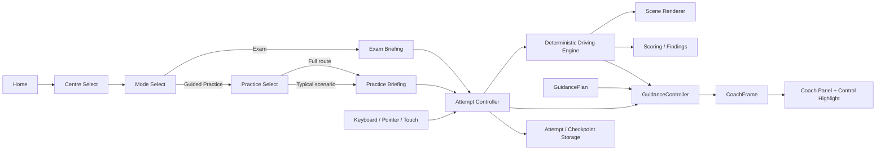
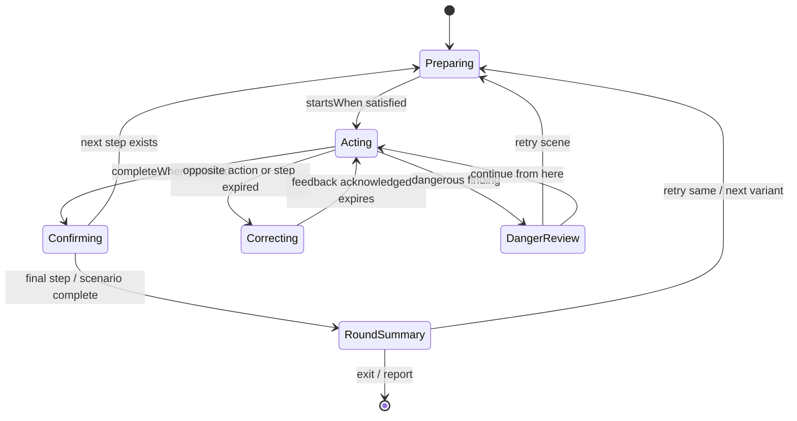

# Design: Ontario G Test 引导式练习模式

**日期**: 2026-08-14
**Owner**: nieyuanyuan
**状态**: Draft
**源项目 / 分支**: `nieyy/ontario-g-test / main @ ff4e573`
**相关调研 / 代码讲解 / review**: [Ontario G Test 互动驾驶备考游戏 MVP 设计 v1.1](./2026-08-12-ontario-g-test-interactive-game-mvp-design-zh.md)、[Ontario G Test 真实路况互动驾驶游戏调研 v1.1](../research/2026-08-12-ontario-g-test-interactive-driving-game-research-zh.md)

## 修订记录

| 版本 | 日期 | 作者 | 摘要 |
|---|---|---|---|
| v0.1 | 2026-08-14 | nieyuanyuan | 初版设计：定义考试/练习模式边界、完整路线与典型场景练习、Coach 指导契约、即时反馈、重试、记录迁移和分阶段验收。 |

## 1. 摘要

- 这个设计解决什么问题: 当前公开版本的主流程实际以考试方式运行；已有 `practiceType` 只能从历史弱项进入单场景，所谓练习提示只是完成数量，用户无法主动选择完整路线练习、六类典型场景或得到逐步操作指导和重试闭环。
- 选择的方向: 保持现有确定性驾驶引擎、场景、输入、评分和渲染为唯一事实源，在其旁边新增只读的 `GuidanceController` 和练习模式页面流。考试与练习使用相同 seed 时必须生成相同路线和路况；练习层只显示 Prepare / Act / Feedback 提示、控件高亮、场景总结和重试入口，不替用户操作，也不改变评分事实。
- 预期结果: 用户可在 Newmarket 下明确选择 Exam 或 Guided Practice；Practice 可运行与考试相同的约 16 分钟完整路线，也可选择六类典型场景进行 2–3 分钟短练习，并通过 Mirror → Signal → Shoulder、位置、速度和决策步骤形成可重复的操作习惯。
- AI Agent 应该能根据本文直接实现什么: 从 `main @ ff4e573` 出发，按第 7 节四个 Phase 修改模式入口、运行状态、内容契约、Coach 纯函数、练习 UI、重试和本地历史；每个 Phase 均有文件范围、迁移、自动化测试、人工验收和停止条件，不需要临时决定产品边界。

本文是 MVP v1.1 的后续增量设计，仅替代其对“Practice 允许提示、暂停和重做”的概括性描述。MVP 中已锁定的非官方路线、无官方评分、纯静态部署、确定性引擎、本地隐私和 Newmarket 首发边界继续有效。

## 2. 背景和目标

### 当前状态

- `ontario-g-test` 已以 `1.0.0` 发布到 `https://nieyy.github.io/ontario-g-test/`，`main @ ff4e573` 通过 Vitest、Playwright Chromium/WebKit 和 GitHub Pages 工作流。
- 首页只有“Choose a test centre”主入口；选择 Newmarket 后直接进入 briefing，没有独立 Mode Selection 和 Practice Selection。
- `App.tsx` 通过可选 `practiceType` 判断运行单一场景；只有本地历史推导出弱项时首页才显示 `Practise: <scenario>`。
- `createEngine(seed, stage, onlyType)` 已能以 `stage='practice'` 和单一 `ScenarioType` 创建路线，但完整路线无法以 Practice 身份主动启动。
- Player 在非 exam 状态只显示 `x/y expected actions observed`；没有下一步提示、时机窗口、即时纠错、场景重试或变体轮换。
- `RunStage = 'exam' | 'practice' | 'continued-practice'` 同时表达启动模式和危险后继续语境，无法稳定回答“这次原本是什么模式”“当前是否显示指导”“finding 产生于考试还是练习”。
- `ScenarioVariant.requiredActions` 用于结果判断，不保证教学顺序；例如部分 MSS 场景的数据顺序不是 Mirror → Signal → Shoulder，不能直接拿来驱动 Coach。
- `AttemptRecord` 没有 schemaVersion、practice scope、重试关系或 finding context；`weakestScenario()` 会把所有 attempt 一起计算，重复练习会放大弱项统计。

### 痛点 / 动机

- 考试模式要求用户已经记住规则，适合检验但不适合第一次建立操作顺序。
- 当前控制面板虽然显示快捷键，用户仍需自己把考官指令、路况时机和 MSS/速度/车道动作拼成一套流程。
- 只在结束报告中指出遗漏，反馈距离操作太远；用户难以判断是“没做”“方向做反”“做得太早”还是“危险时机仍然执行”。
- 弱项短练入口依赖已有历史，新用户无法主动选择典型场景；完成后也不能快速以相同条件重试。
- 如果单独复制一套 Practice 引擎，考试和练习会逐渐出现不同道路、操作语义和判定，失去“先练、再考同一能力”的价值。

### 目标

1. 在 Newmarket 考点下提供明确的 `Exam` 与 `Guided Practice` 模式选择。
2. Guided Practice 同时支持完整六场景路线和任一典型场景短练。
3. 完整路线在相同 seed 下与 Exam 使用相同场景 ID、变体、道路推进、车辆控制、考官英文指令和评分器。
4. 练习中用不遮挡道路的 Coach 提供 Prepare、Act、Feedback 三阶段指导，并用当前键位动态显示下一步操作。
5. 教学顺序独立于结果评分；`guidance.steps` 不复用或重排 `requiredActions` 来冒充教学内容。
6. 普通错误不中断；危险错误暂停并允许重试当前场景或从当前状态继续，练习结果不得显示成“考试失败”。
7. 单场景练习支持“相同条件重试”和“下一个变体”，两条路径均可确定性复现。
8. 旧 attempt/checkpoint 保持可读；练习记录不会无差别放大考试弱项统计。
9. 键盘、鼠标、触摸、中文辅助字幕、低动态、高对比和无障碍语义继续可用。
10. 保持 GitHub Pages 纯静态、本地存储、无账号、无遥测、无付费地图和无运行时 AI 依赖。

### 非目标

- 不新增 Newmarket 之外的考点、路线或场景类型。
- 不改变现有道路视觉方向，不引入 3D、Street View、在线地图、自由驾驶或真实车辆物理。
- 不复刻 DriveTest 官方评分表，不显示官方分数、通过率或“已准备好通过考试”的结论。
- 不让 Coach 自动打灯、观察、变道、加减速或阻止普通错误；提示不是自动驾驶。
- 不在首版提供 Beginner / Intermediate / Advanced 多档指导强度、自定义教学步骤或远程内容后台。
- 不使用 LLM 在运行时生成提示、解释或判分；所有措辞和规则必须受控、可审阅、可测试。
- 不把单场景重复练习做成排行榜、连胜、积分、徽章或社交功能。
- 不在本设计中重构整个应用目录、引入 React Router/XState/游戏引擎或替换 IndexedDB。
- 不在练习模式中提前暴露尚未由画面或世界状态呈现的交通信息。

### 约束

- 原 MVP v1.1 状态为 `Locked`；实现若要改变其非官方定位、评分、隐私、考点或确定性边界，必须另行修订设计，不能借练习模式静默扩大范围。
- Mode 和 Guidance 不得进入 `buildRoute` 的随机选择；相同 `centreId + contentVersion + seed + scope=full-route` 必须生成同一 `scenarioIds`。
- Coach 只读取经过确定性引擎确认的 `EngineState`、动作事件和 `GuidancePlan`，不得读取 Canvas 像素、CSS class、墙钟或 DOM 位置来判断完成情况。
- 提示时机不得早于对应道路对象对用户可见的时机；低动态模式可减少动画，但不得改变提示/评分窗口。
- Coach 文本不自动语音朗读，避免覆盖考官指令；英文为主，中文仅随现有字幕设置显示。
- 所有 Practice 内容必须通过构建时校验；运行时若指导内容损坏，只禁用 Practice，Exam 仍可启动。
- 页面隐藏、失焦、危险解释、场景重试和总结界面期间模拟时钟停止；恢复时不追帧。
- 新记录写入现有本地数据库，不增加远端请求；旧数据库不得通过自动删除来“迁移”。

### 成功标准

- 新用户从首页到任一典型场景开始练习不超过 4 次主按钮点击，并能在 30 秒内理解 Practice 与 Exam 的差异。
- 六类场景各至少有一个完整、经内容校验的 `GuidancePlan`；所有 18 个现有 variant 都能解析到确定的教学步骤。
- Coach 任一时刻最多突出一个“当前动作”和一个简短反馈，不遮挡红绿灯、道路、车道、镜子、考官指令或小地图。
- MSS 场景按 Mirror → Signal → Shoulder 顺序指导，并显示用户当前配置的键位，例如右侧 `E → C → Shift+E`。
- 单场景相同条件重试保持 scenario ID、seed 和初始世界状态一致；“下一个变体”在遍历当前类型所有变体前不重复。
- 同一 full-route seed 在 Exam 与 Practice 的 `scenarioIds`、环境参数和无用户输入世界推进测试中深度相等。
- Exam 中不存在 Coach、步骤高亮、即时正确/错误提示或场景重试入口；既有考试 E2E 全部继续通过。
- 旧 `exam`、`practice` attempt 可读；旧 `continued-practice` 因缺失分界点不参与新的 exam-only 弱项统计，但历史和导出不丢失。
- `npm run check`、`npm run test:e2e`、桌面/手机手工验收和公开 Pages smoke 全部通过。

## 3. 当前系统对齐

| 区域 / 模块 | 当前行为 | 对设计的影响 |
|---|---|---|
| `src/App.tsx` | `View`、Home、CentrePicker、Briefing、Player、Report、History、Settings 集中在单文件；`practiceType` 兼作模式和场景范围 | 首版在现有结构上新增 `mode-select`、`practice-select`、`scene-summary` 和显式 `RunConfig`；只提取新组件，不为本功能全面重构页面 |
| `src/content/types.ts` | `ScenarioVariant` 只有 required/dangerous actions；`RunStage` 混合模式和继续语境 | 新增独立 Guidance/RunConfig/record v2 类型；保留旧类型用于迁移读取 |
| `src/content/data.ts` | Newmarket 六类场景、每类三个变体；工厂函数可复用共同字段 | 新增受控 `GuidancePlan` 注册表或 variant 引用；不得从 requiredActions 自动生成顺序 |
| `src/content/validate.ts` | 校验六类、三个变体、指令和 evidence | 扩展为 Practice 完整性、step ID、触发条件、动作方向、文案和 variant 引用校验 |
| `src/domain/engine.ts` | 单一确定性引擎；`onlyType` 可构建单场景；stage 决定危险是否暂停 | 保持世界和评分事实源；新增显式 mode/context，提供场景重置所需纯函数，不把 Coach 塞进 tick |
| `src/components/CanvasRoadScene.tsx` | 渲染世界并显示道路事件/动作反馈 | 不负责教学判断；只接收必要的 presentation state，Coach 面板在 HTML 层独立渲染 |
| `src/components/RouteMiniMap.tsx` | 显示完整路线和当前场景 | 完整练习复用；单场景显示一个节点或场景名称，不伪造完整路线进度 |
| `src/services/storage.ts` | IndexedDB v1 两个 store；attempt 无 schemaVersion；checkpoint 保存 EngineState | 不升级 object store 即可写 record v2；增加纯函数 normalize/migrate，恢复时识别旧 `stage` |
| `weakestScenario()` | 最近十个 attempt 不区分考试与练习 | 改为优先使用 exam-context findings；无考试证据时才使用 practice 并明确标注来源 |
| `src/styles.css` | 桌面/手机控制面板、MSS 分组、考官卡、小地图均已存在 | Coach 使用现有视觉语言；桌面放在道路与控制区之间，手机放在小地图下方，不新增覆盖道路的大卡片 |
| `e2e/app.spec.ts` | 覆盖完整考试、恢复、油门刹车、道路推进、变道/转弯、移动端、无障碍和键位 | 原测试作为 Exam 回归；新增模式选择、六场景、指导、重试、迁移和无提示隔离 E2E |
| `.github/workflows/deploy.yml` | `check:release` 成功后发布 Pages | 保持不变；新测试纳入现有命令，发布后增加 Practice smoke |

## 4. 候选方案

| 方案 | 核心思路 | 优点 | 缺点 / 风险 | 判断 |
|---|---|---|---|---|
| A. 单一驾驶引擎 + 只读 GuidanceController | Exam/Practice 共用路线、世界、输入和评分；Coach 从引擎状态与受控计划派生 presentation | 一致、可重放、可单测；不会因为练习功能改变驾驶事实 | 需要明确 mode/context/migration，并为六类场景编写教学契约 | **选择** |
| B. 为 Practice 复制或分叉引擎 | 单独实现教学版路线推进、动作接受和反馈 | 短期可快速堆提示和重试 | 两套速度、车道、时机和判定必然漂移；无法证明练习与考试相同 | 不选 |
| C. UI 直接读取 `requiredActions` 做 checklist | React 将尚未出现的 required action 当下一步并高亮按钮 | 改动最少 | requiredActions 不是有序教学计划；无法表达时机、分支、做反、过早或重试；把判断绑到 UI | 不选 |
| D. 运行时 LLM Coach | 把状态发给模型生成下一步和解释 | 文案灵活，表面上覆盖更多情况 | 需要网络/费用/隐私，结果不确定、不可回放，可能教错规则 | 不选 |

## 5. 选择

**选择的方案**: 方案 A。保留一个 `DrivingEngine` 作为世界状态、动作记录、场景完成和 finding 的唯一事实源；新增纯 TypeScript `GuidanceController`，以 `GuidancePlan + EngineState + 本场景动作` 计算 `CoachFrame`。React 只渲染 Coach、步骤状态和重试入口。

**为什么选它**:

- 用户要求完整路线练习“完全和考试一样”，最强保证是 Exam/Practice 从同一引擎和内容构建，而不是靠人工同步两套流程。
- Coach 必须知道动作是否在正确方向和时间窗口内，单纯 checklist 不够；独立纯函数既能表达规则，又能以 fixture 覆盖边界。
- 当前引擎已有 seed、单场景构建、动作历史、场景进度和危险 finding，增量实现成本可控。
- 受控教学内容能被作者审阅和版本化，不引入运行时网络或不可预测回答。

**为什么不选其他方案**:

- A: 选择。
- B: 引擎分叉违背同 seed 同路况和单一事实源，后续修复道路/变道问题需要改两遍。
- C: `requiredActions` 只表示完成期望，当前顺序不能承担 MSS 教学；UI 推导也无法稳定重放。
- D: 与静态、本地、无费用和可验证原则冲突。

**后果 / 取舍**:

- 什么会变简单:
  - Exam 与 Practice 的道路/控制回归由同一套测试保护。
  - Coach 可以独立做内容校验、单测和低动态/无障碍呈现。
  - 相同条件重试可由 seed/scenario ID 直接复现，不需要保存画面快照。
- 什么会变困难:
  - 六类场景的提示步骤和时机必须人工设计，不能从 requiredActions 自动拼接。
  - 旧 `RunStage` 和 attempt 记录需要显式兼容，不能直接改字段后让旧历史失效。
  - 练习中“错误动作”必须谨慎定义，不能把与当前步骤无关但合法的速度调整误报为错误。
- 可能引出的后续决策:
  - 1.1 稳定后是否增加 Minimal Guidance 或用户自定义提示强度。
  - 后续新增考点时 GuidancePlan 是按公共场景复用还是由 CentrePack 覆盖。
  - 是否把多轮单场景训练聚合成独立 mastery 视图；本设计只在历史中分组展示。

## 6. 详细设计

### 6.1 架构 / 流程



依赖和事实边界：

```text
content/data + content/guidance
  -> domain/engine             # 驾驶与评分事实
  -> domain/guidance           # 只读派生 CoachFrame
  -> App / CoachPanel          # 页面与呈现
  -> services/storage          # record/checkpoint 兼容保存
```

强制不变量：

1. `domain/guidance` 可以 import `content/types` 和读取 `EngineState`，但不能调用 `recordAction()`、`advanceEngine()` 或修改状态。
2. `domain/engine` 不 import GuidancePlan、React、DOM 或 CSS。
3. scoring 不读取 `CoachFrame`；用户是否打开/看到提示不改变 finding。
4. Renderer 不根据 Coach 推进道路；控件高亮只改变 presentation class/ARIA。
5. `buildRoute()` 只接收 seed 和 scope，不接收 guidance visibility。

页面流：

```text
[Home]
  -> [Centre: Newmarket]
  -> [Mode]
       -> Exam
            -> Briefing -> Full route -> Report
       -> Guided Practice
            -> Full route
                 -> Briefing -> Guided route -> Practice report
            -> Typical scenario
                 -> Scenario cards -> Briefing -> Guided round
                 -> Round summary
                      -> Retry same situation
                      -> Try next variation
                      -> Choose another scenario
```

建议新增/修改文件：

```text
src/
  App.tsx                         # RunConfig 页面流和 mode/scope 入口
  content/
    types.ts                      # GuidancePlan、RunConfig、record v2
    data.ts                       # variant 与 plan 引用
    guidance.ts                   # 六类受控教学计划与文案
    validate.ts                   # guidance 完整性/语义校验
  domain/
    engine.ts                     # 显式 mode/context、resetScenario 纯函数
    guidance.ts                   # deriveCoachFrame / feedback 纯函数
    guidance.test.ts
  components/
    ModeSelect.tsx
    PracticeSelect.tsx
    CoachPanel.tsx
    PracticeRoundSummary.tsx
  services/
    storage.ts                    # record/checkpoint normalize/migration
    storage.test.ts
  App.test.tsx
e2e/
  app.spec.ts                     # 保留 Exam 回归
  practice.spec.ts                # 练习模式全流程和隔离验证
```

不要求在本功能中把现有整个 `App.tsx` 拆成 feature 目录；只提取有清晰输入输出的新页面和 Coach 组件，避免无关重构扩大 diff。

### 6.2 数据 / 状态模型

#### 运行配置与生命周期

```ts
type AttemptMode = 'exam' | 'practice'

type PracticeScope =
  | { kind: 'full-route' }
  | {
      kind: 'scenario'
      scenarioType: ScenarioType
      variantId?: string
      practiceSessionId: string
      roundIndex: number
      retryOfAttemptId?: string
    }

type RunConfig =
  | {
      mode: 'exam'
      centreId: CentreId
      scope: { kind: 'full-route' }
      guidance: 'off'
      seed: number
    }
  | {
      mode: 'practice'
      centreId: CentreId
      scope: PracticeScope
      guidance: 'guided'
      seed: number
    }

type AttemptStatus =
  | 'briefing'
  | 'running'
  | 'paused'
  | 'danger-review'
  | 'round-summary'
  | 'completed'
  | 'aborted'

type FindingContext = 'exam' | 'practice' | 'legacy-unknown'
```

- `mode` 表示 attempt 最初从哪个入口创建，完成前不改变。
- `guidance` 表示当前是否显示 Coach。Exam 初始为 `off`；Exam 危险后选择继续时仍保留 `mode='exam'`，但后续 finding 标记 `FindingContext='practice'`，并可显示 guided Coach。
- `scope` 决定 full route 或一个 scenario，不改变引擎的动作语义。
- `status` 只表达生命周期，不再承担教学语境。
- `practiceSessionId + roundIndex` 用于把同一典型场景的多次重试在历史中分组，不新建远端或新的数据库 store。

#### Guidance 内容契约

`requiredActions` 继续用于结果判定；教学计划独立定义：

```ts
type GuidanceStepPhase = 'prepare' | 'act' | 'confirm'

type GuidanceCondition =
  | { kind: 'scenario-elapsed-at-least'; seconds: number }
  | { kind: 'distance-at-least'; metres: number }
  | { kind: 'distance-at-most'; metres: number }
  | { kind: 'lane-is'; lane: -1 | 0 | 1 }
  | { kind: 'speed-at-most'; kph: number }
  | { kind: 'speed-at-least'; kph: number }
  | { kind: 'action-observed'; action: ActionType }
  | { kind: 'turn-completed'; direction: 'left' | 'right' }

type GuidanceCompletion =
  | { kind: 'action'; action: ActionType }
  | { kind: 'lane'; lane: -1 | 0 | 1 }
  | { kind: 'speed-range'; minKph: number; maxKph: number }
  | { kind: 'turn-completed'; direction: 'left' | 'right' }
  | { kind: 'scenario-completed' }

interface GuidanceStep {
  id: string
  phase: GuidanceStepPhase
  titleEn: string
  titleZh?: string
  instructionEn: string
  instructionZh?: string
  highlightedAction?: ActionType
  startsWhen: GuidanceCondition[]
  completeWhen: GuidanceCompletion
  expiresWhen?: GuidanceCondition[]
  oppositeActions?: ActionType[]
  correctiveFeedbackEn?: string
  correctiveFeedbackZh?: string
}

interface GuidancePlan {
  id: string
  version: 1
  scenarioType: ScenarioType
  variantIds: string[]
  steps: GuidanceStep[]
  commonMistakes: Array<{
    id: string
    whenAction?: ActionType
    messageEn: string
    messageZh?: string
  }>
}
```

内容约束：

- 每个 playable `ScenarioVariant.id` 恰好解析到一个 GuidancePlan；不得零个或多个。
- step ID 在 plan 内唯一；至少一个 `act` step，最后一个 step 必须可完成或可过期，避免 Coach 永久卡住。
- `highlightedAction` 必须存在于 `ActionType` 和当前 Preferences 的显示映射；Coach 显示实时键位，不在内容中硬编码 `Q/E/Z/C`。
- MSS 教学计划必须以同方向 `mirror-* -> signal-* -> shoulder-*` 排列；内容校验器直接检查该顺序。
- 指导条件只允许穷举的 typed condition，不允许 JavaScript 表达式、任意属性路径或 `eval` 字符串。
- plan 可以由多个 variant 共用；Yellow Light 的 `safeStop=true/false` 若步骤不同，应分别绑定不同 plan，而不是在 UI 中猜测分支。
- Guidance 文案描述练习动作和风险，不宣称官方逐字评分或固定路线。

#### Coach 派生状态

```ts
type CoachFeedbackTone = 'positive' | 'corrective' | 'danger'

interface CoachFeedback {
  id: string
  tone: CoachFeedbackTone
  messageEn: string
  messageZh?: string
  atSeconds: number
}

interface CoachFrame {
  planId: string
  currentStepId?: string
  completedStepIds: string[]
  visibleSteps: Array<{
    id: string
    state: 'done' | 'current' | 'upcoming' | 'missed'
    title: string
    instruction?: string
    highlightedAction?: ActionType
    keyLabel?: string
  }>
  feedback?: CoachFeedback
  progress: { completed: number; total: number }
}
```

`deriveCoachFrame(previousFrame, plan, engineState, latestAction)` 是确定性纯函数：

- expected action 完成当前 step：标记 done，产生 positive feedback，推进至下一可激活 step。
- 用户执行 `oppositeActions`：产生 corrective feedback，但动作仍交给驾驶引擎处理，Coach 不撤销动作。
- 用户执行与当前步骤无关但可能合理的加速、刹车或观察：记录为 neutral，不弹“错误”，避免提示噪音。
- step 的有效窗口结束仍未完成：标记 missed，并显示一次 corrective feedback；不得每 tick 重复生成。
- dangerous finding 由评分器产生后，Coach 使用 finding 的 situation/action/impact 进入 danger feedback；Coach 自身不发明危险结论。
- feedback 以模拟时钟显示约 2.5 秒；暂停时不消失，恢复后继续计时。

#### AttemptRecord v2 与迁移

```ts
interface AttemptRecordV2 extends Omit<AttemptRecord, 'runStage'> {
  schemaVersion: 2
  mode: AttemptMode
  scope: { kind: 'full-route' } | {
    kind: 'scenario'
    scenarioType: ScenarioType
    practiceSessionId: string
    roundIndex: number
    retryOfAttemptId?: string
  }
  continuedAfterDangerAtSeconds?: number
  findingContexts: Record<string, FindingContext>
  guidanceSummary?: {
    planIds: string[]
    completedStepIds: string[]
    missedStepIds: string[]
  }
}
```

- IndexedDB object store 结构不变，无需升级数据库 version；record 内部使用 `schemaVersion: 2`。
- `normalizeAttemptRecord()` 读取没有 schemaVersion 的旧记录：
  - `runStage='exam'` -> `mode='exam'`、full route，旧 findings context 为 exam。
  - `runStage='practice'` -> `mode='practice'`、scope 从 scenarioIds 推断，旧 findings context 为 practice。
  - `runStage='continued-practice'` -> 保持历史可见和可导出，但因旧数据没有危险后分界点，findings context 标为 legacy-unknown，不进入新 exam-only 弱项计算。
- checkpoint 恢复时用 `normalizeEngineCheckpoint()` 将旧 `stage` 转换为 `mode/guidance/continuedAfterDanger`；无法确定的旧字段使用保守值，不删除 checkpoint。
- 新版本保存 attempt 前必须固化 `mode/scope/findingContexts`，报告不得根据当前 UI 状态反推。

#### 弱项和历史语义

- 历史卡片标记 `Exam`、`Guided full route`、`Scenario practice · round N` 或 `Legacy continued practice`。
- 多个相同 `practiceSessionId` 在 UI 中分组，但底层仍是独立 attempt，便于每轮复盘和导出。
- 弱项推荐优先读取最近十个包含 exam-context finding 的记录，只计算 exam context。
- 若没有任何 exam-context evidence，可使用最近十个 Practice 记录，并明确显示“Based on practice history”，不能伪装成考试弱项。
- practice 重试不得覆盖旧 attempt；每轮保存后再创建新 ID，形成可审计进步轨迹。

### 6.3 API / CLI / 接口变更

#### 对外接口

- 页面入口仍使用现有应用状态，不引入新路由依赖：
  - Home -> Centre -> Mode Select。
  - Mode Select -> Exam Briefing 或 Practice Select。
  - Practice Select -> Full Route 或六类 Scenario Card。
- URL query 继续只用于本地 debug/seed；公开用户流程不要求手写 URL。
- History/JSON 导出增加 v2 字段；不包含姓名、设备指纹或远端 ID。
- 所有键位提示从 Preferences 动态读取；默认 MSS 为左 `Q -> Z -> Shift+Q`、右 `E -> C -> Shift+E`，`,/.` 继续作为兼容 signal alias。

#### 内部接口

```ts
function createRunConfig(input: {
  centreId: CentreId
  mode: AttemptMode
  scope?: PracticeScope
  seed: number
}): RunConfig

function createEngine(config: RunConfig): EngineState

function getGuidancePlan(variantId: string): GuidancePlan | undefined

function deriveCoachFrame(input: {
  previous?: CoachFrame
  plan: GuidancePlan
  state: Readonly<EngineState>
  latestAction?: InputAction
  latestFinding?: Finding
  keyBindings: KeyBinding[]
}): CoachFrame

function restartScenario(input: {
  completed: Readonly<EngineState>
  strategy: 'same' | 'next'
}): { config: RunConfig; state: EngineState }

function normalizeAttemptRecord(
  stored: AttemptRecord | AttemptRecordV2,
): NormalizedAttemptRecord
```

`restartScenario('same')` 保持 centre/contentVersion/seed/scenario ID/variant parameters；`restartScenario('next')` 按内容数组顺序循环到下一个 variant，并派生新 seed，不直接调用 `Math.random()`。

#### 输入校验

- mode 必须为 `exam|practice`；Exam 只允许 full-route 和 guidance off。
- Practice scenario scope 必须来自 `scenarioOrder`，variant 必须属于所选 centre/type。
- GuidancePlan 的所有 variant/step/action 引用在 `validate:content` 中校验；Practice 入口只有在六类均完整时启用。
- 恢复 checkpoint 时，以 checkpoint 固化 config 为准，不使用用户之后在首页新选的 mode/scope。
- 相同条件重试只接受刚完成/危险暂停的单场景 Practice；Exam 和 full-route 不显示该按钮。
- “下一个变体”在 deterministic variant registry 中选择；内容删除后找不到旧 variant 时回到场景选择并显示可恢复提示。

#### 输出 / 错误形态

```ts
type PracticeError =
  | { code: 'GUIDANCE_PLAN_MISSING'; scenarioId: string }
  | { code: 'GUIDANCE_PLAN_INVALID'; planId: string; details: string[] }
  | { code: 'PRACTICE_SCOPE_INVALID'; scenarioType?: string }
  | { code: 'RETRY_SOURCE_UNAVAILABLE'; attemptId: string }
  | { code: 'LEGACY_CONTEXT_UNKNOWN'; attemptId: string; recoverable: true }
```

- 内容错误：Practice 模式卡禁用并显示“练习内容暂不可用”；Exam 不被 Guidance 错误连带禁用。
- 旧 continued-practice：历史正常显示；弱项统计旁显示不纳入原因，不阻塞页面。
- Coach 渲染错误：隐藏 Coach 并暂停 Practice，允许返回选择页；不得在无提示且用户不知情的情况下继续标成 Guided Practice。

### 6.4 关键流程

| 流程 | 入口 | 步骤 | 结果 |
|---|---|---|---|
| 选择模式 | Newmarket Mode Select | 比较 Exam/Guided Practice -> 用户明确选择 | 创建尚未开始的 RunConfig；计时不启动 |
| 完整路线考试 | Exam | briefing -> 同现有六场景路线 -> finding/report | 无 Coach、无步骤高亮、无场景重试；行为与 1.0 回归一致 |
| 完整路线练习 | Practice / Full route | 同 seed 构建六场景 -> 每段加载 GuidancePlan -> Coach 推进 -> 完整 practice report | 与 Exam 同道路/控制；普通场景间以不阻塞的短总结继续 |
| 典型场景选择 | Practice / Typical scenario | 展示六类卡片、时长、训练重点和推荐弱项 -> 选择一类 | 创建 one-scenario Practice RunConfig |
| Prepare 提示 | 场景开始/目标尚远 | Coach 显示观察目标和路况关注点，不高亮提交动作 | 不提前泄露不可见交通信息，不替用户做决定 |
| Act 提示 | startsWhen 全满足 | 显示当前 step、快捷键并高亮一个控制 | 用户动作仍由同一 Input -> Engine 路径处理 |
| 即时反馈 | 动作或 step 过期 | positive/corrective/danger 反馈一次 -> 更新 CoachFrame | 普通错误不中断；危险来自 scoring finding |
| 完整路线场景衔接 | 非最终场景完成 | 显示约 4 秒非阻塞摘要；允许展开详情，默认继续下一场景 | 保持近似考试连续性，不强制每段停下来 |
| 单场景完成 | scenario 完成 | 固化本轮 -> Round Summary | 可 Retry same、Try next variation、Choose another scene |
| 相同条件重试 | Round Summary | 保存旧 round -> 复用 seed/variant -> reset 世界/动作/Coach | 新 attempt ID，初始状态可深度比较 |
| 下一个变体 | Round Summary | 保存旧 round -> deterministic next variant -> 新 seed | 遍历三变体前不重复 |
| Practice 危险错误 | dangerous finding | 暂停 -> 显示 situation/action/impact/improvement | Retry this scene 或 Continue from here；不显示考试失败 |
| Exam 危险后继续 | 现有 Danger Review | 保留 origin mode=exam 和 exam findings -> guidance 开启 -> 后续 context=practice | 报告区分危险前考试与危险后练习，不清除首次危险 |
| 弱项推荐 | Home/History | exam-context 最近十次；无 exam 时 fallback practice | 推荐场景并标注证据来源 |
| 页面隐藏 | visibilitychange | 释放油门刹车 -> 暂停 clock/Coach feedback -> checkpoint | 返回后显式恢复，提示步骤不跳过 |

#### Coach 状态机



Coach 与 driving status 正交：manual pause、页面隐藏和 modal 可以暂停两者时钟，但不得把 Coach phase 写进 EngineState 或把 engine lane/speed 写进 React-only state。

#### 六类场景指导骨架

| 场景 | Prepare | 核心 Act 顺序 | 关键分支 / 反馈 |
|---|---|---|---|
| Right on red | 观察红灯、路口和右侧位置 | Right mirror -> Right signal -> Right shoulder -> Move right -> Progressive brake/stop -> Turn right when allowed | 未停车/未肩检的危险结论必须来自评分 finding；Coach 不虚构 gap |
| Yellow-light decision | 观察灯色、距离、后方 | Mirror -> 根据 variant 的 safeStop 进入 Brake 或 Continue 分支 | 不教“黄灯永远停/永远冲”；plan 与 safeStop variant 明确绑定 |
| Multi-lane left turn | 识别左转目标和车道 | Left mirror -> Left signal -> Left shoulder -> Move left -> Adjust speed -> Turn left | 方向错误即时纠正；未到决策区不提示 turn now |
| Freeway merge | 提前观察主线和速度差 | Left mirror -> Left signal -> Left shoulder -> Accelerate toward traffic -> Merge left | 速度提示为适配 authored traffic target，不写固定 110 |
| Slow lead vehicle | 识别前车速度和空间 | Mirror -> Assess gap -> 对需要变道的 variant 执行 MSS/Move left；否则保持车道和空间 | 不能因存在慢车就一律提示变道；按 variant plan 区分 |
| Freeway exit | 提前识别出口和右侧空间 | Right mirror -> Right signal -> Right shoulder -> Move right -> Enter exit -> Progressive brake | 不在仍处主线时提示猛刹；speed window 随距离触发 |

“Assess gap / wait when safe”若当前游戏没有独立输入，不伪装成可点击动作；它作为 Prepare/Confirm 文本，并由世界/评分已有事实判断。若实现需要新增明确 scan/gap action，属于新的输入契约，必须先修订本文。

### 6.5 错误处理和边界

- 预期错误:
  - GuidancePlan 缺失/引用错误：构建失败；运行时兜底禁用 Practice，Exam 可用。
  - 用户按了未来步骤：动作正常进入引擎；若是明确 opposite action 才纠正，否则不产生噪音。
  - 用户在提示出现前已完成合法动作：Coach 从动作窗口识别并直接标记完成，不要求重复做一次来满足 UI。
  - 用户改键：Coach 每次渲染从 Preferences 获取 key label；计划不缓存旧键位。
  - SpeechSynthesis 不可用：考官字幕和 Coach 文本继续，Coach 本来就不自动朗读。
  - 存储不可用：当前 Practice 保留内存，报告可查看/导出；重试仍可在当前标签页进行。
- 重试 / 超时行为:
  - same retry 不做网络/存储重试；从已固化 config 同步创建新 engine。
  - 保存旧 round 失败时先保留内存报告并提示，再允许用户选择是否继续下一轮；不能静默声称历史已保存。
  - Coach feedback 使用模拟时钟 2.5 秒；页面暂停/隐藏期间不超时。
  - full-route 非阻塞摘要约 4 秒后隐藏；用户展开时不自动关闭，但道路默认继续，除非用户显式 Pause。
- 部分失败行为:
  - Coach 组件异常时暂停 Guided Practice；不能降级成 Exam UI 后继续记录为 Practice completed。
  - 小地图异常不改变 Coach/engine；保留文本场景和步骤。
  - 中文提示缺失时只显示英文，不由英文运行时机器翻译。
- 并发 / 顺序:
  - 沿用单标签 active attempt lock；同一 practiceSession 的 retry 必须先释放旧 attempt lock 再创建新 lock。
  - 一个动作先进入 driving engine，再以相同 sequence 供 GuidanceController 派生；同 tick 不得因 React render 次数重复消费。
  - finding 生成后再通知 Coach，确保 danger feedback 使用评分事实。
- 幂等性:
  - Coach completion key 为 `attemptId + planId + stepId`；相同 action 重放不重复计数。
  - Round 保存、finish 和 retry 创建均可重复调用但只能生成一个有效下轮 ID。
  - next variant 由 `(currentVariantIndex + 1) % variants.length` 决定；刷新恢复不改变选择。
- 安全边界:
  - Coach 不提示用户在红灯、黄灯或 gap 场景执行一个尚未由 authored variant 判定为可行的动作。
  - “Correct/Good”只说明本教学步骤已完成，不等于整个 manoeuvre 安全、考试通过或官方认可。

### 6.6 可观测性和运维

- 日志: 继续只在本地 console/debug 面板输出。`?debug=1` 增加 mode、scope、planId、stepId、completed/missed steps、practiceSessionId、roundIndex 和 migration source；不得输出用户身份或设备指纹。
- 指标: 不采集远程指标。开发态可显示 Coach 派生耗时、反馈数、step miss 数和 record schemaVersion。
- 告警: 仍由 GitHub Actions `check:release` 阻止内容/测试失败的 Pages 部署；无服务端告警。
- 调试命令 / 查询:
  - `npm run validate:content`
  - `npm run test -- --run src/domain/guidance.test.ts`
  - `npm run test -- --run src/services/storage.test.ts`
  - `npm run check`
  - `npm run test:e2e`
  - `npm run check:release`
- 回滚 / 禁用开关:
  - 静态常量 `PRACTICE_MODE_ENABLED` 控制 Mode Select 是否开放 Practice；flag=false 时 Exam 仍可用，历史中的 v2 Practice 记录仍可读。
  - Guidance 内容校验失败在运行时将 Practice 标记 unavailable，不隐藏 Exam。
  - 回滚到 `ff4e573` 时 v2 记录会被旧代码当普通结构读取存在风险，因此正式发布前必须先验证旧版本对新增字段的宽松读取；若不兼容，回滚目标必须是包含 v2 reader 的最小兼容 commit，而不是直接回到 1.0。

## 7. 分阶段实现与验证计划

> 四个 Phase 必须按数字顺序执行。实现和测试在同一 Phase 完成；每个 Phase 达到退出标准后停下，由 Owner 基于可运行产物验收。不得把未完成的 Practice 入口公开到 Pages。

### 阶段依赖与交付证据

| Phase | 前置条件 | 核心交付 | Owner gate | 建议证据文件 |
|---|---|---|---|---|
| Phase 1 | `main @ ff4e573`、v0.1 设计确认 | mode/scope/record v2 契约、迁移、Mode/Practice Select，feature flag 默认关闭 | 能选择但不进入未完成 Coach；旧历史可读 | `docs/test-reports/2026-08-14-ontario-g-test-practice-phase-1-contract-zh.md` |
| Phase 2 | Phase 1 退出 | Right on red 垂直切片、Coach 纯函数/UI、same retry | Mac/手机能完成一轮并按 MSS 提示重试 | `docs/test-reports/2026-08-14-ontario-g-test-practice-phase-2-coach-zh.md` |
| Phase 3 | Phase 2 退出 | 六类 guidance、完整路线、next variant、历史/弱项语义 | 六类均可完成；Exam/Practice 隔离通过 | `docs/test-reports/2026-08-14-ontario-g-test-practice-phase-3-content-zh.md` |
| Phase 4 | Phase 3 退出 | E2E/无障碍/兼容/Pages 发布，版本 1.1.0 | 公开站点完整 Practice smoke | `docs/test-reports/2026-08-14-ontario-g-test-practice-phase-4-release-zh.md` |

### 所有阶段共同约束

- 必须保留当前 Exam E2E；任何 Practice 改动导致既有考试流程、道路推进、车道/转弯、油门刹车或报告回归都视为失败。
- 每次内容契约变化同步更新 `validate:content` 和正反 fixture，不能只改 TypeScript 类型让坏数据在运行时失败。
- 新 UI 同时提供键盘、pointer、touch 和可访问名称；提示不能只靠颜色或动画。
- 不使用网络依赖、远程 feature flag、地图 API、LLM、账号或遥测。
- 不提前 commit/push/发布；只有用户明确要求时执行。

### Phase 1: 运行契约、迁移与模式入口

**目标**: 把“启动模式、练习范围、危险后语境和生命周期”拆开，建立可兼容旧记录的 v2 契约，并完成不暴露未完成 Coach 的页面入口。

**实现范围**:

- [ ] `src/content/types.ts`: 新增 `AttemptMode`、`PracticeScope`、`RunConfig`、`AttemptStatus`、`FindingContext`、record v2 类型；旧 `RunStage` 标为 legacy reader 使用。
- [ ] `src/domain/engine.ts`: `createEngine(config)` 与 route builder 解耦 mode/guidance；finding 固化 context；增加 full-route Exam/Practice 同 seed 等价测试。
- [ ] `src/services/storage.ts`: `normalizeAttemptRecord()`、`normalizeEngineCheckpoint()` 和 v2 save；旧 continued-practice 保守处理。
- [ ] `src/components/ModeSelect.tsx`、`PracticeSelect.tsx`: Exam/Guided Practice、Full route 和六类场景卡；推荐弱项显示 evidence source。
- [ ] `src/App.tsx`: 用 `RunConfig` 替代 `practiceType` 的双重含义，新增页面状态和 back 行为；Practice feature flag 默认关闭或仅 debug 开放。

**数据 / migration 改动**:

- [ ] record 写入 `schemaVersion: 2`；IndexedDB version/store 不变。
- [ ] 旧 attempt/checkpoint fixture 覆盖 exam、practice、continued-practice 和缺字段。
- [ ] `weakestScenario()` 接受 context policy，旧 unknown 不纳入 exam-only 统计。

**Agent 执行约束**:

- 必须遵守: mode 不参与 route random；迁移为纯函数；旧记录原始 JSON 仍可导出。
- 禁止做: 删除 IndexedDB、覆盖旧 attempt、在 Phase 1 伪造 Coach checklist、公开 feature flag。
- 不确定时先问: 若现有旧 checkpoint 无法在不猜测世界事实的情况下恢复，先提出只读/放弃恢复策略，不自行填充评分事实。

**本阶段验证**:

- 自动化测试: config union、非法 scope、同 seed route 等价、record/checkpoint v1->v2、weakest context、页面模式选择和 back navigation。
- 手工 / workflow 验证: 打开已有 History、导出旧 JSON、Home -> Newmarket -> Mode -> Practice Select；flag off 时公开主流程仍与 1.0 一致。
- 回归检查: `npm run check`；现有 `e2e/app.spec.ts` 全通过。
- 失败 / 边界检查: 缺 scenario type、旧 continued-practice、checkpoint 中途刷新、另一个标签页 active lock、Practice flag off。

**退出标准**:

- [ ] RunConfig 不需要 `practiceType` 推断模式；Exam/Practice 同 seed full route 深度相等。
- [ ] 所有旧 fixture 可读且无自动数据删除。
- [ ] Mode/Practice Select 完成键盘、触摸和无障碍基础验收，但公开 flag 尚未开启。

### Phase 2: Right on red 引导垂直切片

**目标**: 用一个代表性场景验证 GuidancePlan、Coach 纯函数、MSS 控件高亮、即时反馈、危险解释和 same retry 的完整闭环。

**实现范围**:

- [ ] `src/content/guidance.ts`: Right on red 三个 variant 的 GuidancePlan 和中英文受控文案。
- [ ] `src/content/validate.ts`: plan/variant/step/condition/MSS 顺序校验和坏数据 fixture。
- [ ] `src/domain/guidance.ts`: `deriveCoachFrame()`、step window、opposite action、missed/feedback 去重。
- [ ] `src/components/CoachPanel.tsx`: Prepare/Act/Feedback、步骤进度、动态键位、ARIA live polite、低动态样式。
- [ ] `src/components/PracticeRoundSummary.tsx`: Retry same、Choose another；next variation 可先隐藏到 Phase 3。
- [ ] `src/App.tsx` / `styles.css`: Practice-only Coach placement 和 action highlight；Exam 不渲染 Coach DOM。
- [ ] `src/domain/engine.ts`: deterministic same retry/reset helper，不清除已保存上一轮。

**数据 / migration 改动**:

- [ ] 保存 practiceSessionId、roundIndex、retryOfAttemptId、guidanceSummary。
- [ ] checkpoint 包含 RunConfig 和 Coach 可重建所需 action/plan version；不保存 DOM/presentation snapshot。

**Agent 执行约束**:

- 必须遵守: Coach 只读；danger 必须来自 finding；same retry 初始世界可深度相等；提示从 Preferences 读取 `E/C/Shift+E`。
- 禁止做: 自动完成动作、拦截普通错误、把 requiredActions 顺序当 guidance、在 Exam 留隐藏但可被读屏读取的 Coach 文本。
- 不确定时先问: Right on red 某提示若依赖当前 engine 不存在的 gap/scan 事实，不得编造；先说明缺失状态并请求是否扩展引擎契约。

**本阶段验证**:

- 自动化测试: plan validation、step 激活/完成/过期、opposite direction、无关动作不误报、feedback pause、same retry、key remap、Exam DOM 无 Coach。
- 手工 / workflow 验证: Mac 完成 `E -> C -> Shift+E -> D/Right -> brake -> turn`；手机触控完成同流程；提示不遮红绿灯、镜子、考官卡和小地图。
- 回归检查: Right on red Exam 同 seed 前后 frame/action/finding fixture 相等；低动态和高对比可读。
- 失败 / 边界检查: 提示前已做 mirror、快速连点、方向做反、步骤过期、危险后 retry、刷新恢复、Coach render error。

**退出标准**:

- [ ] 一个新用户不看外部说明能根据 Coach 完成 Right on red 并成功 same retry。
- [ ] Coach/Engine/Scoring 的单向依赖由测试证明；Exam 无任何教学提示回归。
- [ ] Owner 确认桌面和手机提示密度、语气、MSS 顺序和危险解释可接受。

### Phase 3: 六类内容、完整路线与练习历史

**目标**: 将垂直切片扩展到全部现有场景，支持完整路线、next variation、连续场景摘要和不会污染考试证据的历史/弱项统计。

**实现范围**:

- [ ] `src/content/guidance.ts`: Yellow Light、Multi-lane Left、Freeway Merge、Slow Lead、Freeway Exit plans；18 variants 全覆盖。
- [ ] `src/content/validate.ts`: 所有 playable variant coverage、分支和阈值语义校验。
- [ ] `src/components/PracticeSelect.tsx`: 六类卡片、训练重点、时长、推荐来源、full route 入口。
- [ ] `src/components/PracticeRoundSummary.tsx`: Retry same、Try next variation、Choose another；variant 不重复循环。
- [ ] `src/App.tsx`: full-route Practice 非阻塞场景摘要、最终 Practice report、Exam danger 后 context 切换。
- [ ] `src/services/storage.ts` / History: practice session 分组、mode/scope 标签、exam-first weakness fallback。
- [ ] `src/components/RouteMiniMap.tsx`: 单场景语义和 full-route 保持；不把短练显示成六段考试进度。

**数据 / migration 改动**:

- [ ] contentVersion 随 GuidancePlan 进入内容契约后递增；旧报告继续读取已保存 findings。
- [ ] 每个 round 独立 AttemptRecordV2；same/next retry 通过 practiceSessionId 关联。
- [ ] findingContexts 在 Exam danger 后继续时按分界点固化。

**Agent 执行约束**:

- 必须遵守: Yellow/Slow Lead 按 variant 分支，不写绝对口诀；full-route Practice 与 Exam 同 route；所有六类必须有正反/边界测试。
- 禁止做: 为凑完整性生成通用“按 requiredActions 做”提示、让 Practice repetition 等权污染 exam weakness、强制 full route 每场暂停。
- 不确定时先问: 某 variant 的 authored 参数不足以决定教学分支时，先将该 variant 标记 Practice unavailable 并请求内容决策，不自行推断交通事实。

**本阶段验证**:

- 自动化测试: 18 variant coverage、每类 plan progression、safeStop 正反、merge/exit speed windows、slow lead stay/change 分支、next variant cycle、session grouping、weakness evidence source。
- 手工 / workflow 验证: 桌面完成一次六场景 guided route；手机各抽测城市/高速一个；每场景完成一次 same retry 和 next variation。
- 回归检查: Exam 全流程、报告、历史、恢复、导出、MSS/油门刹车/变道转弯原 E2E 全通过。
- 失败 / 边界检查: 中途退出、刷新 scene summary、存储拒绝、删除旧 round、plan 缺失、内容版本不兼容、无 exam evidence fallback。

**退出标准**:

- [ ] 六类/18 variants 均通过内容校验和可完成性测试。
- [ ] full-route 与 scenario Practice 均形成报告；same/next/choose 流程无死路。
- [ ] History 清楚区分 Exam/Practice，弱项来源可解释。
- [ ] Owner 完成六类教学语气、顺序和连续性验收。

### Phase 4: 发布硬化与 1.1.0 验收

**目标**: 打开 Practice feature flag，完成跨浏览器、无障碍、兼容、公开 Pages 和回滚验证，以 `1.1.0` 发布。

**实现范围**:

- [ ] `e2e/practice.spec.ts`: Mode Select、full route、六场景入口、Coach、same/next、danger、历史、恢复和 Exam 隔离。
- [ ] 响应式/无障碍: 390x844 手机、常见 Mac 桌面、键盘-only、touch、reduced motion、high contrast、ARIA live。
- [ ] 版本/文案: `package.json` 和页面 content/app version 更新为 `1.1.0`；免责声明不变。
- [ ] `.github/workflows/deploy.yml`: 原则上不改，仅在现有 `check:release` 未覆盖新 E2E 时补齐。
- [ ] 在全部 release gate 通过后将 `PRACTICE_MODE_ENABLED=true` 并部署 Pages。

**数据 / migration 改动**:

- [ ] 用真实 1.0 本地数据 fixture 做升级/回滚 smoke；确认旧 History 和 checkpoint 策略。
- [ ] 验证 v2 Practice record 在兼容回滚版本可读；必要时先发布 reader-only commit，再发布功能。

**Agent 执行约束**:

- 必须遵守: 先本地 release checks，再推送，等待 Actions，最后真实 Pages 验收；公开验证不能只看 CI 绿色。
- 禁止做: 在 Owner smoke 前打 tag/宣称发布成功；因 Coach 问题删用户数据库；把 Practice beta 暴露给 Exam 用户。
- 不确定时先问: 如果回滚测试证明 `ff4e573` 无法安全读取 v2 数据，必须由 Owner 选择兼容 reader 前置发布或延后 1.1，不得忽略。

**本阶段验证**:

- 自动化测试: `npm run check:release`；Chromium/WebKit 全套；axe serious/critical=0；v1/v2 migration/rollback fixtures。
- 手工 / workflow 验证: Pages 上完成 Mode -> Full Practice -> Coach -> Round/Report；抽测 scenario retry；打开 1.0 历史；网络面板无业务 API/遥测。
- 回归检查: Pages Exam 完整 15–20 分钟 smoke、语音/字幕、MSS、道路、小地图、历史、设置和导出。
- 失败 / 边界检查: Pages base 404、缓存旧 chunk、手机浏览器栏、离线重载、SpeechSynthesis 缺失、IndexedDB 禁用、页面隐藏。

**退出标准**:

- [ ] `npm run check:release` 和 Actions 成功，P0/P1 为 0。
- [ ] Owner 在公开 Pages 完成一次 full-route Practice 和一次典型场景 retry smoke。
- [ ] Exam 公开 smoke 无 Coach 泄漏且与 1.0 核心行为一致。
- [ ] 迁移和回滚证据记录到 test report 后，才可标记设计实现完成并发布 `1.1.0`。

### 整体验收

| 验收领域 | 验证内容 | 命令 / 方法 | 合并前是否必须 |
|---|---|---|---|
| 单元 / 组件 | RunConfig、route 等价、GuidancePlan、CoachFrame、retry、migration、History | `npm run test` | Yes |
| 内容契约 | 六类/18 variant guidance coverage、MSS 顺序、typed conditions、文案/evidence | `npm run validate:content` | Yes |
| 集成 / workflow | Input -> Engine -> Guidance -> UI 单向链；finding context；checkpoint 恢复 | `npm run check` | Yes |
| 端到端 / 运维 | Exam、full Practice、scenario same/next、danger、Pages base | `npm run test:e2e` + Actions + 公开 smoke | Yes |
| 无障碍 / 响应式 | 键盘/touch、ARIA live、低动态、高对比、390x844 与 Mac | axe + Playwright + 人工检查 | Yes |
| 回归测试 | 1.0 道路推进、变道转弯、油门刹车、MSS、报告、历史 | 既有 `e2e/app.spec.ts` | Yes |
| 回滚 / 兼容性 | v1 record/checkpoint 升级、v2 reader、flag off、兼容回滚 | migration fixtures + 本地双版本 smoke | Yes |

**必要测试数据 / fixtures**:

- 六类场景每类三个 variant，共 18 个 GuidancePlan coverage fixture。
- Right/Left MSS：正确顺序、方向相反、提前完成、漏肩检、快速连点。
- Yellow Light：safeStop=true/false 两类边界。
- Freeway Merge/Exit：速度低/适当/过高和提示窗口边界。
- Slow Lead：保持车道和需要变道两种 plan。
- RunConfig：Exam full、Practice full、Practice scenario、非法组合。
- Record/checkpoint：legacy exam、legacy practice、legacy continued-practice、v2 full、v2 multi-round。
- Storage denied、Speech unavailable、page hidden、reduced motion/high contrast。

**性能 / 规模检查**:

- `deriveCoachFrame()` 在常规 tick 中不扫描全 attempt 历史；只读取当前 plan、当前场景动作和最新 finding，目标单次 <1 ms（开发机抽样，不上传指标）。
- Coach 不增加新的动画循环；仅状态变化重渲染，feedback 不用独立 60 FPS 定时器。
- 18 plans 随静态 bundle 发布；gzip 增量应保持在可解释的小型文本范围，若首屏 chunk 明显增大则按路由 lazy load Practice 内容。
- 20 分钟 full route 后 action/Coach record 不逐 tick增长；只保存输入边沿、step completion/miss 和 findings。

**向后兼容检查**:

- 1.0 preferences 和新 `Z/C` signal migration 继续生效。
- 旧 attempt 报告、History、导出可用；legacy unknown 不被误算为 exam evidence。
- 旧 checkpoint 能明确迁移则恢复；不能明确迁移则提供只读说明/放弃入口，不猜测。
- flag off 时 Exam 和旧 History 可独立工作。

**失败注入 / 负向测试**:

- 删除某 plan、重复 variant 引用、非法 step action、MSS 顺序错误、永不完成 step，构建必须失败。
- Coach 组件抛错、存储 save 拒绝、刷新 summary、重复 retry click，不产生重复 record。
- Practice 中执行相反车道/信号、漏步骤、危险 finding；Exam 中同动作不出现 Coach。
- 网络断开后已加载页面可完成当前场景；无远程业务请求。

## 8. 发布和回滚

- 发布顺序: Phase 1–3 在 flag off/debug 下完成 -> `npm run check:release` -> 兼容 reader/rollback smoke -> 打开 Practice flag -> 推送 `main` -> Actions 部署 -> 公开 Pages full Practice + scenario retry + Exam smoke -> 更新 Phase 4 报告 -> 发布 `1.1.0`。
- Feature flag / 配置开关: 代码内静态 `PRACTICE_MODE_ENABLED`；关闭时隐藏 Guided Practice 入口，但 v2 History reader 保持启用。不得用远程配置或 query 参数为公众绕过关闭状态。
- 部署顺序: 单一 GitHub Pages 静态站，无后端顺序；若 v2 回滚不兼容，先部署 reader-only 兼容 commit，再部署功能 commit。
- 发布期间监控: GitHub Actions、Pages asset 200、浏览器 console、真实操作、History migration 和 Network（无业务 API/遥测）；不增加远程用户监控。
- 回滚步骤: 优先把 flag 关闭并重新发布最小热修；若引擎/存储有问题，`git revert` 功能 commit 到最近兼容 v2 reader 的版本。不得用强推或改写 tag。
- 如果回滚，数据如何清理: 不删除、不降级写回 v2 数据。兼容 reader 保持 History/导出；需要修复时以新的 schema migration 前进，不调用 `indexedDB.deleteDatabase()`。

## 9. 风险和缓解

| 风险 | 影响 | 缓解方式 | 测试 / 信号 |
|---|---|---|---|
| Guidance 教学顺序错误 | 形成错误驾驶习惯 | 独立受控 plan、MSS 顺序 lint、Owner 六类教学验收 | plan fixture + 人工逐场景验收 |
| Coach 提前泄露交通事实 | 练习变成背提示，且与可见路况矛盾 | startsWhen 只能读已呈现世界状态；不支持的 gap 只做观察文本 | 距离/可见性边界测试 |
| Coach 与评分漂移 | UI 显示完成但报告判定遗漏 | 共享 action/EngineState；Coach 不改 scoring；契约矩阵 | 同 action replay 比较 Coach/finding |
| Practice 改坏 Exam | 公开核心流程回归 | 单引擎、Exam E2E 固定、Exam DOM 无 Coach | 既有 E2E + snapshot/DOM 断言 |
| requiredActions 被误当顺序 | MSS/速度教学不正确 | GuidancePlan 独立字段，validator 禁止隐式生成 | 内容代码审查 + order test |
| 提示太多遮挡道路 | 无法观察红绿灯/车道 | 单 current step、短 feedback、桌面 strip/手机下置 | Mac/390x844 截图和 Owner gate |
| 无关动作被误报错误 | 用户被频繁打断、失去信任 | 仅 opposite/expired 纠正；速度微调 neutral | action matrix 单测 |
| 相同条件重试不相同 | 用户无法验证改进 | 固化 seed/scenario/variant；重置纯函数深度测试 | before/after state fixture |
| 练习历史污染弱项 | 重复同一场景被过度加权 | finding context、exam-first、practice fallback 标注 | mixed history fixtures |
| v2 数据无法回滚 | 发布故障后 History 不可用 | reader-only 兼容层、flag 优先、双版本 smoke | 1.0/v2 rollback gate |
| 内容维护成本增加 | 每个新 variant 都需 guidance | coverage validator、plan 可受控复用、禁止通用空提示 | build failure on missing coverage |
| Coach 语音盖住考官 | 用户错过正式指令 | Coach 默认纯文本；考官 voice 唯一自动语音 | speech queue E2E/手工听测 |
| 危险提示虚构后果 | 误导用户 | danger 只复用 scoring finding 的事实和风险表述 | finding provenance test |
| Practice 被误认为官方教学 | 合规/信任风险 | 保留独立工具和 authored scenario 声明，不给官方分数 | 文案快照和 Pages smoke |

## 10. AI Agent 交接检查清单

- [x] 明确列出了要改的文件 / 模块。
- [x] 每个阶段都把实现范围、验证方式和退出标准放在一起。
- [x] 整体验收写清楚必须执行的命令或手工检查。
- [x] 高风险决策标成“不确定时先问”。
- [x] 非目标足够明确，能防止实现时扩大范围。
- [x] 明确原 MVP v1.1 继续 Locked，本设计只扩展 Practice。
- [x] 明确 Exam/Practice 单引擎、同 seed 同路线和 Coach 只读边界。
- [x] 明确 v1/v2 本地记录、checkpoint、弱项统计和回滚兼容策略。
- [x] 明确六类/18 variants 内容覆盖、MSS 顺序和动态键位要求。
- [ ] Owner 审阅 v0.1 后决定是否修订并收口为 Locked v1.0。
- [ ] 每个 Phase 到达退出标准时生成对应 test report，并由 Owner 接受或退回。
- [ ] 实现若需要新增 gap/scan 输入、改变 Engine 事实或远程能力，先修订设计，不静默实现。

## 11. Open Questions

截至 v0.1 没有阻塞实现的产品开放问题，以下内容作为待 Owner 审阅的建议实现基线：

- Guided Practice 同时提供 full route 和六类 typical scenario；Exam 只提供 full route。
- Practice 默认只有一种 guided 强度，不在 1.1 增加多档难度。
- full-route 场景摘要不强制暂停；single-scenario 结束进入 Round Summary。
- same retry 保持 seed/variant，next variation 确定性轮换且遍历前不重复。
- Coach 不自动语音、不自动操作、不独立判定危险、不使用 LLM。
- History 保留每轮独立 attempt 并按 practiceSessionId 分组；弱项 exam-first、无 exam 时才 fallback practice。
- 新字段使用 record schemaVersion 2，但不升级/删除 IndexedDB object store。
- 公开发布目标为 `1.1.0`，必须经过兼容 reader、flag、Pages 和 Owner smoke gate。

Phase 2 和 Phase 3 的 Owner 教学验收是实施 gate，不是要求 Owner 在编码前补充的开放答案。若实现发现当前世界状态不足以支持某个提示，应新增 Open Question 并暂停相关场景，而不是编造交通事实。
