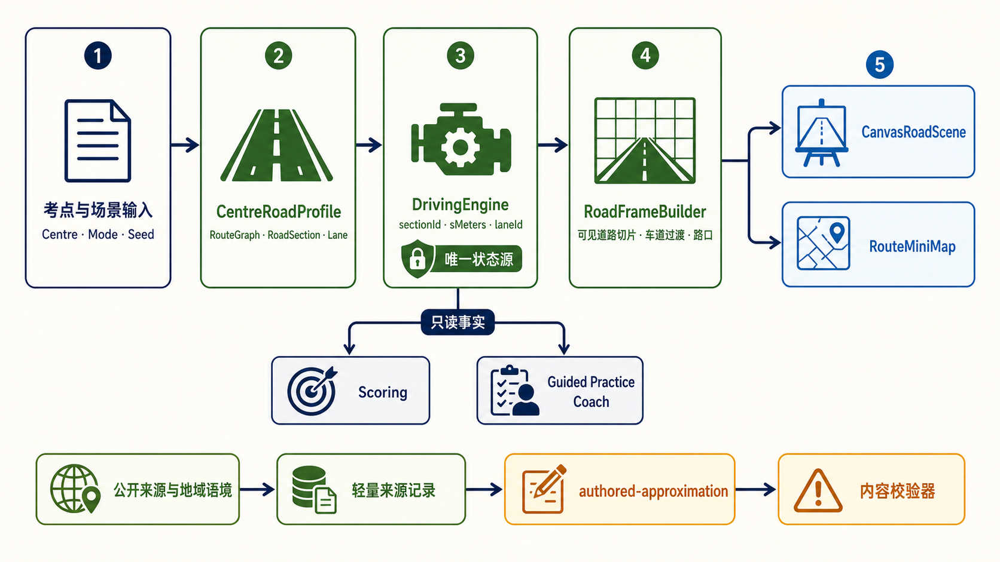

# Design: Ontario G Test Newmarket 道路画像与动态车道拓扑

**日期**: 2026-08-16
**Owner**: nieyuanyuan
**状态**: Draft
**源项目 / 分支**: `nieyy/ontario-g-test / main @ 6ebd9b4`
**相关调研 / 代码讲解 / review**:

- [Ontario G Test 互动驾驶备考游戏调研](../research/2026-08-12-ontario-g-test-interactive-driving-game-research-zh.md)
- [Ontario G Test 互动驾驶备考游戏 MVP 设计](2026-08-12-ontario-g-test-interactive-game-mvp-design-zh.md)
- [Ontario G Test 引导式练习模式设计](2026-08-14-ontario-g-test-guided-practice-mode-design-zh.md)
- [DriveTest 官方考点列表](https://drivetest.ca/find-a-drivetest-centre/find-a-drivetest-centre%20/)
- [Town of Newmarket：Restricted Area for Driving Instructors and Schools](https://www.newmarket.ca/resident-services/by-law-enforcement/restricted-area-driving-instructors-driving-schools)

## 修订记录

| 版本 | 日期 | 作者 | 摘要 |
|---|---|---|---|
| v0.1 | 2026-08-16 | nieyuanyuan | 初版设计：定义 Newmarket 道路画像、动态车道拓扑、地图数据边界和四阶段实现验收计划。 |
| v0.2 | 2026-08-16 | nieyuanyuan | 明确所有路线和道路几何默认采用教学近似，取消真实车道逐项核验及 Owner 内容门禁。 |
| v0.3 | 2026-08-16 | nieyuanyuan | 在 6.1 补充道路画像架构与数据流说明图。 |

## 1. 摘要

- **这个设计解决什么问题**: 当前游戏虽选择了 Newmarket 考点，但道路长期显示为固定三车道，左转专用车道、车道增减、匝道和出口等结构不清楚，考点选择与实际训练内容缺少可感知联系。
- **选择的方向**: 保留现有 React、TypeScript 和 Canvas 2.5D 技术栈，引入内容驱动的 `CentreRoadProfile`、`RouteGraph` 和 `RoadSectionDefinition`。首个道路画像使用已确认的 Newmarket 考点及周边道路名称提供地域语境，所有路线顺序、车道布局和道路几何默认按 `authored-approximation` 创作。
- **预期结果**: 用户在 Newmarket 训练中能自然经历停车场出口、工业道路、城市主干道、左转专用车道、信号灯路口、高速入口、主线和出口；道路变化由路线决定，而不是随机换皮。
- **AI Agent 应该能根据本文直接实现什么**: 数据模型、验证器、道路帧生成器、基于 Canvas 的动态道路渲染、车道角色驱动的操作与评分、路线小地图、存档迁移、自动化测试及 GitHub Pages 发布验收。

本文是两份 Locked 设计的增量设计。考试模式、引导式练习模式、评分归属和“不联网的静态 GitHub Pages”约束保持不变。

## 2. 背景和目标

### 2.1 当前状态

- `CanvasRoadScene` 已使用世界坐标和相机投影绘制道路，支持前进、变道、接近路口和转弯，但道路面、三条车道及路口结构主要由固定几何生成。
- Engine 用 `-1 | 0 | 1` 表示左、中、右车道，无法表达左转袋形车道、汇入车道、出口车道以及车道在路段中途出现或消失。
- `RouteMiniMap` 是固定示意折线和场景进度点，不是由考点路线图生成。
- Newmarket 选择目前主要影响名称和内容入口，未绑定一套可辨识的道路画像。

### 2.2 已核验事实与事实边界

| 事实 | 证据等级 | 设计用途 |
|---|---|---|
| Newmarket DriveTest Centre 地址为 `320 Harry Walker Parkway S, Newmarket, L3Y 7B4` | 官方 DriveTest | 道路画像的起终点语义和考点名称 |
| Newmarket 的限制区域覆盖该考点使用的多条考试路线 | Town of Newmarket | 证明考试路线不应建模成唯一、固定、官方路线 |
| 限制区域及边界涉及 Gorham Street、Prospect Street、Bayview Parkway、Traviss Drive、Leslie Valley Drive、Leslie Street，页面另列 Davis Drive 等允许教学的主要道路 | Town of Newmarket | 确定周边道路语境和候选道路类型，不直接推导精确路线 |

基于 G Test 教学目标，画像将包含地方道路、城市主干道、左转袋形车道、高速入口、主线和出口等道路类型；这是产品设计决定，不是对真实考试路线的事实声明。

以下内容不得表述为事实：

- 不声称游戏路线是 DriveTest 官方路线、考试预测路线或某次考试的精确复现。
- 不根据个人复盘或社区帖子推断固定行驶顺序、精确限速、车道数和信号相位。
- 考点地址和道路名称以公开来源为地域背景；所有路线顺序、道路断面、车道数、路口、限速参数和 Highway 404 出入口均默认标为 `authored-approximation`。
- 首版不提供任何“精确对应真实路口”的道路几何，因此不需要 Owner 逐项批准道路细节。

### 2.3 痛点 / 动机

- 左转专用车道只有操作提示，没有足够明确的道路扩宽、车道箭头和边界线，用户不能从道路本身判断位置。
- 所有场景长期保持三条同向车道，使地方道路、主干道和高速路没有结构差异。
- 固定 `-1 | 0 | 1` 让“变到右侧出口车道”和“进入左转袋形车道”只能伪装成相同的横向位移，容易再次出现画面与状态不一致。
- 考点选择没有绑定路线图和道路断面，削弱了面向不同考点扩展的意义。

### 2.4 目标

1. 用稳定车道 ID 和车道角色表达道路，而不是假设永远存在左、中、右三条车道。
2. 为 Newmarket 建立一套静态、可审计、可版本化的道路画像。
3. 让左转专用车道、汇入、出口和车道数量变化从驾驶视角中清楚可见，并与 Engine 状态一致。
4. 同一条路线图同时驱动主视图、车道操作提示、小地图、引导式练习和评分事实。
5. 保持纯静态部署、无付费地图、无运行时地图请求，并为未来增加其他考点提供可复用模型。

### 2.5 非目标

- 不制作实时 3D、卫星图、Street View、精确建筑模型或照片级复刻。
- 不承诺道路比例、建筑、交通灯位置和路线与现实 1:1 一致。
- 不在本阶段增加 AI 交通流、行人仿真、天气、昼夜或多车物理系统。
- 不新增 Newmarket 之外的考点画像，只验证模型具备扩展能力。
- 不重写考试评分规则，不让 Coach 层直接改变路况或评分。
- 不接入 Google Maps、Google Street View、在线 Nominatim、在线 Overpass 或地图瓦片服务。

### 2.6 约束

- 继续部署到 `https://nieyy.github.io/ontario-g-test/`，首屏和训练过程中不得依赖业务网络请求。
- 考点地址、道路名称和区域语境的公开来源必须离线记录在仓库内的小型数据文件；不得提交第三方瓦片、Street View 截图或受限素材。
- 首版不复制或追踪 OpenStreetMap/Google Maps 的坐标和几何，也不提交地图截图或瓦片；地图只用于人工理解周边道路语境。
- Agent 可以按教学需要创作车道数、转弯袋、匝道和限速参数，但必须标为 `authored-approximation`，且不得描述为现实道路事实。
- Mac 桌面和手机横屏均需可辨识；动态道路不能牺牲既有键盘、触控和无障碍语义。

### 2.7 成功标准

- Newmarket 路线至少包含 7 类可辨识道路断面：停车场出口、双向地方道路、城市多车道主干道、左转袋形车道、信号灯路口、高速入口/加速车道、高速主线/出口车道。
- 用户无需看文字提示，仅看道路即可在 3 秒内指出左转专用车道；桌面与手机横屏各由 Owner 验收一次。
- 路线中同向可用车道数至少出现三种状态，例如 1、2、3 条；变化必须由 RoadProfile 决定且可重复。
- Engine 的 `laneId`、车道角色、可执行动作、Canvas 位置和小地图位置在所有路段保持一致。
- 左转车道必须具有可见的车道分叉/扩宽、方向箭头、边界线和动态操作标签；匝道和出口具有相应车道角色。
- Exam 与 Guided Practice 使用同一道路事实和随机种子时得到相同路线；Coach 只能解释，不能改变道路。
- 全部既有自动化测试通过，并新增道路拓扑验证、关键帧截图和完整路线 E2E。
- 生产构建无地图业务网络请求，GitHub Pages 公开 smoke test 通过。

## 3. 当前系统对齐

| 区域 / 模块 | 当前行为 | 对设计的影响 |
|---|---|---|
| `src/components/CanvasRoadScene.tsx` | 固定道路几何和三条同向车道；有相机和世界坐标基础 | 保留 Canvas，拆出道路帧生成；禁止继续用 CSS/Canvas 偏移伪装变道 |
| `src/domain/roadGeometry.ts` | 提供投影和道路几何辅助 | 扩展为路线局部坐标、道路切片、车道边界和路口裁剪的唯一几何来源 |
| `src/domain/engine.ts` | `lane: -1 | 0 | 1` 为驾驶状态 | 增加 `sectionId`、`sMeters`、`laneId`；旧整数只能作为短期兼容派生值 |
| `src/content/types.ts` | 场景描述考试任务，缺少完整道路断面 | 新增道路画像类型；Scenario 通过 `routeBinding` 引用道路图，不复制几何 |
| `src/content/data.ts` | 6 类、18 个场景变体 | 保留教学覆盖面，把场景落到具体道路段和决策区 |
| `src/content/validate.ts` | 校验场景及内容版本 | 增加图连通、车道生命周期、转向合法性、证据等级和来源声明校验 |
| `src/components/RouteMiniMap.tsx` | 固定示意线和进度点 | 改为消费 RouteGraph 的简化几何及节点名称 |
| `src/domain/coach.ts` | 根据 Engine facts 生成提示 | 新增车道角色事实；Coach 不读取 Canvas，也不能改变 RouteGraph |
| checkpoint / localStorage | 保存当前训练进度和旧 lane | 车道主键变化需要 checkpoint v3 和明确的兼容/放弃策略 |
| GitHub Pages | 静态发布 | 所有数据随 bundle 发布，不引入运行时地图依赖 |

## 4. 候选方案

| 方案 | 核心思路 | 优点 | 缺点 / 风险 | 判断 |
|---|---|---|---|---|
| A. 内容驱动的 Canvas 2.5D 道路语法 | 用 RoadProfile、RouteGraph、RoadSection 生成道路切片，继续由现有 Canvas 绘制 | 沿用现有引擎、输入、测试和静态部署；能精确控制教学表达 | 需要重构固定车道状态和渲染边界；几何测试工作量较大 | **选择** |
| B. 预制 SVG/图片场景切换 | 每种道路结构制作一张静态背景，在节点切换 | 实现快，视觉可控 | 缺乏连续接近感；变道、路口和车道增减仍容易画面/状态脱节 | 不选 |
| C. MapLibre/地图瓦片或 3D 引擎 | 使用真实地图底图或 3D 路网 | 地理感强，后续扩展空间大 | 引入地图许可、瓦片、网络、性能和相机复杂度；超出备考目标 | 不选 |

## 5. 选择

**选择的方案**: 方案 A，以“参数化道路语法 + Newmarket 教学近似道路画像 + 轻量来源记录”扩展现有 Canvas 2.5D。

**为什么选它**:

- 当前最需要解决的是车道结构和交互状态一致性，不是提高纹理精度。
- 现有相机、世界坐标、输入、评分和 Pages 部署可以继续使用，重构范围可控。
- 7 类道路断面已经足以让 Newmarket 选择产生明确训练意义，也能复用于未来其他考点。
- 所有路线和证据可进入代码审查与测试，不依赖外部服务变化。

**为什么不选其他方案**:

- **A**: 选择；其复杂度集中在可测试的数据和几何层，长期收益高。
- **B**: 适合作为装饰背景补充，不适合作为道路状态的真相来源。
- **C**: 视觉和地理能力超出 MVP 增强需求，且与免费、静态、低维护目标冲突。

**后果 / 取舍**:

- **什么会变简单**: 新增路段、考点和车道角色；验证“画面是否对应状态”；复用道路结构；解释引导提示。
- **什么会变困难**: 内容制作需要证据审计；道路断面连接和近裁剪必须有系统测试；旧存档不能无条件恢复。
- **可能引出的后续决策**: 是否制作第二个考点画像；是否引入更多装饰资产；是否提供教学路线编辑器。这些都不属于本设计。

## 6. 详细设计

### 6.1 架构 / 流程

```text
[Centre selection + mode + scenario seed]
  -> [CentreRoadProfile / RouteGraph / Scenario routeBinding]
  -> [DrivingEngine: sectionId + sMeters + laneId]
  -> [RoadFrameBuilder: visible road slices + lane transitions + intersections]
  -> [CanvasRoadScene]
       -> road surface / markings / arrows / signals / scenery
       -> dynamic lane controls and accessible road summary
  -> [RouteMiniMap: same RouteGraph]

[DrivingEngine facts]
  -> [Scoring]
  -> [Guided Practice Coach]

[offline context review]
  -> [lightweight source ledger]
  -> [authored-approximation static profile]
  -> [content validator]
```



图 1：道路画像、驾驶状态、道路帧和界面消费者的数据流。`DrivingEngine` 是车辆位置与车道状态的唯一真相来源；Scoring 和 Guided Practice Coach 只读取事实，不反向修改驾驶状态。底部链路表示真实名称只提供地域语境，道路几何统一作为 `authored-approximation` 进入内容校验。

边界原则：

1. `CentreRoadProfile` 是考点道路内容的唯一入口。
2. `DrivingEngine` 是车辆位置、车道和动作结果的唯一真相来源。
3. `RoadFrameBuilder` 只把 Engine 状态和静态内容转换为可绘制几何，不判分。
4. Canvas、Coach 和 MiniMap 都是消费者，任何一个都不得保存独立的“当前车道”。
5. 地图只在内容制作阶段帮助理解地域语境；不得追踪或复制真实几何，浏览器运行时不得向地图服务请求数据。

### 6.2 数据 / 状态模型

```ts
type EvidenceLevel =
  | "verified-context"
  | "authored-approximation";

type RoadSectionTemplate =
  | "parking-exit"
  | "two-way-local"
  | "urban-arterial"
  | "turn-pocket-intersection"
  | "freeway-on-ramp"
  | "freeway-mainline"
  | "freeway-off-ramp";

type LaneRole =
  | "through"
  | "left-turn"
  | "right-turn"
  | "merge"
  | "exit"
  | "parking-access"
  | "opposing";

type LaneBoundary =
  | "none"
  | "dashed-white"
  | "solid-white"
  | "single-yellow"
  | "double-yellow"
  | "curb";

interface LaneDefinition {
  id: string;
  direction: "forward" | "opposing";
  role: LaneRole;
  widthM: number;
  startsAtM: number;
  endsAtM: number;
  leftBoundary: LaneBoundary;
  rightBoundary: LaneBoundary;
  arrows: Array<"straight" | "left" | "right">;
  allowedMovements: Array<"continue" | "left" | "right" | "merge" | "exit">;
}

interface LaneTransition {
  atM: number;
  kind: "continue" | "split" | "merge" | "turn";
  fromLaneIds: string[];
  toLaneIds: string[];
}

interface RoadEvidence {
  id: string;
  level: EvidenceLevel;
  sourceUrl?: string;
  observedAt: string;
  supports: string[];
  notes: string;
}

interface RoadSectionDefinition {
  id: string;
  template: RoadSectionTemplate;
  displayName: string;
  trainingLabel: string;
  lengthM: number;
  speedLimitKph: number | null;
  lanes: LaneDefinition[];
  transitions: LaneTransition[];
  intersection?: IntersectionDefinition;
  evidenceRefs: string[];
  fidelity: EvidenceLevel;
}

interface RouteEdge {
  id: string;
  fromNodeId: string;
  toNodeId: string;
  sectionId: string;
  miniMapPath: Array<{ x: number; y: number }>;
}

interface CentreRoadProfile {
  id: string;
  centreId: "newmarket";
  version: "1.0.0";
  displayName: string;
  disclaimer: string;
  sourceNotices: string[];
  evidence: RoadEvidence[];
  sections: RoadSectionDefinition[];
  routes: RouteGraph[];
}

interface RoadPosition {
  routeId: string;
  sectionId: string;
  sMeters: number;
  laneId: string;
}
```

#### Newmarket v1 道路画像

画像不是一条声称真实的考试路线，而是按 Newmarket 周边道路语境组织的教学走廊：

| 顺序 | 教学路段 | 必须呈现的结构 | 事实标记策略 |
|---|---|---|---|
| 1 | DriveTest 起步与停车场出口 | 低速、停车线、左右观察、驶入道路 | 考点地址为事实；停车场结构全部为教学近似 |
| 2 | Harry Walker 风格工业/地方道路 | 双向道路、每方向一条主要车道、路边工业语境 | 道路名称提供地域感；连接和断面为教学近似 |
| 3 | 城市信号灯路口 | 路口由远及近、停止线、交通灯、横向道路 | 使用匿名训练路口，不暗示对应某个真实路口 |
| 4 | 左转袋形车道 | 同向道路扩宽、专用左转车道、箭头、实/虚线过渡 | 按 G Test 教学目标创作，不绑定真实路口 |
| 5 | Davis/Leslie 风格城市主干道 | 多车道、较长直行、连续路口语境 | 道路名称提供地域感；车道数和路口为教学近似 |
| 6 | Highway 404 风格入口和加速车道 | 弧形匝道、加速车道、汇入点、主线 gap | 不指定或预测真实考试入口，训练参数为教学近似 |
| 7 | Highway 404 风格主线与出口 | 多车道主线、出口预告、减速车道、离开主线 | 不指定或预测真实考试出口，训练参数为教学近似 |
| 8 | 返回城市道路 | 车道减少、城市限速语境、回到考点终点 | 为 15–20 分钟教学闭环，可明确标教学路线 |

道路数量变化必须源于上述路段：地方道路 1 条同向车道、教学主干道 2 条、高速主线 3 条训练车道，左转/加速/出口车道按距离出现和结束。这些数字是教学参数，不代表相应真实道路的精确车道数；禁止为追求变化而随机改车道数。

#### 车道生命周期与连接规则

- 每条车道必须有稳定 `laneId`；画面、Engine、评分和提示均使用同一 ID。
- `startsAtM`/`endsAtM` 不得孤立存在，必须有对应 `split`、`merge`、`turn` 或路段边界 transition。
- 车辆位置为 `sectionId + sMeters + laneId`；路段切换时必须通过 `LaneTransition` 映射到下一车道。
- 变道只选择当前位置可达的相邻 forward lane。对向车道、实线隔离、已经结束的车道和非相邻车道不可选。
- “左/中/右”仅为屏幕上基于当前断面的相对描述，不再是持久状态。
- 左转动作只有在车道 `allowedMovements` 包含 `left` 且进入路口 decision zone 后才有效。
- 左转袋形车道至少在 decision zone 前留出足够教学距离，使用户完成 Mirror–Signal–Shoulder–Move 流程；具体距离由场景参数定义并接受测试，不硬编码在 Canvas。

#### 道路帧

`RoadFrameBuilder` 根据当前位置生成相机前后有限范围内的 `RenderRoadSlice[]`。每个切片含中心线、道路左右边界、当前存在的车道多边形、标线、箭头、路口裁剪和信号设施。所有道路元素共享同一局部坐标与投影过程，禁止独立用屏幕坐标移动停止线或交通灯。

这条规则直接防止以下历史问题：横向道路或白线漂浮、路口永远固定在车前、方向盘转动但车辆仍在原车道、信号灯与路口脱离。

#### 迁移 / 回填 / 兼容性

- 应用目标版本：`1.2.0`；道路内容版本：`1.2.0`；`CentreRoadProfile.version` 独立从 `1.0.0` 开始。
- checkpoint 升级为 v3，保存 `RoadPosition`、profile ID/version 和 route seed。
- v2 checkpoint 只有在当前场景能无歧义映射到兼容三车道路段时才迁移；否则显示“旧驾驶无法继续，但历史记录仍保留”，由用户确认后开始新驾驶。
- 已完成的 AttemptRecord 和训练报告继续可读；新增 `roadProfileId`、`routeId`、`sectionIds` 为可选字段。
- 一个发布周期内可保留由 `laneId` 派生的 legacy lane index 供旧组件读取，但禁止写回或作为判分依据。

### 6.3 API / CLI / 接口变更

#### 对外接口

- URL 和 GitHub Pages 路径不变。
- 考点选择 Newmarket 后加载 `newmarket-road-profile-v1`；界面显示“Newmarket-inspired training route / Newmarket 教学近似路线”免责声明。
- 训练 HUD 动态显示当前道路类型、车道角色和下一个关键结构；考试模式只显示现实驾驶中合理的信息，不暴露答案。
- About/页脚显示考点及道路名称来源，并明确几何为人工教学近似。

#### 内部接口

```ts
createDrivingSession({ centreId, mode, routeSeed }): DrivingSession;
advanceRoadPosition(position, deltaMeters, profile): RoadAdvanceResult;
requestAdjacentLane(position, direction, profile): LaneChangeResult;
requestTurn(position, direction, profile): TurnResult;
buildRoadFrame(position, profile, viewport): RoadFrame;
getAvailableLaneActions(position, profile): LaneAction[];
getRouteMiniMap(routeId, profile): MiniMapModel;
```

#### 输入校验

- 所有引用 ID 必须存在且在 profile 内唯一。
- RouteGraph 从起点到终点必须连通；每条 edge 对应存在的 section。
- 同一路段同方向车道在同一纵向范围内不得几何重叠。
- lane transition 的输入输出必须在 `atM` 处存在，且不能指向 opposing lane。
- 车道箭头必须与 `allowedMovements` 一致。
- `verified-context` 只允许用于考点地址、公开道路名称及区域语境，并且必须有来源 URL、审阅日期和说明。
- 道路几何和训练参数必须是 `authored-approximation`，并有用户可见免责声明；教学限速可以明确给出，但不能冒充现实道路限速。

#### 输出 / 错误形态

- 内容校验错误在构建阶段失败，包含 profile、section、lane 和规则编号。
- 运行时遇到无效车道引用时暂停训练并显示可恢复错误，不把车辆静默吸附到另一车道。
- 到达车道末端而没有合法 transition 时 Engine 停在安全边界并记录诊断事件；生产内容不得依赖该兜底。

### 6.4 关键流程

| 流程 | 入口 | 步骤 | 结果 |
|---|---|---|---|
| 开始 Newmarket 训练 | 选择考点、模式和路线 | 解析 profile → 选择 RouteGraph → 创建 RoadPosition → 建第一帧 | 主视图、小地图、引导和评分共享同一路线 |
| 接近左转袋形车道 | 车辆进入 split 前的预告范围 | 绘制逐渐扩宽的道路 → 新车道从 transition 出现 → 箭头和边界进入视野 → 开放相邻变道 | 用户能看见并进入真实存在的左转车道 |
| 执行变道 | 键盘或触控请求相邻车道 | Engine 校验相邻关系和边界 → 建立 lane-change transition → 相机相对道路中心线平滑横移 → 完成后更新 laneId | 方向盘只在过渡期间偏转，车道与视角同步 |
| 通过信号灯路口 | 距离随速度减少 | 同一世界坐标投影让停止线、横向道路和信号灯由远及近 → decision zone 开放转向 → 转弯后进入目标 section/lane | 不再出现漂浮白线或固定在车前的路口 |
| 高速汇入 | 进入 on-ramp | 弯道 → 加速车道 → gap 判断 → merge transition → 主线 laneId | 视觉结构和汇入评分使用同一 transition |
| 显示路线小地图 | session 创建或位置更新 | 从 RouteGraph 取简化路径 → 标注道路类型和关键节点 → 将 `sMeters` 投影到当前 edge | 小地图反映考点画像而非固定六个点 |

### 6.5 错误处理和边界

- **预期错误**: 无相邻车道、实线禁止变道、车道尚未出现、错过转弯、到达 merge/exit 末端、内容版本不匹配、旧存档无法迁移。
- **重试 / 超时行为**: 用户操作不自动重试；引导模式给出原因和下一步，考试模式只记录结果。内容加载来自本地 bundle，不设计网络重试。
- **部分失败行为**: 装饰物失败不能影响道路；小地图失败时主训练仍可继续并显示“Map unavailable”；道路 profile 校验失败则禁止开始该考点。
- **并发 / 顺序**: 每一动画帧先更新 Engine，再生成 RoadFrame，最后渲染 HUD/Canvas；同一帧内多个方向请求按事件时间只接受第一个有效动作。
- **幂等性**: 相同 profile version、route seed、初始状态和输入序列必须产生相同 RoadPosition、评分和路线。
- **边界**: 低速/停车时也可观察和打灯；车道变化速度受动画限制，但判定以 Engine transition 状态为准；页面失焦后暂停输入。

### 6.6 可观测性和运维

- **日志**: 仅开发模式输出结构化事件：profile load、section enter、lane transition、intersection zone、migration result、geometry invariant failure。不得记录个人信息或上传日志。
- **指标**: MVP 不收集匿名遥测。测试报告记录 bundle 大小、关键帧计算耗时和自动化结果。
- **告警**: 无后端告警；GitHub Actions 构建、测试和 Pages deployment failure 为发布信号。
- **调试命令 / 查询**: 提供开发页或 query flag，显示 `routeId / sectionId / sMeters / laneId / laneRole / availableActions`，生产默认关闭。
- **回滚 / 禁用开关**: `NEWMARKET_ROAD_PROFILE_ENABLED` 构建开关；关闭后回到 v1.1 固定场景兼容路径。开关仅作一个版本的迁移保险，不形成长期双实现。

## 7. 分阶段实现与验证计划

> 实现和测试放在一起写。每个阶段都要具体到 AI Agent 可以实现、验证，并在阶段边界停下来，不需要临时发明范围。

### Phase 1: 教学道路画像、数据模型与验证器

**目标**: 在不改变生产画面的前提下，建立默认采用教学近似的 Newmarket 道路画像骨架和严格内容契约。

**实现范围**:

- [ ] 新增 `src/content/roadProfiles/types.ts`、`newmarket.ts`、`evidence.ts` 和 fixtures。
- [ ] 新增 `src/content/roadProfiles/validate.ts`，实现 ID、图连通、车道生命周期、transition、箭头和证据等级校验。
- [ ] 建立轻量来源记录：确认考点地址、可使用的道路名称和 Newmarket 周边道路语境；不记录、复制或声称精确车道数、路口和出入口。
- [ ] 在 `src/content/types.ts` 增加 `routeBinding`，但 feature flag 默认关闭。
- [ ] 在 About/README 准备教学近似、非官方路线和公开名称来源文案。

**数据 / migration 改动**:

- [ ] 新增 `CentreRoadProfile v1.0.0`，不修改现有 checkpoint。
- [ ] 所有具体路口、车道断面和出入口统一使用 training label 和 `authored-approximation`。

**Agent 执行约束**:

- **必须遵守**: 只提交小型静态内容；`verified-context` 有公开来源；所有道路几何和训练参数明确为 `authored-approximation`。
- **禁止做**: 提交或追踪地图图片、瓦片、坐标和几何；调用运行时地图 API；把社区路线当官方路线；宣称精确复刻真实路口、入口或出口。
- **不确定时先问**: 需求要求引入真实坐标、第三方派生几何，或要求把某个场景描述为精确对应现实道路时。

**本阶段验证**:

- **自动化测试**: validator 正/反 fixtures；断链 graph、悬空 lane、非法 opposing transition、箭头不匹配、缺证据和重复 ID 均必须失败。
- **手工 / workflow 验证**: 检查路线选择页、About 和训练界面均明确展示教学近似与非官方路线声明。
- **回归检查**: feature flag 关闭时现有页面截图、输入、评分和保存行为不变。
- **失败 / 边界检查**: profile 缺失、版本错误、空 route、单车道路段、缺少教学近似标记、将几何误标为 `verified-context`。

**退出标准**:

- [ ] Newmarket profile 通过 validator，且 `verified-context` 只包含有来源的名称和区域语境。
- [ ] 全部路线、道路断面、车道数、路口和出入口均标记为 `authored-approximation`，产品已展示教学近似与非官方路线声明。
- [ ] 既有测试全部通过，生产画面没有变化。

### Phase 2: 动态车道内核与左转路口垂直切片

**目标**: 完成“地方道路 → 左转袋形车道 → 信号灯左/右转 → 下一路段”的端到端垂直切片，消除固定三车道模型。

**实现范围**:

- [ ] 在 `src/domain/engine.ts` 引入 `RoadPosition`、稳定 `laneId`、相邻车道请求和路段 transition。
- [ ] 扩展 `src/domain/roadGeometry.ts`，新增 route-local 坐标、道路切片、车道边界、路口裁剪和 near-plane 规则。
- [ ] 新增 `src/domain/roadFrame.ts`，成为 Canvas 所有道路面、标线、箭头和信号设施的几何来源。
- [ ] 重构 `CanvasRoadScene.tsx`，绘制动态车道数、袋形左转车道、方向箭头、停止线和由远及近的信号灯路口。
- [ ] 动态生成可用车道操作和标签，例如“Move left to left-turn lane”，不再永久显示 Left/Centre/Right。
- [ ] 方向盘仅跟随进行中的 lane-change/turn transition，并限制到视觉合理角度，完成后回正。

**数据 / migration 改动**:

- [ ] 新增 checkpoint v3 reader/writer；保留已完成历史记录。
- [ ] 为旧三车道场景提供一层 `laneId` 兼容映射，flag 关闭时不改变旧行为。

**Agent 执行约束**:

- **必须遵守**: Engine 先更新状态，Canvas 只消费 RoadFrame；停止线、横向道路、交通灯和车道线全部使用统一世界坐标。
- **禁止做**: 用旋转方向盘、平移仪表盘或平移整张背景伪装车辆转向/变道；在 Canvas 内复制 lane 状态；用固定屏幕坐标放路口元素。
- **不确定时先问**: checkpoint 无歧义迁移不可保证；旧评分断言与新车道角色发生语义冲突。

**本阶段验证**:

- **自动化测试**: lane adjacency、split/merge/turn、路段切换、可用动作、投影/裁剪、确定性重放和 checkpoint 迁移单元测试。
- **手工 / workflow 验证**: Mac 键盘和手机触控各跑一次垂直切片；从远处看到左转车道出现，进入后车身视角确实移动，路口穿过视野并完成转向。
- **回归检查**: Mirror–Signal–Shoulder–Move、速度保持、音频、小地图容器、Pause 和评分不回退。
- **失败 / 边界检查**: 在车道出现前请求变道、越过实线、错过袋形车道、到停止线仍在错误车道、反复按键、页面失焦。

**退出标准**:

- [ ] 左转专用车道不依赖文字也能被 Owner 识别。
- [ ] Engine、Canvas、HUD 的 `laneId` 在自动化断言和手工观察中一致。
- [ ] 不再出现漂浮白线、固定路口、脱离路口的信号灯或方向盘长时间不回正。

### Phase 3: 完整 Newmarket 教学走廊与模式接入

**目标**: 把七类道路断面接成 15–20 分钟路线，并让 Exam、Guided Practice、典型场景和小地图消费相同道路画像。

**实现范围**:

- [ ] 完成停车场出口、地方道路、城市主干道、左转路口、高速入口、主线、出口及返回道路的 RoadSections。
- [ ] 将 6 类教学场景通过 `routeBinding` 放入合适路段和 decision zone；不改变既有评分所有权。
- [ ] 重构 `RouteMiniMap.tsx`，从 RouteGraph 绘制简化路线、关键道路类型、当前 edge 和进度。
- [ ] 扩展 Coach facts：`lane-role-is`、`lane-transition-available`、`intersection-distance-band`、`road-section-kind`。
- [ ] 练习模式显示结构性提示；考试模式隐藏答案式提示，但保留现实可见道路标线。
- [ ] 增加动态 accessible road summary，朗读当前道路类型、可用同向车道数和当前车道角色。

**数据 / migration 改动**:

- [ ] Scenario/content version 升至 1.2.0；AttemptRecord 可选记录 profile、route 和 section IDs。
- [ ] 固定 seed fixture 覆盖一条完整 Newmarket route，确保 Exam 和 Practice 路况一致。

**Agent 执行约束**:

- **必须遵守**: 车道数量变化由 profile 决定；真实道路名只提供地域语境，几何保持教学近似；小地图与 Canvas 使用同一 RouteGraph。
- **禁止做**: 为每个场景重新创建一份不一致道路；Coach 修改 RoadPosition；随机增减车道；把小地图标成官方考试路线。
- **不确定时先问**: 某场景无法自然映射到教学近似路段；完整路线时长只能靠拉长无内容直路满足。

**本阶段验证**:

- **自动化测试**: 完整路线图连通、所有场景可达、固定 seed 重放、Coach/Exam 路况相同、MiniMap 进度、无障碍标签和内容快照。
- **手工 / workflow 验证**: 用 Exam 和 Guided Practice 各完成一条路线；核对同向 1/2/3 车道、左转袋、入口、主线、出口均自然出现。
- **回归检查**: 六类场景的结果、危险后继续练完、反馈语气和报告结构符合两份 Locked 设计。
- **失败 / 边界检查**: 错过出口、错误车道转弯、汇入失败、路线暂停/恢复、刷新后 checkpoint、手机横屏小地图降级。

**退出标准**:

- [ ] Newmarket 考点选择产生清楚、稳定、可重复的道路画像。
- [ ] Exam、Guided Practice 和典型场景均通过端到端验收。
- [ ] 页面无业务网络请求，教学近似声明和公开名称来源可见。

### Phase 4: 发布硬化、公开验收与旧实现退场

**目标**: 完成 1.2.0 发布质量验证，在公开 GitHub Pages 上验收后移除临时兼容风险。

**实现范围**:

- [ ] 增加桌面与手机横屏关键帧视觉回归：地方道路、袋形左转、路口近景、匝道汇入、出口。
- [ ] 增加 15–20 分钟完整路线 E2E、checkpoint v2/v3、feature flag 和回滚测试。
- [ ] 更新 README、版本号、公开免责声明、来源声明、操作说明和 release notes。
- [ ] 检查并删除 Phase 2/3 遗留的调试覆盖层、未使用兼容代码和占位道路数据。
- [ ] 构建并发布 GitHub Pages，验证生产 URL 和静态资源 base path。

**数据 / migration 改动**:

- [ ] 锁定 `newmarket-road-profile-v1` 内容 hash 和轻量来源记录。
- [ ] 保留 checkpoint v2 reader 一个发布周期；不得删除历史 AttemptRecord。

**Agent 执行约束**:

- **必须遵守**: 发布前以真实 Pages URL 完成 smoke test；测试截图必须检查道路结构而不只检查元素存在；任何证据或许可问题阻止发布。
- **禁止做**: 为赶发布降低 validator 严格度；用跳过 E2E 掩盖不稳定；未验证就移除回滚开关。
- **不确定时先问**: 公开页面出现与地图许可、官方关联或“考试路线”措辞有关的歧义；旧存档迁移会丢失用户历史。

**本阶段验证**:

- **自动化测试**: lint、typecheck、unit/component、完整 Playwright、build、静态产物无意外外链请求；现有回归套件全部通过。
- **手工 / workflow 验证**: Owner 在 Mac 完成一次 15–20 分钟 Exam smoke test，并在手机横屏完成 Guided Practice 关键场景；检查左转线、车道变化、路口接近、小地图和报告。
- **回归检查**: GitHub Pages 刷新深链、音频解锁、键盘/触控、存档恢复、About/来源声明、无控制台错误。
- **失败 / 边界检查**: 禁用 flag 回到旧实现；损坏 checkpoint；离线加载；窄屏；低帧率设备的降级表现。

**退出标准**:

- [ ] 全部自动化与公开 smoke test 通过，测试报告归档至 `docs/test-reports/`。
- [ ] Owner 确认 Newmarket 画像有训练意义且没有误导为官方固定路线。
- [ ] 发布 `1.2.0`；稳定观察一个发布周期后再决定移除旧道路兼容路径。

### 整体验收

| 验收领域 | 验证内容 | 命令 / 方法 | 合并前是否必须 |
|---|---|---|---|
| 单元 / 组件 | profile validator、图连通、车道 transition、Engine、RoadFrame、Coach facts、MiniMap | 使用仓库 `package.json` 已定义的 unit/typecheck/lint 命令 | Yes |
| 集成 / workflow | 完整路线、模式一致性、checkpoint v3、固定 seed 重放 | integration tests + production build preview | Yes |
| 端到端 / 运维 | 键盘/触控完成地方路—左转—高速—出口；公开 Pages smoke test | Playwright desktop/mobile + `https://nieyy.github.io/ontario-g-test/` | Yes |
| 回归测试 | 既有 Exam/Guided Practice、评分、速度、音频、暂停、报告 | 全量既有测试套件 | Yes |
| 回滚 / 兼容性 | flag 关闭、v2 checkpoint、旧报告可读 | migration fixtures + 手工回滚演练 | Yes |
| 内容与许可 | 轻量来源记录、教学近似声明、非官方路线声明、零地图运行时请求 | 人工审阅 + 浏览器 Network 面板 | Yes |

**必要测试数据 / fixtures**:

- 合法的 Newmarket 完整 profile 和每类 RoadSection 最小 fixture。
- 断链 route、悬空 lane、无 transition 的车道结束、非法对向变道、错误箭头、把道路几何误标为 `verified-context` 的内容。
- v2 可迁移、v2 不可迁移、v3 正常和损坏 checkpoint。
- 固定输入序列：地方路行驶、进入左转袋、完成转弯、匝道加速汇入、进入出口车道、错过出口。

**性能 / 规模检查**:

- RoadFrame 只生成相机可见范围切片，不遍历或绘制整条路线。
- 在目标 Mac 浏览器保持流畅 60 fps；中等手机允许降级到稳定 30 fps，不因小地图重复计算明显掉帧。
- profile 和小地图为小型静态数据；构建产物体积增量需记录，异常增长必须解释。
- 性能测试不以 CI 的绝对帧率作为唯一门槛，同时记录 RoadFrame 构建耗时和长任务。

**向后兼容检查**:

- 已完成报告可读；旧 checkpoint 给出明确迁移结果；旧 URL、Pages base path 和本地设置不变。
- 关闭 feature flag 后能恢复 v1.1 行为；不出现新旧 Engine 同时更新状态。

**失败注入 / 负向测试**:

- 删除 section、lane 或来源引用，或把几何误标为 `verified-context`，构建必须失败。
- 在车道开始前/结束后请求变道、从 opposing lane 请求 transition、在错误车道转弯，Engine 必须拒绝且画面不移动。
- 模拟 Canvas context 丢失、小地图模型异常和 localStorage 损坏，提供可恢复降级。
- 阻断网络后完整训练仍可运行；若训练请求地图域名则验收失败。

## 8. 发布和回滚

- **发布顺序**: 合并 profile/schema（flag off）→ 合并垂直切片（flag off）→ 完整路线和 E2E → 打开 flag → 发布 1.2.0 → 公开 smoke test。
- **Feature flag / 配置开关**: `NEWMARKET_ROAD_PROFILE_ENABLED`；生产启用前必须通过 Phase 4。开关不通过 query string 暴露给普通用户。
- **部署顺序**: 本地全量测试 → production build preview → push main → GitHub Actions Pages → 生产 URL 验证。
- **发布期间监控**: Actions 状态、Pages HTTP/静态资源、浏览器 console、关键操作和 checkpoint 恢复；不新增用户遥测。
- **回滚步骤**: 先关闭 build flag 并重新部署；若问题仍在，回退到最后通过 smoke test 的 Pages commit。
- **如果回滚，数据如何清理**: 不删除 AttemptRecord；v3 checkpoint 保留但旧版本不自动读取，重新启用后可恢复。只有用户显式确认才清除不可恢复的当前驾驶。

## 9. 风险和缓解

| 风险 | 影响 | 缓解方式 | 测试 / 信号 |
|---|---|---|---|
| 把教学路线误解成官方考试路线 | 误导考生、损害可信度 | 全程使用 “Newmarket-inspired / 教学近似”，记录证据等级，不提供路线预测 | 文案审阅、About 和路线选择页检查 |
| 地图数据许可不清 | 无法安全发布 | 首版不复制/追踪第三方地图几何或素材，只保存公开名称来源和人工 authored 结构 | 来源记录、Network/仓库资产审计 |
| 车道状态与画面再次脱节 | 核心交互失真 | Engine 单一真相、稳定 laneId、RoadFrame 单一路径、禁止屏幕偏移伪装 | 输入重放、截图关键帧、状态覆盖层 |
| 路段连接产生漂浮标线或跳变 | 视觉诡异、无法判断路口距离 | 统一世界坐标、切片裁剪、transition 几何规则、near-plane 测试 | geometry tests、由远及近 E2E |
| 内容模型过度复杂 | 延期且难维护 | 首版只做 7 类模板和一条教学走廊，不做通用地图编辑器 | 代码规模审阅、Phase 边界 |
| 真实道路发生变化 | 地域语境可能过时 | profile 版本化，来源记录观察日期；道路几何始终声明为教学近似，不宣称实时地图 | 发布复核清单、过期提示 |
| checkpoint v2 无法安全迁移 | 用户当前进度中断 | 历史保留、仅无歧义迁移、明确提示开始新驾驶 | migration fixtures |
| 手机性能或可读性不足 | 目标用户无法使用 | 可见范围切片、装饰降级、动态文字摘要和手机横屏验收 | mobile E2E、性能记录 |

## 10. AI Agent 交接检查清单

- [x] 明确列出了要改的文件 / 模块。
- [x] 每个阶段都把实现范围、验证方式和退出标准放在一起。
- [x] 整体验收写清楚必须执行的命令或手工检查。
- [x] 高风险决策标成“不确定时先问”。
- [x] 非目标足够明确，能防止实现时扩大范围。
- [x] 当前发布 commit、目标版本、feature flag 和迁移边界明确。
- [x] 真实道路事实、教学近似和官方路线声明的边界明确。
- [x] Canvas、Engine、Coach、MiniMap 的状态所有权明确。

## 11. Open Questions

- [ ] **Phase 2 视觉门禁**: Owner 在 Mac 与手机横屏确认左转袋形车道、车道增减、停止线和信号灯无需文字解释也能正确辨识。
- [ ] **Phase 3 教学门禁**: Owner 确认完整走廊的结构变化服务 G Test 规则训练，而不是为了展示技术随意增加道路变化。
- [ ] **Phase 4 发布门禁**: Owner 完成公开站点 15–20 分钟 smoke test 后，文档从 Draft 收口为 Locked v1.0，产品才能标记为 1.2.0。
