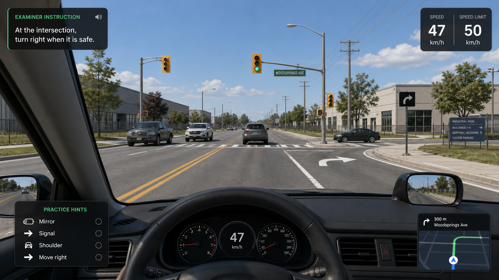
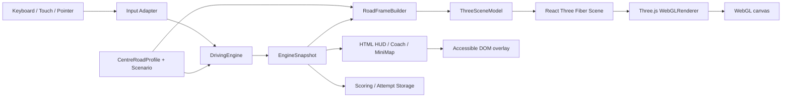

# Design: Ontario G Test Three.js 轻量 3D 驾驶画面

**日期**: 2026-08-17
**Owner**: nieyuanyuan
**状态**: Draft
**源项目 / 分支**: `nieyy/ontario-g-test / main @ e99d9e9`
**相关调研 / 代码讲解 / review**: [互动驾驶游戏 MVP 设计 v1.1](./2026-08-12-ontario-g-test-interactive-game-mvp-design-zh.md)、[引导式练习模式设计 v1.0](./2026-08-14-ontario-g-test-guided-practice-mode-design-zh.md)、[Newmarket 道路画像设计 v1.0](./2026-08-16-ontario-g-test-newmarket-road-profile-design-zh.md)

## 修订记录

| 版本 | 日期 | 作者 | 摘要 |
|---|---|---|---|
| v0.1 | 2026-08-17 | nieyuanyuan | 初版设计：锁定以 React Three Fiber + Three.js 一次性替换现有 Canvas 驾驶画面，定义场景图、道路网格、资产规范、相机同步、性能预算、测试和发布验收。 |

## 1. 摘要

- **这个设计解决什么问题**: 当前 `CanvasRoadScene` 虽然已经消费统一的道路画像和车辆状态，但二维手绘形状缺乏可信的纵深、材质、遮挡、光照和环境尺度；道路容易显得悬空、标线和路口不自然，建筑与树木像方块和圆球，削弱了场景辨识和沉浸式备考价值。
- **选择的方向**: 保留现有确定性驾驶引擎、`CentreRoadProfile`、`RoadPosition`、评分、Coach、HUD、小地图、输入和本地存储，以 React Three Fiber 9 + Three.js WebGLRenderer 重写驾驶画面的表现层；使用程序化低多边形道路、标线、路口和轻工业环境构建 “Newmarket-inspired” 教学场景。
- **替换策略**: 这是一次完整替换，不做按路段、按用户或按模式的渐进迁移，不保留 `CanvasRoadScene`、旧 Canvas 几何或旧渲染 feature flag 作为回退。开发可以按依赖顺序完成，但合并和发布时全部现有可玩场景必须同时切换到 3D。
- **预期结果**: 道路从车下连续延伸至远方，车道数、中心线、同向分隔线、转弯袋、匝道、停止线、路口和交通灯在空间上相互对齐；建筑、树木、车辆、路灯和电线杆建立可信的 Newmarket 工业道路语境，同时仍可在 GitHub Pages 免费静态发布。
- **AI Agent 应该能根据本文直接实现什么**: 在 `/Users/nieyuanyuan/Desktop/ccproj/nieyy/ontario-g-test` 中加入 Three.js 渲染依赖和模块，删除旧 Canvas renderer，将 `RoadFrame` 转换为可复用 3D 几何，覆盖全部道路模板、动态交通、座舱和响应式画面，并完成单测、WebGL 集成测试、截图回归、性能检查和公开站点验收。

## 2. 背景和目标

### 2.1 当前状态

- 项目为 React 19 + TypeScript 6 + Vite 8 的纯静态网页，当前版本为 `1.2.0`，由 GitHub Actions 发布到 `https://nieyy.github.io/ontario-g-test/`。
- `DrivingEngine` 已经使用 `routeId + edgeId + sectionId + sMeters + laneId` 表示车辆位置；考试模式、引导式练习、评分和小地图不依赖具体渲染技术。
- `CentreRoadProfile` 已定义停车场出口、双向地方道路、城市主干道、左转袋形车道、信号灯路口、高速入口、主线和出口等教学道路结构。
- `buildRoadFrame()` 已能将道路画像转换为相机、道路切片、车道边界、箭头和路口事实；当前 `CanvasRoadScene.tsx` 再用手写二维投影绘制它们。
- 当前画面存在明显的视觉表达瓶颈：远近尺度不可信、道路与环境缺乏接触感、标线难以辨别、路口设施缺乏统一空间锚点、背景资产过度抽象。

### 2.2 痛点 / 动机

- 备考并不需要照片级复刻，但考生必须迅速看懂“我在哪条车道、前方是什么结构、冲突车辆在哪里、应该何时开始观察和制动”。
- 二维 Canvas 继续堆叠修补会重复实现投影、近裁剪、遮挡、深度排序和透视缩放；这些正是 3D 渲染管线已经稳定解决的问题。
- 目前视觉反馈与已经较成熟的道路状态模型不匹配，导致考点选择和 Newmarket 道路画像的价值无法充分呈现。
- 静态 GitHub Pages 并不限制 WebGL；只要资产随 bundle 发布，Three.js 场景仍然可以完全在浏览器本地运行，不需要后端或地图 API。

### 2.3 目标

1. 使用一个连续的 3D 世界表达全部 Newmarket 教学路线，杜绝道路中断、横线漂浮、路口固定在车前或交通灯脱离路口。
2. 让当前 `RoadPosition` 和 `RoadFrame` 继续成为车辆、车道与道路几何的唯一事实源；3D renderer 不复制游戏规则。
3. 清楚表现双黄中心线、白色同向虚线/实线、道路边缘、转向箭头、车道增减、停止线、斑马线、路口、匝道和出口。
4. 通过低多边形建筑、树木、路灯、电线杆、停车场、围栏和少量车辆建立 Newmarket-inspired 轻工业道路语境。
5. 保持考试与练习模式完全一致的路况；练习模式仅通过既有 HTML HUD 提示，不改变 3D 世界。
6. 在常见 Mac 桌面浏览器和手机横屏维持稳定、清楚的交互，低端设备允许降低画质但不改变道路事实。
7. 保持纯静态、无账号、无遥测、无 Street View、无在线地图、无运行时业务网络请求。

### 2.4 非目标

- 不追求照片级真实、真实建筑建模、卫星级几何、精确坐标、官方考试路线或 1:1 Newmarket 数字孪生。
- 不接入 Google Maps、Google Street View、Mapillary、在线地图瓦片或收费地图 API。
- 不增加真实车辆动力学、轮胎模型、碰撞物理、自由驾驶、行人 AI、多人、天气或昼夜系统。
- 不改变考试规则、评分、Coach 步骤、输入键位、声音、本地存储和路线内容含义。
- 不把仪表、Coach、考官指令和主要按钮绘制到 WebGL；它们继续使用可访问、可测试的 React/HTML。
- 不引入 Unity、Unreal、Babylon.js、Phaser 或独立游戏运行时。
- 不保留现有 Canvas renderer、二维道路几何或 Canvas 回退方案。
- 不把概念效果图当作必须逐像素复刻的验收基线。

### 2.5 约束

- 发布目标仍是 GitHub Pages 子路径 `/ontario-g-test/`，所有 3D 资源必须使用 Vite 可解析的本地 URL。
- 运行时不得请求地图、模型 CDN、字体 CDN 或远程纹理；生产网络请求白名单保持为空。
- Three.js `WebGLRenderer` 依赖 WebGL 2；若浏览器不能创建 WebGL context，应用显示包含最低浏览器建议和诊断信息的阻断页，不启动 attempt，也不调用旧 Canvas。
- 所有第三方模型、纹理和音频必须具有仓库可接受的许可、记录来源并完成归属展示；首版优先使用代码生成几何和自制小纹理，避免许可负担。
- `DrivingEngine` 不得 import Three.js、React Three Fiber 或 DOM；渲染层不得修改 Engine、评分或 Coach 状态。
- 必须尊重 `prefers-reduced-motion` 与现有 reduced-motion 偏好；减少环境动画和镜头缓动，但车辆位置、道路变化和教学反馈不能消失。
- 不允许为了帧率删除关键道路标线、信号灯、冲突车辆或车道角色；降级只作用于阴影、装饰密度、抗锯齿、像素比和远景细节。

### 2.6 成功标准

- 全部现有考试路线、完整路线练习和六类典型场景都由 Three.js renderer 完成，不存在调用 `CanvasRoadScene` 的生产路径。
- 道路从近裁剪面至可见远方连续，无草地穿过道路、悬空路面、断裂边线、漂浮停止线或与路口脱离的信号灯。
- Owner 不看文字提示即可在 3 秒内辨认当前是每方向一车道、同向两车道、同向三车道、左转袋形车道、加速车道或出口车道。
- 变道时相机横向位置与 `laneId/laneOffsetM` 同步，转向时相机航向与路线 connector 同步；动作结束后方向盘回正且车辆位于目标车道中心。
- Mac 桌面 1440×900 的代表性设备以 60 FPS 为目标，持续驾驶的 p95 frame time 不高于 25 ms；手机横屏代表性 viewport 以 30 FPS 为硬门槛，p95 frame time 不高于 33 ms。
- 生产默认配置中 draw calls 目标不高于 180、三角形目标不高于 150k、同时加载的纹理 GPU 估算不高于 64 MiB、首个 3D 可交互画面额外 gzip 资源目标不高于 1.5 MiB。
- WebGL context 丢失时暂停 attempt 并显示恢复提示；context 恢复后由 Engine 当前状态重建场景，不产生额外距离、计时或评分事件。
- `npm run check:release`、新增 WebGL E2E、视觉截图、性能预算检查和公开 Pages smoke test 全部通过。

## 3. 当前系统对齐

| 区域 / 模块 | 当前行为 | 对设计的影响 |
|---|---|---|
| `src/components/CanvasRoadScene.tsx` | 手写 Canvas 2D 投影、道路、交通灯、车辆和座舱 | 由 `ThreeRoadScene.tsx` 完整替换后删除；不得留下生产引用或 feature flag |
| `src/domain/roadFrame.ts` | 输出相机、道路切片、lane edges、标线、箭头和一个路口 | 保留为渲染中立输入；扩展稳定的世界设施、可见物和跨路段 connector 描述，不返回 Three.js 对象 |
| `src/domain/roadGeometry.ts` | 含旧二维 `worldToScreen` 和 Canvas 常量，也含世界坐标类型 | 将世界/相机数学拆到 `roadFrame`/`roadModel` 的渲染中立部分；删除仅为 Canvas 服务的投影函数 |
| `src/content/roadProfiles/*` | 参数化道路断面、车道、路口、路线和 authored-approximation 声明 | 继续作为 3D 道路网格的唯一内容输入；补充环境主题和稳定 placement seed，不存 mesh |
| `src/domain/engine.ts` | 负责距离、车道、变道、转向、速度和场景推进 | 完全保留事实所有权；renderer 只读取 snapshot 并插值显示 |
| `src/App.tsx` | 直接渲染 `CanvasRoadScene` 并传入 Engine 状态 | 改用 `ThreeRoadScene`；HUD、Coach、小地图、操作按钮的 DOM 层级不迁入 WebGL |
| `src/styles.css` | 驾驶画布、镜面、HUD 和响应式布局混合 | 删除 Canvas 专属规则；保留 HTML overlay，新增 3D 容器、兼容性页和加载状态样式 |
| `e2e/app.spec.ts`、`e2e/road-profile.spec.ts` | 通过 `driving-canvas` data 属性和截图验证 Canvas | 更新为 `driving-webgl`/`road-world` 语义状态与 WebGL 截图；测试不读取 GPU 私有对象 |
| `RouteMiniMap`、Coach、评分、存储 | 读取 Engine/RouteGraph，与 Canvas 绘图解耦 | 保持现有实现，作为迁移回归重点 |
| GitHub Actions | Node 24，Chromium/WebKit，`check:release` 后发布 `dist` | 加入 WebGL 软件渲染测试配置、视觉基线和 bundle/performance budget 检查 |
| `VITE_NEWMARKET_ROAD_PROFILE_ENABLED` | 当前发布仍显式开启道路画像 | Three.js 发布后道路画像成为唯一生产路径；删除该 flag，避免形成旧渲染分支 |

## 4. 候选方案

| 方案 | 核心思路 | 优点 | 缺点 / 风险 | 判断 |
|---|---|---|---|---|
| A. React Three Fiber + Three.js 程序化低多边形场景 | 用 R3F 组织 scene graph，用 Three.js BufferGeometry/InstancedMesh 绘制道路和环境 | 与 React 19、Vite 和现有组件自然组合；场景组件可拆分；完整使用 Three.js 能力；适合当前中等规模场景 | 增加 WebGL、资产生命周期、视觉回归和性能治理成本 | **选择** |
| B. 原生 Three.js imperative renderer | React 只挂载一个自管 Three.js runtime | 依赖更少、生命周期完全可控 | 需要自行同步 React、resize、dispose、loading 和组件生命周期；易形成第二套状态管理 | 不选 |
| C. 继续增强 Canvas 2D/2.5D | 加贴图、阴影、更多手写投影和装饰 | 依赖与包体变化最小 | 继续承担 3D 管线问题；无法根治深度、遮挡、尺度和维护成本 | 明确不选 |
| D. 使用照片/全景图作为背景 | 在静态照片上叠加操作和道路提示 | 单张画面观感真实 | 无法连续驾驶和可靠变道；来源、许可、路线一致性与动态路况困难 | 不选 |
| E. 完整游戏引擎或真实地图 3D | 引入 Babylon/Unity Web 或地图引擎 | 功能强、生态完整 | 包体、维护、许可和复杂度远超教学目标 | 不选 |

## 5. 选择

**选择的方案**: 方案 A。安装与 React 19 匹配的 `@react-three/fiber` 9、`three` 和 TypeScript 类型，使用一个 R3F `<Canvas>` 承载驾驶世界；道路、标线、设施和高频重复环境由程序化几何生成，少量车辆/树木/灯具可使用项目自有低多边形 glTF，但不是首个可用版本的前置条件。

React Three Fiber 官方说明其是 Three.js 的 React renderer，R3F 9 与 React 19 配对，Vite 可直接使用；其 `<Canvas>` 负责创建 scene/camera 并适配父容器。Three.js `WebGLRenderer` 当前使用 WebGL 2。因此该组合与现有 React 19/Vite 工程一致，但需要明确 WebGL 2 不可用时的阻断体验。参考：[R3F 安装](https://r3f.docs.pmnd.rs/getting-started/installation)、[R3F Canvas](https://r3f.docs.pmnd.rs/api/canvas)、[Three.js WebGLRenderer](https://threejs.org/docs/pages/WebGLRenderer.html)。

**为什么选它**:

- Engine 与 RoadProfile 已经提供连续世界坐标，迁移的核心是把同一组事实转换成真正的 3D mesh，而不是重做游戏逻辑。
- R3F 允许道路、车辆、路口、环境和座舱按 React 组件拆分，同时底层仍是原生 Three.js 对象。
- 低多边形、少材质、实例化和有限视距可以在静态网页预算内实现；无需加载地图服务或照片素材。
- HTML HUD 可继续覆盖在 WebGL 画布之上，既保留可访问性，也避免 3D 文本清晰度和交互测试问题。

**为什么不选其他方案**:

- **B**: 当前应用本身已经由 React 管理生命周期和状态，原生 imperative wrapper 会增加重复桥接代码，性能收益不足以抵消维护成本。
- **C**: 用户已明确现有 Canvas 视觉无保留价值，且主要问题来自二维表现模型的上限。
- **D**: 静态照片无法随 `RoadPosition`、车道变化和信号状态形成连续一致的教学世界。
- **E**: 当前不需要物理、编辑器、多人或真实 GIS；更重的引擎不会自动提高教学正确性。

**后果 / 取舍**:

- **什么会变简单**: 透视、遮挡、深度排序、连续路面、路口设施定位、车辆尺度、阴影和未来场景资产复用。
- **什么会变困难**: WebGL 兼容性、GPU 资源释放、截图稳定性、资产许可、包体和移动设备性能。
- **可能引出的后续决策**: 第二个考点是否共用环境资产库、是否引入经过许可的 glTF 资产、是否增加天气。这些不属于本设计。

### 5.1 目标视觉



图 1：目标视觉方向。效果图用于说明可信的道路纵深、正确标线、低多边形轻工业环境、交通参与者、第一视角座舱和 HTML 教学 HUD 的组合，不代表真实考点、官方路线或最终逐像素 UI。正式实现应保持教学近似声明，并优先保证道路结构和操作反馈，而不是追求照片级材质。

## 6. 详细设计

### 6.1 架构 / 流程



核心边界：

1. `DrivingEngine` 仍是位置、速度、信号、变道和转向的唯一动态事实源。
2. `RoadFrameBuilder` 仍负责将 `CentreRoadProfile` 与当前位置裁成可见窗口，不依赖 React 或 Three.js。
3. 新增纯转换层 `buildThreeSceneModel(frame, environment)`，输出稳定、可序列化、可单测的 mesh descriptor；不得直接创建 GPU 资源。
4. R3F scene components 把 descriptor 映射为 Three.js geometry/material/instance。它们只做表现插值，不提交驾驶事件。
5. HUD、Coach、考官指令、小地图、控制按钮和无障碍文本继续位于 DOM overlay。
6. `ThreeRoadScene` 是唯一驾驶画面入口；不存在 `CanvasRoadScene` 分支。

建议目录：

```text
src/
  components/
    ThreeRoadScene.tsx             # 3D 容器、HTML overlay 边界、兼容性状态
  domain/
    roadFrame.ts                   # 渲染中立的可见道路事实
    threeSceneModel.ts             # RoadFrame -> mesh descriptors（纯函数）
    threeSceneModel.test.ts
  rendering/three/
    DrivingWorld.tsx               # scene 根节点和统一坐标系
    DrivingCamera.tsx              # camera pose 与平滑插值
    RoadMesh.tsx                   # 路面、路缘和 section connectors
    RoadMarkings.tsx               # 黄/白标线、箭头、停止线、斑马线
    IntersectionScene.tsx          # 横向道路、信号杆、灯组、路牌
    TrafficScene.tsx               # 前车、对向车、横向冲突车
    EnvironmentScene.tsx           # 建筑、树木、路灯、围栏、电线杆
    CockpitScene.tsx               # 方向盘、仪表台、后视镜模型
    LightingRig.tsx                # 天空、雾、环境光、太阳光和阴影
    SceneQuality.ts                # 设备质量档与预算
    materials.ts                   # 共享材质及颜色规范
    geometry/
      buildRibbonGeometry.ts       # 沿道路边界生成连续带状网格
      buildMarkingGeometry.ts
      buildIntersectionGeometry.ts
    assets/
      manifest.ts                  # 本地资产、许可和大小
public/
  models/                          # 仅存经过许可、压缩后的可选 glb
  textures/                        # 小尺寸自有纹理；禁止远程 URL
scripts/
  validate-3d-assets.ts
  check-render-budget.ts
e2e/
  three-road-scene.spec.ts
  three-road-visual.spec.ts
```

### 6.2 坐标、数据与状态模型

#### 坐标系

- 延续道路画像的世界单位：`1 unit = 1 metre`。
- 地面为 `y = 0`，`+y` 向上；道路局部 `+z` 向前、`+x` 向驾驶员右侧。
- Three.js camera 默认朝 `-z`，因此只在 `DrivingWorld` 根节点做一次明确坐标变换，或用 quaternion 从道路 heading 构造视线；禁止各组件各自反转 `x/z`。
- 正 steering/heading 始终表示右转，负值表示左转。该符号约定与 Engine、RoadFrame、方向盘和 camera 必须由一个测试共同锁定。

#### 渲染中立 scene model

```ts
type Vec3Tuple = readonly [x: number, y: number, z: number]

type MeshStrip = {
  id: string
  points: Vec3Tuple[]
  material: 'asphalt' | 'concrete' | 'grass'
}

type MarkingStrip = {
  id: string
  kind: LaneBoundaryMarking | 'stop-line' | 'crosswalk' | 'lane-arrow'
  points: Vec3Tuple[]
  widthM: number
  dash?: { lengthM: number; gapM: number; phaseM: number }
}

type ScenePlacement = {
  id: string
  kind:
    | 'traffic-signal'
    | 'street-light'
    | 'utility-pole'
    | 'tree'
    | 'industrial-building'
    | 'fence'
    | 'vehicle'
    | 'road-sign'
  position: Vec3Tuple
  headingRad: number
  scale: number
  variant: string
  state?: Record<string, string | number | boolean>
}

type ThreeSceneModel = {
  schemaVersion: 1
  worldOrigin: { routeDistanceM: number; xM: number; zM: number }
  camera: {
    position: Vec3Tuple
    headingRad: number
    pitchRad: number
    fovDeg: number
  }
  roadSurfaces: MeshStrip[]
  markings: MarkingStrip[]
  placements: ScenePlacement[]
  environment: {
    theme: 'parking-industrial' | 'local-industrial' | 'urban-arterial' | 'freeway'
    seed: number
    fogNearM: number
    fogFarM: number
  }
  debug: {
    sectionId: string
    laneId: string
    intersectionDistanceM?: number
  }
}
```

规则：

- `ThreeSceneModel` 不保存 `THREE.Mesh`、material、texture 或 callback，因此可在 Node/Vitest 中深比较。
- `worldOrigin` 随车辆跨过安全阈值时重定位可见世界，避免路线距离持续增长导致浮点抖动；重定位只改变渲染局部坐标，不改变 Engine `sMeters`。
- 道路表面使用相邻 `RenderRoadSlice` 生成连续 ribbon geometry；相邻 section 和 connector 的首尾顶点必须焊接或重叠少量 epsilon，禁止露出草地缝隙。
- 标线在道路表面上方固定 `0.01–0.02 m`，配合 polygon offset 防止 z-fighting；停止线、斑马线和车道箭头共享道路 heading 和同一锚点。
- 路口是道路 mesh 的拓扑组成，不是漂浮 overlay；cross road、停止线、信号杆和灯头全部引用同一个 `IntersectionAnchor`。
- 环境 placement 使用 `profile id + section id + quantized distance` 派生的固定 seed；刷新和重放不得改变建筑、树木和车辆外观。
- 环境设施不得占用可行驶 lane polygon，也不得遮住关键交通灯和标志。

#### 迁移与兼容性

- Engine、RoadProfile、checkpoint 和 AttemptRecord schema 不因表现层迁移而升级；渲染器不写持久化状态。
- 旧版本正在进行的 checkpoint 可由新 renderer 直接从 `RoadPosition` 恢复；如果 checkpoint 本身无效，沿用现有“不能恢复但保留历史记录”的处理。
- 删除 `VITE_NEWMARKET_ROAD_PROFILE_ENABLED` 和 Canvas-only data attributes；保留/新增 `road-world` 上的语义 data attributes，供测试和诊断读取。
- 不存在 Canvas 兼容迁移期；完成后源代码、测试、CSS、依赖和文档均不得再引用 `CanvasRoadScene`。

### 6.3 渲染与视觉规范

#### Camera 与运动

- 使用 `PerspectiveCamera`，桌面默认 FOV 约 `58–65°`，手机横屏按可视面积调到不超过 `72°`，避免广角造成道路弯曲感。
- camera 高度约 `1.18–1.30 m`，位置来自车道中心加 `laneOffsetM`，heading 来自道路切线和 turn connector。
- Engine 仍以固定步长更新事实；renderer 在上一个和当前 snapshot 之间做视觉插值。插值不得回写 Engine，也不得改变评分时间。
- 变道使用平滑的横向 S 曲线；方向盘角度取该曲线的一阶变化趋势并限制在教学合理的小角度，动作完成后精确回零。
- reduced motion 下禁用 camera bob、环境摆动和长缓动，车道移动可缩短为小幅线性过渡，但不能瞬间改变到无法理解。

#### 道路与标线

- 路面为低细节 PBR/standard material：深灰粗糙表面、轻微色差；不使用大尺寸照片贴图。
- 对向交通与本方向之间使用黄线：双黄线、单黄线的数量必须来自 `LaneBoundaryMarking`；同向车道之间只使用白色虚线/实线。
- 道路外边缘可用白色 edge line、混凝土 curb 或 shoulder，三者由道路模板决定；不能用白色长线暗示不存在的车道。
- 同向车道数必须由可行驶表面宽度、白色分隔线和车辆位置共同表达，HUD 的 lane indicator 只作辅助。
- 左/右转袋、加速车道和出口车道必须通过实际 mesh taper 展开/收窄，不能仅移动标线或显示按钮。
- 路口从远处逐渐接近并越过相机，停止线和斑马线固定在路面，信号灯在远处可辨色、近处可见结构。

#### 环境和资产

- 首版采用 4 套 authored theme：停车场/考点出口、低密度工业道路、城市主干道、高速公路。
- 工业建筑至少具有主体、屋顶女儿墙、门窗/装卸门、停车区或围栏中的两项，不允许只显示无细节立方体。
- 树木至少由树干与 2–4 个不规则低多边形冠层组成；近景与远景使用不同几何复杂度，不使用纯球体。
- 交通灯采用 Ontario 常见黄色灯壳、黑色遮光罩、灰色杆臂；教学准确性优先于装饰。
- 车辆至少有车身、车窗、车轮、前后灯和方向，颜色和车型通过固定 seed 变化；不需要可开门或内部模型。
- 近景使用 geometry/material sharing，重复树木、灯杆、护栏柱和 lane dashes 使用 `InstancedMesh` 降低 draw calls。Three.js 官方将 `InstancedMesh` 定义为共享 geometry/material、通过不同 transform 批量绘制并减少 draw calls 的机制：[InstancedMesh 文档](https://threejs.org/docs/pages/InstancedMesh.html)。
- 首版不启用通用后处理链。允许 tone mapping、雾、一个方向光、环境光和一张低分辨率阴影贴图；SSAO、景深、运动模糊、反射和实时后视镜 render target 均不进入范围。
- 左右后视镜首版使用低成本独立 camera 的降频渲染或近似镜面场景，只有在性能预算内才启用；若超预算，使用与当前车辆后方事实同步的简化 3D 镜面画面，而不是静态装饰。它不是旧 Canvas 回退。

#### 座舱和 HUD

- 方向盘、仪表台、A 柱和镜壳可在 3D 中表达，用于建立第一视角；速度、限速、时间、考官指令、Coach 和操作按钮继续使用 DOM。
- 座舱不得遮挡近处 lane boundaries、停止线或主要交通灯；手机横屏可缩小方向盘和仪表台占比。
- WebGL canvas 设为非交互背景；全部训练动作仍由既有按钮和键盘输入处理，避免 3D picking 形成新的输入路径。
- screen reader 使用 `road-world` 的动态摘要，不朗读 scene graph；WebGL canvas 设适当 `aria-label`，重要状态由 DOM live region 提供。

### 6.4 质量档与性能预算

```ts
type SceneQuality = 'low' | 'medium' | 'high'

type SceneQualityConfig = {
  dpr: number
  shadowMapSize: 0 | 512 | 1024
  sceneryDensity: number
  mirrorFps: 0 | 10 | 15
  viewDistanceM: number
  antialias: boolean
}
```

- 初始档位根据 viewport、device memory（可用时）、hardware concurrency 和一次短 warm-up 测量选择，不根据 user agent 猜测。
- `high`: DPR 上限 1.5、1024 阴影、完整装饰密度；`medium`: DPR 1.0、512 阴影、70% 装饰；`low`: DPR 0.75–1.0、关闭动态阴影、40% 装饰、镜面降频或简化。
- 连续驾驶需要每帧渲染，不能全局使用 `frameloop="demand"`；暂停页、briefing 和画面完全静止时切换按需刷新或停止 frame advancement。R3F 官方建议静止场景用按需渲染，并通过实例化、复用 geometry/material、LOD 和 performance monitor 控制性能：[R3F 性能扩展指南](https://r3f.docs.pmnd.rs/advanced/scaling-performance)。
- DPR 由质量档显式限制，不直接无上限采用 `window.devicePixelRatio`。Three.js 响应式指南指出高 DPI 全分辨率对重型场景可能显著拖慢性能：[Three.js 响应式设计](https://threejs.org/manual/en/responsive.html)。
- 重复对象实例化；近/中/远景可使用简单 LOD，Three.js 的 `LOD` 会按距离切换对象复杂度：[LOD 文档](https://threejs.org/docs/pages/LOD.html)。
- 资源卸载、重载或离开 attempt 时必须 dispose 不再使用的 geometry、material、texture 和 render target；Three.js 不会自动释放所有 GPU 资源，可通过 `renderer.info` 观察 draw calls 与 GPU 对象：[资源释放](https://threejs.org/manual/en/how-to-dispose-of-objects.html)。

### 6.5 API / CLI / 接口变更

#### 对外接口

- URL、模式选择、键位、触摸按钮、结果报告和历史记录不变。
- 驾驶画面改为 WebGL 3D；About 页增加“Low-poly 3D teaching approximation / 低多边形 3D 教学近似”说明。
- 首次进入 attempt 时可以出现很短的本地资产加载状态；加载失败不得开始计时。
- WebGL 2 不可用时显示兼容性阻断页，提供“重新检测”“返回首页”和诊断文本；不显示空白 canvas，不提供 Canvas 模式。

#### 内部接口

```ts
buildRoadFrame(input: RoadFrameInput): RoadFrame
buildThreeSceneModel(input: {
  frame: RoadFrame
  scenario: ScenarioVariant
  traffic: TrafficSnapshot
  environmentSeed: number
}): ThreeSceneModel

resolveSceneQuality(capability: CapabilitySample): SceneQualityConfig
createEnvironmentPlacements(input: EnvironmentPlacementInput): ScenePlacement[]
```

输入校验：

- 所有 mesh strip 至少 2 个横断面，坐标必须为有限数；连续道路顶点距离不得超过定义的采样上限。
- marking 必须落在 road surface 容差范围内；yellow marking 只能分隔相反方向或道路画像明确的禁止跨越边界。
- placement ID 稳定且唯一；scale、heading、distance 和 variant 必须通过 schema 校验。
- 未知 environment theme、material、asset ID 或车辆 state 在构建/测试阶段报错，不在运行时静默创建默认方块。

输出 / 错误形态：

- `buildThreeSceneModel` 为纯函数，内容错误抛出带 section/lane/placement ID 的结构化错误并被内容验证捕获。
- 资产加载失败显示可重试的阻断状态并暂停 attempt；单个非关键装饰资产失败可跳过，但道路、标线、交通灯、车辆或座舱失败必须阻断。
- shader compile/context 创建错误记录到本地 debug 面板；不得远程上传。

### 6.6 关键流程

| 流程 | 入口 | 步骤 | 结果 |
|---|---|---|---|
| 开始驾驶 | Briefing 完成 | 检测 WebGL 2 → 预加载关键本地资产 → 构建 RoadFrame/scene model → mount R3F scene → 首帧完成后启动 Engine 时钟 | 用户看到与当前道路状态一致的 3D 世界 |
| 正常前进 | Engine 固定步长更新 | 更新 `RoadPosition` → 重建可见 frame/model → 复用 geometry/material → camera 前进与环境从远到近 | 道路、路口和设施连续经过车辆 |
| 变道 | 既有 lane action 成功 | Engine 更新 lane transition → renderer 插值 `laneOffsetM` → camera 和 cockpit steering 同步 → 结束后回正 | 视觉与目标 `laneId` 一致 |
| 转弯 | 进入 decision zone 并执行 turn | Engine 进入 route connector → camera 跟随 connector position/quaternion → cross road 成为新前方道路 | 用户实际转入目标道路而非原地摆方向盘 |
| 路口接近 | intersection 进入 view window | road mesh 显示 cross road → 停止线/斑马线/信号灯共享 anchor → 设施尺度随距离自然变化 | 路口有明确由远及近和经过过程 |
| 暂停/切后台 | Pause 或 visibility hidden | 停止 Engine 时钟、动画和镜面更新；保留 GPU 资源 | 回来后不补算时间和距离 |
| context 丢失 | `webglcontextlost` | `preventDefault` → 暂停 attempt → 显示恢复层 → context restored 后从 Engine snapshot 重建 | 不丢进度、不重复评分 |
| 离开 attempt | 返回首页/报告/重开 | unmount scene → dispose 非共享资源和 render target → 清空 animation subscription | GPU 资源不持续增长 |

### 6.7 错误处理和边界

- **WebGL 不可用**: 不开始训练；显示明确兼容性页。没有旧 Canvas 回退。
- **关键资源失败**: 暂停并允许重试；重试只重载资源，不重置 Engine 或重复记录动作。
- **非关键装饰失败**: 跳过该 placement，并在本地 debug 状态中记录；不得用无意义方块代替。
- **context lost**: 自动暂停；恢复前屏蔽输入，防止用户以为动作已经执行。
- **窗口 resize / 旋转**: R3F Canvas 跟随父容器，更新 aspect 和 DPR 档位，不重建 attempt。
- **极低帧率**: 连续 3 秒低于 25 FPS 时逐级降低画质；不改变 view 中的关键道路设施。已经处于 low 仍不达标时提示用户关闭其他页面或降低窗口尺寸。
- **路段连接异常**: validator 阻止构建；运行时不得用向前无限延长的最后一个 slice 掩盖内容错误。
- **资产缓存版本错配**: 资源名包含内容 hash；部署后旧 bundle 不得引用被删除的无 hash 资源。
- **并发 / 顺序**: 每一帧只消费同一 Engine snapshot；RoadFrame 和 traffic snapshot 必须带相同 simulation tick。
- **幂等性**: 相同 profile/version、seed、Engine snapshot 和 quality 档生成相同 `ThreeSceneModel`；画质只改变装饰复杂度，不改变教学事实。

### 6.8 可观测性和运维

- **日志**: 仅本地 debug 模式记录 renderer 初始化、quality 档、资源加载错误、context lost/restored 和预算超限；默认控制台不刷逐帧日志。
- **指标**: debug overlay 显示 FPS、p95 frame time、draw calls、triangles、textures、geometries、当前 section/lane、camera pose 和 visible intersection distance。
- **告警**: 无远程告警；CI 对 bundle、资产、视觉和性能预算失败。
- **调试入口**: `?debug3d=1` 显示坐标轴、lane IDs、road slice、intersection anchor、bounding boxes 和 renderer info；生产默认关闭。
- **回滚 / 禁用开关**: 无运行时 Canvas 回退开关。发布故障只能通过 Git/GitHub Pages 将整个站点回滚到上一个已发布 commit；该历史版本可能仍是 Canvas，但新代码库不维护双实现。

## 7. 分阶段实现与验证计划

> 以下 Phase 是同一个替换分支内的实现依赖顺序，不是分阶段上线策略。任何 Phase 完成都不能单独发布；只有 Phase 1–4 和整体验收全部通过后，才一次性合并并替换生产 Canvas。

### Phase 1: 锁定渲染边界与 3D 几何契约

**目标**: 在不改变 Engine 行为的前提下，建立可序列化的 Three.js 场景输入和严格几何验证，为全部道路模板提供连续 3D 数据。

**实现范围**:

- [ ] `package.json` / lockfile：加入与 React 19 匹配的 `three`、`@react-three/fiber`、`@types/three`；不引入完整游戏引擎。
- [ ] `src/domain/roadFrame.ts`：补齐 connectors、完整 intersection anchor、道路环境和动态设施所需的渲染中立事实。
- [ ] `src/domain/threeSceneModel.ts`：实现纯函数 scene model builder、稳定 seed 和 world-origin rebasing。
- [ ] `src/rendering/three/geometry/*`：实现 road ribbon、lane surface、marking、intersection geometry descriptors。
- [ ] `src/content/roadProfiles/*`：只补充环境 theme/placement seed 等表现元数据，不改变教学路线与评分含义。
- [ ] `scripts/validate-content.ts`：加入道路连续性、标线语义、设施锚点和有限坐标校验。

**数据 / migration 改动**:

- [ ] RoadProfile 只新增向后兼容的表现字段；checkpoint/attempt schema 不变。
- [ ] fixture 覆盖 7 类道路模板和 1/2/3 条同向车道、袋形车道、merge/exit、路口 connector。

**Agent 执行约束**:

- 必须遵守: Engine/RoadProfile 继续拥有道路和车辆事实；scene model 可在 Node 中序列化和深比较。
- 禁止做: 在本 Phase 创建两套道路事实、复制 lane state 到 React、用无限延长 slice 隐藏路段断裂。
- 不确定时先问: 需要改变 RoadProfile 教学结构、路线顺序或评分事实时。

**本阶段验证**:

- 自动化测试: `threeSceneModel.test.ts` 验证确定性、连续道路、标线颜色语义、connector、路口共同锚点、有限坐标和 world rebasing。
- 手工 / workflow 验证: debug geometry viewer 展示全部模板的 wireframe、lane IDs 和法线。
- 回归检查: 现有 Engine、Coach、RoadProfile、MiniMap 和 storage 测试保持通过。
- 失败 / 边界检查: 缺失 lane、断裂 section、非法黄/白线、NaN、重复 placement ID 和错误 intersection anchor 必须被拒绝。

**退出标准**:

- [ ] 所有现有可玩路段能生成确定、连续、合法的 `ThreeSceneModel`，不依赖 Canvas 几何。

### Phase 2: 一次覆盖全部道路类型的 Three.js 驾驶世界

**目标**: 建立完整 R3F scene graph，覆盖道路、路口、车辆、环境、光照、座舱和 Engine camera 同步；此时旧 Canvas 仍只存在于未合并代码中，不形成运行时切换。

**实现范围**:

- [ ] `src/components/ThreeRoadScene.tsx`：实现 R3F Canvas、初始化/加载/错误/context-lost 状态和 DOM overlay 边界。
- [ ] `src/rendering/three/DrivingWorld.tsx`、`DrivingCamera.tsx`：统一坐标变换、snapshot 插值、变道和转弯 camera。
- [ ] `RoadMesh.tsx`、`RoadMarkings.tsx`、`IntersectionScene.tsx`：绘制所有道路与控制设施。
- [ ] `TrafficScene.tsx`：绘制前车、对向车、横向冲突车及信号状态。
- [ ] `EnvironmentScene.tsx`、`LightingRig.tsx`：实现四类环境主题、雾、光照、阴影和实例化装饰。
- [ ] `CockpitScene.tsx`：实现不遮挡关键道路事实的低多边形座舱和同步方向盘。
- [ ] `SceneQuality.ts`：实现 high/medium/low 质量档、DPR 限制和自适应降级。
- [ ] `public/models|textures` 和资产 manifest：仅加入必要、许可明确、经过压缩的本地资产。

**数据 / migration 改动**:

- [ ] 不修改 checkpoint/attempt；资产 manifest 记录 ID、hash、许可、作者、来源、文件大小和用途。

**Agent 执行约束**:

- 必须遵守: 全部现有道路模板和模式同时具备 3D 表现；关键几何不能用装饰贴图假装。
- 禁止做: 接入 Street View/在线地图/远程 CDN；引入物理引擎；用 post-processing 掩盖几何问题；只实现一个演示路段。
- 不确定时先问: 第三方资产许可不明确、单个资产超过 250 KiB gzip，或需要改变现有 UI 布局时。

**本阶段验证**:

- 自动化测试: R3F 组件 smoke、资源 manifest、quality resolver、camera/steering 同向、lane offset 和 route connector tests。
- 手工 / workflow 验证: Mac Chrome/Safari 查看停车场、地方道路、主干道、袋形左转、信号灯、高速入口/主线/出口；手机横屏检查 FOV、座舱遮挡和 HUD。
- 回归检查: Exam、Guided Practice、典型场景的 Engine snapshot 与迁移前 fixture 完全一致。
- 失败 / 边界检查: WebGL unavailable、资源 404、context lost、resize、reduced motion 和 low-quality 场景。

**退出标准**:

- [ ] 单一 `ThreeRoadScene` 能正确、连续地展示所有现有可玩内容，且没有依赖旧 Canvas renderer 的道路类型。

### Phase 3: 删除 Canvas 并完成产品集成

**目标**: 将 Three.js 设置为唯一生产驾驶画面，删除旧实现和旧分支，更新测试与用户文案。

**实现范围**:

- [ ] `src/App.tsx`：只 import/render `ThreeRoadScene`，保留现有 HUD、Coach、MiniMap 和输入。
- [ ] 删除 `src/components/CanvasRoadScene.tsx` 和仅为二维绘图存在的 `roadGeometry` API/测试。
- [ ] `src/styles.css`：删除 Canvas 专属样式，完成 WebGL 容器、loading/error/context lost 和响应式 overlay。
- [ ] `src/config/featureFlags.ts`：删除 `VITE_NEWMARKET_ROAD_PROFILE_ENABLED` 及相关测试；道路画像和 3D renderer 成为唯一生产路径。
- [ ] `e2e/app.spec.ts`、`practice.spec.ts`、`road-profile.spec.ts`：从 `driving-canvas` 迁移到 `driving-webgl`/`road-world` 契约。
- [ ] 首页/About/免责声明：更新为低多边形 3D 教学近似，不承诺真实路线。
- [ ] `scripts/validate-3d-assets.ts`、`check-render-budget.ts`：加入 release check。

**数据 / migration 改动**:

- [ ] 不改用户数据；生产 cache 通过 Vite hashed assets 自然失效。

**Agent 执行约束**:

- 必须遵守: 删除旧 renderer、旧 feature flag、死 CSS、死测试和未使用依赖；WebGL 不支持时阻断，不回退 Canvas。
- 禁止做: 保留隐藏的 query flag、环境变量或 emergency Canvas path；把 Coach/HUD 搬进 WebGL。
- 不确定时先问: 删除的旧函数仍被 Engine、评分、小地图或存储使用时，先重构调用方而不是强删。

**本阶段验证**:

- 自动化测试: `rg "CanvasRoadScene|driving-canvas|VITE_NEWMARKET_ROAD_PROFILE_ENABLED" src e2e scripts` 无生产/测试命中；lint、content、unit、build 全部通过。
- 手工 / workflow 验证: 从首页分别进入 Exam、完整路线 Guided Practice、典型场景练习并完成报告/重试/历史恢复。
- 回归检查: 键盘、触控、MSS sequence、速度保持、声音、小地图、暂停和结果记录与迁移前一致。
- 失败 / 边界检查: 无 WebGL 设备看见阻断页；资源失败和 context lost 不产生隐藏计时。

**退出标准**:

- [ ] 仓库中只存在 Three.js 生产驾驶画面；所有功能和测试均不依赖旧 Canvas。

### Phase 4: 视觉、性能与公开发布验收

**目标**: 证明新 renderer 不仅能运行，而且在代表性设备上足够清楚、稳定和可发布，并一次替换生产站点。

**实现范围**:

- [ ] 为 7 类道路模板、左右变道、左右转弯、路口 far/approach/decision/crossing/passed 建立稳定截图。
- [ ] 记录 Chrome/WebKit 代表性性能采样和 renderer.info 预算。
- [ ] 更新 CI：WebGL E2E、视觉基线、bundle/asset budget、生产无业务网络请求。
- [ ] 发布 `1.3.0` release candidate，完成 Pages 公开 smoke test 后标记正式版本。

**数据 / migration 改动**:

- [ ] 无。

**Agent 执行约束**:

- 必须遵守: 以道路可辨识、输入响应和稳定帧率优先；发现超预算先减少装饰/阴影/DPR，不删除教学元素。
- 禁止做: 为通过截图冻结本应运动的世界；只在本机 dev server 验收；在视觉失败时恢复 Canvas。
- 不确定时先问: 性能目标在真实手机上无法达到且需要改变最低支持设备或删减教学内容时。

**本阶段验证**:

- 自动化测试: `npm run check:release`、3D 资产校验、bundle budget、Playwright Chromium/WebKit WebGL E2E 与视觉截图。
- 手工 / workflow 验证: Owner 在 Mac 与手机横屏各完成一次 15–20 分钟完整路线；确认道路类型、标线、路口、信号灯、车辆和 HUD 无需解释即可辨认。
- 回归检查: GitHub Pages 子路径资源全部 200，无地图/模型 CDN 请求；刷新、暂停、恢复、报告和历史记录正常。
- 失败 / 边界检查: throttle 到 low quality、旋转手机、后台恢复、context lost 模拟、旧 checkpoint 恢复、离线加载已缓存站点。

**退出标准**:

- [ ] 全部自动与人工验收通过，`https://nieyy.github.io/ontario-g-test/` 已由 Three.js 版本一次性替换并完成公开 smoke test。

### 整体验收

| 验收领域 | 验证内容 | 命令 / 方法 | 合并前是否必须 |
|---|---|---|---|
| 单元 / 组件 | Scene model 确定性、道路连续、标线、camera、quality、资源 manifest | `npm run test` | Yes |
| 内容 / 资产 | RoadProfile、3D 资源许可/hash/大小、无远程 URL | `npm run validate:content && npm run validate:3d-assets` | Yes |
| 集成 / workflow | Exam、完整路线练习、典型场景、MSS、变道、转弯、报告 | Playwright Chromium + WebKit | Yes |
| 视觉回归 | 7 类断面、5 个路口阶段、变道和转弯关键帧 | Playwright 稳定 seed 截图 | Yes |
| 性能 / 规模 | frame time、draw calls、triangles、纹理、bundle、DPR 降级 | `npm run check:render-budget` + 代表性设备采样 | Yes |
| 无障碍 | DOM HUD、按钮、live region、兼容性页、reduced motion | axe + 键盘/VoiceOver smoke | Yes |
| 失败恢复 | WebGL 不可用、context lost、资源失败、resize、切后台 | E2E 注入 + 手工 | Yes |
| 回归测试 | Engine、评分、Coach、小地图、存储、声音不变 | `npm run check:release` | Yes |
| 发布 | Pages 子路径、hashed assets、无业务网络请求、15–20 分钟 smoke | 公开 URL + DevTools/Playwright | Yes |
| 旧实现清理 | 无 Canvas renderer/flag/测试路径 | `rg "CanvasRoadScene|driving-canvas|VITE_NEWMARKET_ROAD_PROFILE_ENABLED" src e2e scripts` | Yes |

**必要测试数据 / fixtures**:

- 固定 Newmarket profile/version、固定 route seed、每种道路模板的 near/mid/far RoadPosition。
- 左/右变道各 0%、25%、50%、75%、100%；左右转向及 connector 中点。
- 信号灯红/黄/绿，前车、对向车、横向车和无车场景。
- desktop 1440×900、laptop 1280×800、mobile landscape 844×390 三类 viewport。
- high/medium/low quality、reduced motion、WebGL unavailable/context lost fixtures。

**性能 / 规模检查**:

- CI 检查 bundle gzip、单个资产大小、总纹理像素和远程 URL。
- 浏览器采集 60 秒持续驾驶 frame time；忽略前 5 秒 shader warm-up，以 p50/p95 和最低 FPS 报告。
- debug 模式记录 `renderer.info.render.calls/triangles` 与 memory textures/geometries；跨 10 次进入/退出 attempt 不得持续增长。

**向后兼容检查**:

- 旧 checkpoint 从相同 `RoadPosition` 恢复到 3D 画面；AttemptRecord、History、Preferences 无 schema 变化。
- URL、GitHub Pages base、键位和触控操作保持不变。
- 不承诺无 WebGL 2 浏览器继续可玩；这是明确的最低能力提升，而不是 Canvas fallback 场景。

**失败注入 / 负向测试**:

- 拒绝非法 mesh descriptor、断裂 ribbon、错误标线、重复 ID、NaN、未知资产和远程资产 URL。
- 拦截关键模型/纹理，触发资源失败；派发 context lost/restored；模拟低帧率和 viewport 连续变化。
- 验证失败/暂停期间 Engine elapsed、distance 和 finding 数量不增长。

## 8. 发布和回滚

- **发布顺序**: 完成单一替换分支 → 全部本地/CI 验收 → 更新版本为 `1.3.0` → push `main` → GitHub Actions 构建并一次部署完整 Three.js 站点 → 公开 smoke test。
- **Feature flag / 配置开关**: 不提供 Canvas/Three 切换 flag。仅保留画质档和 debug3d 诊断参数；它们不能改变道路事实或选择旧 renderer。
- **部署顺序**: 资源和 JS 由同一 `dist` artifact 原子发布；hashed URL 防止新 JS 配旧模型。
- **发布期间监控**: 观察 Actions、Pages URL、浏览器 console、资源状态、WebGL 初始化、公开 E2E、15–20 分钟 smoke 的 FPS/内存。
- **回滚步骤**: 若正式站点出现阻断性问题，使用 Git/GitHub Pages 重新部署上一个已验证 release commit；不在新版本运行时切换旧 Canvas。
- **如果回滚，数据如何清理**: 无新用户数据 schema，无需清理；已完成 attempt 和 checkpoint 保持。浏览器 hashed assets 由后续缓存自然淘汰。

## 9. 风险和缓解

| 风险 | 影响 | 缓解方式 | 测试 / 信号 |
|---|---|---|---|
| WebGL 2 不可用或 context 不稳定 | 用户无法开始/中途画面消失 | 启动前检测、阻断页、context lost 自动暂停和恢复重建 | WebGL unavailable/context lost E2E |
| 移动设备 GPU 性能不足 | 卡顿、发热、输入延迟 | 限制 DPR、少光源/阴影、实例化、LOD、自适应 quality | 60 秒 frame-time、renderer.info、真机 smoke |
| 3D 画面更漂亮但道路仍错误 | 教学误导更严重 | RoadProfile/Engine 唯一事实源，scene model 几何与语义 validator | 道路/标线/connector 单测与截图 |
| R3F props 更新导致过量 geometry 重建 | GC 抖动和帧率下降 | memoize descriptor、复用 BufferGeometry/material、只更新 transform/instance matrices | React profiler、memory/geometry 数量趋势 |
| GPU 资源泄漏 | 多次练习后内存升高或崩溃 | asset cache ownership、显式 dispose、进入/退出循环测试 | renderer.info memory + 10 次循环 E2E |
| 资产包过大 | Pages 首次加载慢 | 程序化几何优先、小纹理、glTF 压缩、asset budget | bundle/asset CI budget |
| 截图在不同 GPU 不稳定 | CI 误报 | 固定 seed/time/camera、关闭随机动画、容差阈值、结构断言优先 | Chromium/WebKit 基线稳定性 |
| HUD/座舱遮挡道路 | 无法看清车道与路口 | DOM overlay 保持紧凑，响应式 cockpit，关键区域截图检查 | desktop/mobile visual test |
| 低多边形仍显得像玩具 | 视觉升级不达预期 | 统一尺度、可信材质/光照、建筑细节、树干、车辆和环境密度；避免纯球/纯方块 | Owner 视觉验收与概念图方向对照 |
| 无 Canvas 回退增加发布风险 | Three.js 缺陷会整体阻断 | 更严格 release gate、RC 公开测试、Git commit 整站回滚 | 全量 E2E + Pages smoke + release rollback rehearsal |
| 第三方资产许可不清 | 无法公开发布或需下架 | 代码生成/自有资产优先，manifest 强制许可字段 | `validate:3d-assets` |

## 10. AI Agent 交接检查清单

- [x] 明确列出了要改的文件 / 模块。
- [x] 每个阶段都把实现范围、验证方式和退出标准放在一起。
- [x] 整体验收写清楚必须执行的命令或手工检查。
- [x] 高风险决策标成“不确定时先问”。
- [x] 非目标足够明确，能防止实现时扩大范围。
- [x] 明确这是一次性整体替换，Phase 不是渐进发布。
- [x] 明确删除旧 Canvas renderer、旧 feature flag 和回退路径。
- [x] 明确 Engine/RoadProfile/评分/Coach 不因 3D 表现层而改写。
- [x] 明确性能、资源、WebGL 失败和公开 Pages 验收标准。
- [x] 效果图已复制到设计资产目录并嵌入本文。

## 11. Open Questions

当前无阻塞性开放问题。以下实现默认值已在本文锁定：

- 使用 React Three Fiber 9 + Three.js，与 React 19/Vite 保持一致。
- 发布时一次性用 `ThreeRoadScene` 替换全部 `CanvasRoadScene`，不维护双 renderer。
- WebGL 2 不可用时阻断训练，不提供旧 Canvas fallback。
- 程序化低多边形几何优先，首版不以外部 glTF 资产作为关键道路的依赖。
- HTML 继续承担 HUD、Coach、输入和无障碍，WebGL 只承担驾驶世界与座舱表现。
