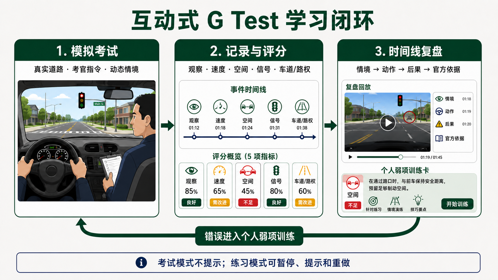
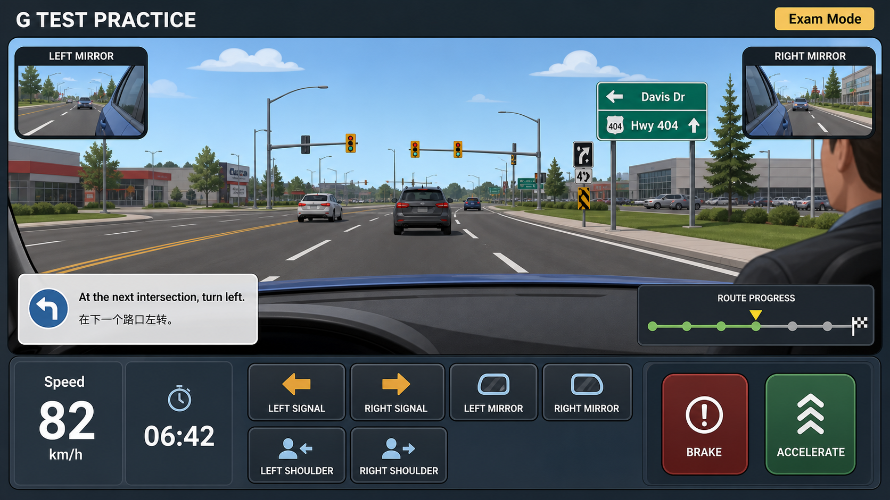

# Research: Ontario G Test 真实路况互动驾驶游戏

**日期**: 2026-08-12
**Owner**: nieyuanyuan
**状态**: Draft
**源项目 / 分支**: `my-ai-brain / main`
**源 commit / 版本**: `9edaf3f`
**相关请求 / 问题**: 基于个人历次 G 牌考试经历与 Newmarket DriveTest Centre（320 Harry Walker Parkway S）周边真实道路，设计可发布到 `https://nieyy.github.io/` 的第一视角互动式考前训练游戏。

## 修订记录

| 版本 | 日期 | 作者 | 摘要 |
|---|---|---|---|
| v0.1 | 2026-08-12 | nieyuanyuan | 初版调研：需求提炼、真实路线证据、玩法选择、技术方案与分阶段落地建议。 |
| v0.2 | 2026-08-12 | nieyuanyuan | 确认 7 次失败及考点分布，核对现存 3 份原始评分表并补充去身份化时间线。 |
| v0.3 | 2026-08-12 | nieyuanyuan | 明确静态互动网页足以支持核心备考目标，取消实时 3D 和连续驾驶作为主路线。 |
| v0.4 | 2026-08-12 | nieyuanyuan | 明确产品从第一版起面向所有 Ontario G 考生，个人考试经历仅作为首批场景参考。 |
| v0.5 | 2026-08-12 | nieyuanyuan | 确认现阶段没有自有/可授权实景素材，改用 Google Street View 作为 MVP 主要环境画面，并补充计费、key、条款和降级边界。 |
| v0.6 | 2026-08-12 | nieyuanyuan | 因 Dynamic Street View 需要启用 billing 且存在费用风险，明确 MVP 不使用 Street View，改用代码生成的 SVG/Canvas 2.5D 道路场景。 |
| v0.7 | 2026-08-12 | nieyuanyuan | 明确 MVP 不收集匿名使用数据、不接入分析 SDK，练习记录只保存在用户本地浏览器。 |
| v0.8 | 2026-08-12 | nieyuanyuan | 确认不录制第一视角/360° 素材；场景只需大致对应考点道路结构，优先保证考点知识和错误记忆，不追求街景级 1:1 复刻。 |
| v0.9 | 2026-08-12 | nieyuanyuan | 确认现存三次可验证失败经历均有代表性、暂无其他反复错误，并明确目标用户是已通过 G2、需要熟悉 G Test 规则与考点路况的驾驶者。 |
| v0.10 | 2026-08-12 | nieyuanyuan | 确认游戏使用独立 `ontario-g-test` 仓库，并要求考官指令统一采用 Ontario G Test 常见英文措辞，不安排教练或近期考生人工审核。 |
| v0.11 | 2026-08-12 | nieyuanyuan | 使用 Image 2.0 生成方案 A 的高保真界面概念图，展示第一视角道路、考官指令、观察操作、速度与考试进度。 |
| v0.12 | 2026-08-12 | nieyuanyuan | 明确方案 A 的实际操作：鼠标/触摸可完成全部流程，键盘提供可选快捷键；车辆自动沿路线推进，玩家控制影响考试结果的观察、速度、信号、选道和 gap 决策。 |

## 1. 摘要

- 调研问题: 能否用 Newmarket 实际考点周边道路，做一个约 15–20 分钟、第一视角、有考官指令和结果复盘的网页训练游戏，并部署到 GitHub Pages？
- 简短结论: **完全可行，而且不需要实景照片、付费地图 API 或实时 3D。** MVP 推荐用 SVG/Canvas/CSS 在浏览器中生成简化的第一视角 2.5D 道路：保留 Newmarket 候选道路的车道数、路口结构、标志、信号灯、匝道和考点名称等备考信息，再由场景引擎控制考官语音、动态车辆、计时、分支决策、评分和复盘。全部内容都可随 GitHub Pages 静态发布。
- 目标用户: **从第一版起面向所有 Ontario G 考生。** 默认考生已经通过 G2、具备基本独立驾驶能力；产品不从零教授车辆操控，而是帮助他们熟悉 Ontario G Test 的规则侧重点、考试习惯、考官指令和考点道路类型。个人 7 次考试经历用于发现容易被文字总结遗漏的高价值场景，但不代表其他考生会遇到相同问题，也不用于预测任何一次实际考试。
- 建议下一步: 先建立 Newmarket 路线与场景数据集，完成一个 5–8 分钟垂直切片：红灯右转完整停车、多车道左转入正确车道、404 高速并入三类场景。验证互动流程是否能训练判断、复盘是否减少遗漏、手机/桌面体验和素材可读性后，再扩展成 15–20 分钟完整模拟考试。
- 置信度: **High**（静态互动网页可承载核心产品）；**Medium**（训练内容完整性）。7 次失败及考点分布已确认，现有原始评分表覆盖其中 3 次；精确考点路线和其余 4 次考试细节仍未完整验证。

## 2. 范围

**范围内**:

- Ontario G 牌考试任务、Newmarket 候选道路和首批高价值训练场景的需求提炼。
- 第一视角驾驶训练的玩法、反馈方式、内容模型和评分模型。
- 代码生成的 SVG/Canvas 场景、静态图片/插画、预录视频、360° 全景和地图服务等表现路线比较。
- 可在 GitHub Pages 部署的前端架构、数据与 API 安全边界。
- MVP 范围、阶段计划、验证方法、法律/许可和安全风险。

**范围外**:

- 本文不宣称掌握 DriveTest 的官方固定考试路线；实际路线与考官指令可能变化。
- 不实现游戏、不创建 GitHub Pages 仓库、不采购地图服务。
- 不替代 MTO 官方手册、合格教练或真实道路练习，也不保证通过考试。
- 不根据尚未纳入调研的原始图片/PDF，猜测每次考试的完整扣分项。
- 不在首版实现方向盘级车辆动力学、碰撞物理、多人模式或真实交通实时同步。
- 不把实时 3D 渲染或自由驾驶作为产品成立的前提。

**假设**:

- 用户已确认 G 牌考试共失败 7 次，其中 Lindsay 4 次、Newmarket 3 次；目前仅保留 3 份原始评分表。
- 首要目标是训练观察和决策，而不是复刻车辆操控手感。
- 目标考生已通过 G2，具备起步、制动、转向、变道等基本驾驶能力；需要补足的是 G Test 语境下的观察动作、路权、速度/空间判断、考试流程和陌生考点路况。
- 首版面向桌面键盘/鼠标，并兼容手机触控；方向盘外设不属于 MVP。
- 游戏以中文为主，考官语音建议同时支持英文原句和中文字幕。
- 首版不登录、不上传成绩，进度仅保存在本地浏览器。
- 当前没有自有/已授权的第一视角实景素材，但这不构成 MVP 阻塞：道路、车辆、标线、信号灯和标志使用项目代码与自制 SVG 图形生成，不需要第三方图片授权或付费 API。
- 没有条件录制 Newmarket 第一视角或 360° 素材，MVP 也不规划外拍。场景只需在影响驾驶判断的道路结构上大致对应考点，不追求建筑、纹理和街景画面的 1:1 还原。

## 3. 调研方法

- 已查看的代码 / 文档:
  - `docs/templates/research-doc-template-zh.md`
  - `CLAUDE.md`
  - `scripts/validate_structure.py`
- 使用的命令或查询:
  - 汇总用户提供的个人历次考试复盘要点；原始记录不随本文公开。
  - 使用 Poppler 将现存 3 份 DriveTest `Record of G Examination` PDF 共 9 页渲染为图片，逐页核对勾选项、未通过原因和考官备注；同时检查 PDF 页数及表单属性。
  - 检查 `https://nieyy.github.io/` HTTP 状态和 `nieyy` 账号可访问仓库。
  - 检索 Ontario MTO、DriveTest、Town of Newmarket、GitHub Pages、Google Maps Platform、MapLibre 和 OpenStreetMap 官方资料。
  - 检索 Newmarket 路线的近期用户报告；此类来源仅用于发现候选道路，不视为官方路线证明。
  - 检索驾驶危险感知训练的系统综述和实验研究。
- 已检查的外部参考:
  - Ontario MTO 官方驾驶手册、Newmarket 市政府限制教学区域资料。
  - GitHub Pages、Vite 静态部署、浏览器本地存储/PWA，以及可选的 Google Street View、MapLibre 和 OSM 官方文档。
  - 2024 年危险感知训练系统综述与北美视频危险感知研究。
- 未验证的内容:
  - 其余 4 次失败的日期、逐项扣分和考官备注缺少原始评分表，不能从记忆反推。
  - DriveTest 不公开保证某条固定路线；第三方和 Reddit 路线报告只能证明“曾有人走过”。
  - 每个候选路段当前的车道数、导向线、限速、标志和施工状态尚未逐点核验；游戏场景只能标注为基于当前资料的教学抽象，不能宣称像素级复刻现实道路。
  - 根地址 `nieyy.github.io` 当前没有用户站点，但不影响通过独立项目仓库发布到 `nieyy.github.io/<项目名>/`。

## 4. 调研内容

### 4.1 当前状态

| 区域 / 模块 | 当前行为 | 证据 |
|---|---|---|
| 失败次数与分布 | 共失败 7 次：Lindsay 4 次、Newmarket 3 次 | 用户确认；现存 3 份原始评分表可核验其中 Lindsay 2 次、Newmarket 1 次 |
| 近期典型问题 | 包括高速并入速度与空间判断、多车道转弯车道选择、跟随慢车时的决策 | 个人考试复盘提炼；逐项结论仍应以原始评分表和官方规则为准 |
| 其他典型问题 | 包括红灯右转的完整停车，以及黄灯时停车或继续通过的情境判断 | 个人考试复盘提炼；本文仅用于形成训练场景，不公开原始记录 |
| 官方 G Test 范围 | 目前仍测试主要道路/高速、汇入驶离、合理速度和空间、转弯、变道、路口和商业区；暂不包含平行停车、路边停车、三点掉头和住宅区驾驶 | [MTO Level Two Road Test](https://www.ontario.ca/document/official-mto-drivers-handbook/level-two-road-test)（更新于 2025-09-08） |
| Newmarket 考点 | DriveTest 地址为 320 Harry Walker Parkway S，并提供 G 测试 | [DriveTest Centre List](https://drivetest.ca/find-a-drivetest-centre/alphabetical_list/) |
| 候选道路范围 | 市政府明确称限制教学区域覆盖 Newmarket DriveTest Centre 的各种考试路线，边界涉及 Gorham、Prospect、Bayview、Traviss、Leslie Valley、Leslie；Davis Drive 是主要通行道路 | [Town of Newmarket Restricted Area](https://www.newmarket.ca/resident-services/by-law-enforcement/restricted-area-driving-instructors-driving-schools) |
| 候选高速链路 | 近期和历史用户报告多次出现 Harry Walker / Davis / Leslie、404 North、Green Lane、404 South，但也明确存在路线变化 | [2025 用户报告](https://www.reddit.com/r/Ontariodrivetest/comments/1mcz55n)、[2022 用户报告](https://www.reddit.com/r/Ontariodrivetest/comments/zzgwu1)；仅作线索，不作为官方路线 |
| 教学限制 | Newmarket 的指定区域禁止驾驶教练/驾校为教学或备考而运营；私人车辆和正式考试不在该项禁止范围内 | [Town of Newmarket Restricted Area](https://www.newmarket.ca/resident-services/by-law-enforcement/restricted-area-driving-instructors-driving-schools)；网页模拟不在道路上运营，但产品应醒目提示当地限制 |
| 发布目标 | 使用独立仓库 `nieyy/ontario-g-test`，发布到 `https://nieyy.github.io/ontario-g-test/`；`my-ai-brain` 只保留调研、设计和复盘 | 用户确认；GitHub Pages 支持项目站点，Vite 的 `base` 设置为 `/ontario-g-test/` |

#### 可验证的失败时间线（现存原始评分表）

为保护隐私，本文只保留与训练设计有关的日期、考点和去身份化评分摘要，不记录姓名、车牌、考官 ID 或签名。考点名称由用户确认，评分表中的 Location code 用于交叉核对。

| 日期 | 考点 | 原始结果 | 可验证的主要问题 | 对游戏场景的启示 |
|---|---|---|---|---|
| 2026-02-10 | Lindsay（`D68`） | `Dangerous Action`；考官进行 verbal/steering intervention | 左转时未正确处理路权，并在红灯阶段未及时清空路口；另有转弯观察、车道/速度、高速观察和信号等扣分 | 强化“进入路口前能否完成左转”的动态判断，以及考官多次提醒后仍未纠正时的危险行为判定 |
| 2026-05-14 | Lindsay（`D68`） | `Too many driving errors` | 没有单一考官干预事件；扣分分散在转弯观察与速度、商业区危险观察、高速进入/行驶/驶离等项目 | 游戏不能只训练一两个致命点，还需要完整 15–20 分钟流程检测累计性普通错误 |
| 2026-08-12 | Newmarket（`D52`） | `Dangerous Action` + `Inadequate skill to complete test`；两次 verbal intervention | 一次转弯影响其他车辆；一次以约 60 km/h 并入 Highway 404，迫使主路车辆避让；评分表另标记转弯车道、进入高速前盲区检查和高速速度处理 | 把“速度匹配 + gap + 前车空间 + 肩检”作为一个整体场景评分，不能简化成“必须达到 110” |

当前原始证据覆盖率为 `3/7`。这三份报告已经显示两种不同失败机制：一类是单次危险行为直接导致失败，另一类是普通错误累积过多导致失败。游戏评分系统必须同时支持这两类路径。

现存三次可验证失败经历都具有代表性，不再从中挑选“最典型”的一次：2026-02-10 代表路权判断与危险干预，2026-05-14 代表普通错误累积，2026-08-12 代表高速并入与转弯对其他车辆造成影响。目前没有确认出除现有个人错误类型之外的其他反复错误。该结论只描述个人证据，不限制公共题库；面向所有考生的内容范围仍以 MTO 官方 G Test 要求为主。

#### 首批训练场景种子

下表由个人考试复盘与 MTO 官方规则交叉提炼，用于启动面向所有考生的公共场景库。它不是对下一次考试内容的预测，也不是完整题库；后续必须继续覆盖官方 G Test 范围、其他考生常见问题、不同交通条件和不同考点道路类型。

| 场景 | 不应教成的死规则 | 应训练的动态判断 | 可观测动作 |
|---|---|---|---|
| 红灯右转 | “红灯可以右转” | 无禁止标志时，也必须先完全停车、观察、让行，确认安全后才转 | 制动到 0、停留、左右观察、盲区检查、起步时机 |
| 黄灯 | “黄灯一定冲”或“黄灯一定急刹” | 根据停止线距离、速度、后车和制动安全判断能否安全停车 | 反应时间、制动强度、停止位置、是否越线 |
| 多车道左转 | “左转后找空车道即可” | 根据出发车道、地面导向线和标志保持对应转弯轨迹 | 进弯前选道、转弯轨迹、出弯所在车道 |
| 高速并入 | “必须到 110 才能并” | 在加速车道尽量匹配主路车流，同时保持前车空间并选择不会迫使主路车辆刹车的 gap | 前车间距、加速曲线、镜/肩检、gap、并入时速度差 |
| 高速跟慢车 | “前车低于 110 就必须超” | 先保持安全车距；只有持续明显偏慢、整体车流允许且左侧安全时才考虑正常超车 | 跟车距离、观察、是否做无意义/危险变道 |
| 高速驶离 | “看到出口先减速” | 先完整进入减速车道，再逐步降到匝道建议速度 | 信号、盲区检查、进入出口车道位置、减速时机 |

这些规则与 MTO 官方说明一致：红灯右转前须完全停车；高速加速车道用于匹配车流速度；不得低速切入快车前方；变道要检查镜子和盲区；驶离高速时不应在完全进入减速车道前降速。来源见[交通灯](https://www.ontario.ca/document/official-mto-drivers-handbook/traffic-lights)、[高速驾驶](https://www.ontario.ca/document/official-mto-drivers-handbook/freeway-driving)、[改变方向](https://www.ontario.ca/document/official-mto-drivers-handbook/changing-directions)和[Level Two Road Test](https://www.ontario.ca/document/official-mto-drivers-handbook/level-two-road-test)。

### 4.2 关键链路 / 机制

#### 建议的玩家体验

```text
[选择 Newmarket 模拟考试]
  -> [考官说明：不辅导、只下指令]
  -> [15–20 分钟第一视角路线]
  -> [沿途生成交通与信号情境]
  -> [记录观察、速度、空间、信号、车道、路权]
  -> [严重错误可结束考试，但允许玩家选择继续练完]
  -> [按时间线回放：当时看到什么、做了什么、正确判断依据]
  -> [把错误加入个人弱项训练]
```



图 1：真实道路模拟、事件记录与评分、时间线复盘和个人弱项再训练构成闭环。考试模式只给考官指令，不提供即时答案；练习模式才允许暂停、提示和重做。

- 重要行为:
  - 考试模式中不给即时答案，避免“边开边教”破坏测评；练习模式才允许暂停、提示和重做。
  - 考官指令应像真实考试一样只说明方向或动作，例如 “At the next intersection, turn left”，不能提前透露正确操作。
  - 所有考官语音和英文字幕统一使用 Ontario G Test 常见英文措辞，不使用中文口语直译；中文只作为辅助字幕。每条 `Prompt` 保存措辞来源或采用依据，并通过术语表和快照测试保证同类指令一致。
  - 关键动作不只用方向键表达。首版可用明确、可评分的输入：油门/刹车、转向灯、镜子、左右肩检、选择目标车道、接受/拒绝 gap。
  - 每个场景都保存上下文和事件时间线，报告不能只写“并线不好”，而要写成“并入时 67 km/h，主路目标车约 103 km/h，迫使后车减速；并入前 4.2 秒未做左肩检”。
  - 路线与规则分离：路线负责位置和考官指令，场景负责交通状态和评分，因此同一路段可以随机生成不同前车速度、gap 和灯色。
- 边界 / 归属:
  - 开放道路资料负责校准道路关系，自有 SVG/Canvas 渲染器负责画面，场景引擎负责考试逻辑和动态交通；三者分离，视觉细节不决定评分。
  - 公共规则/场景库与每位考生的本地训练历史分离。个人错题只能调整该用户后续练习权重，不能改写官方规则或公共题库。
  - 路线必须标注 `official / municipal-boundary / community-reported / authored` 证据等级；当前没有路线可标为 `official`。
  - 场景还原分两级：必须尽量准确的是道路名称、车道数/方向、路口与匝道拓扑、信号/标志、限速和冲突关系；可以抽象的是建筑、植被、材质、精确尺寸和街景外观。
  - 不把 Google Maps/Street View 画面、地图样式或数据复制到项目中，也不以其为 1:1 复刻数据源。道路结构优先依据 MTO、DriveTest、Town of Newmarket/York Region 开放资料；缺口可使用 OpenStreetMap 开放数据，但必须记录来源、遵守 ODbL 并显示 attribution。
- 运行时或运维注意点:
  - 核心流程由预定义场景和事件驱动，不依赖服务器计算；场景渲染器根据道路模板和 JSON 参数生成车道、车辆、交通灯、标志与天气状态。
  - 玩家在一组经过审核的观察/决策节点间推进，不追求自由驾驶。透视道路和车辆移动只需表达“在哪里、谁在移动、还有多少空间、现在应观察什么”。
  - 路线数据可以保存道路名称、经纬度和拓扑关系用于内容核验，但运行时不加载地图瓦片；画面由项目自己的 SVG/Canvas 绘制。
  - 考官指令、速度/gap、镜子、肩检、按钮和评分放在独立 HUD 中。Canvas 不可用或用户开启低动态模式时，降级为静态 SVG/HTML 场景和文字说明。
  - GitHub Pages 只能托管静态资源。排行榜、跨设备账号、服务端密钥和动态内容审核需要另加后端。
  - 首版成绩保存在浏览器本地即可；MVP 不使用付费 API，也不需要在网页中放置第三方 API key。

#### 建议的数据模型

```json
{
  "routeId": "newmarket-g-community-v1",
  "evidence": "community-reported",
  "durationMinutes": 18,
  "segments": [
    {
      "id": "hwy404-north-merge",
      "location": { "lat": 0, "lng": 0, "heading": 0 },
      "examinerPrompt": {
        "en": "Enter the highway when safe.",
        "zh": "安全时驶入高速。"
      },
      "scenario": "freeway-merge",
      "parameters": {
        "leadVehicleSpeedKph": [65, 95],
        "mainTrafficSpeedKph": [95, 110],
        "gapSeconds": [1.5, 4.5]
      },
      "rubric": [
        "following-space",
        "mirror-check",
        "blind-spot-check",
        "speed-match",
        "safe-gap"
      ]
    }
  ]
}
```

经纬度应在路线核验阶段填写；此处用 `0` 避免把未验证坐标写成事实。

### 4.3 关键发现

#### Finding 1: 最需要模拟的是“情境判断链”，不是背诵文字规则

- 证据: 个人复盘显示，问题集中在同一规则随上下文变化的判断：黄灯是否停、前车慢时是否超、何时接受高速 gap，也存在把“匹配车流”简化成“必须 110”的风险。2024 年 57 篇研究的系统综述/Meta-analysis 发现，危险感知训练对驾驶员有显著改善，主动训练比被动训练更稳定；北美视频研究也发现新手对危险反应更慢。
- 为什么重要: 游戏必须呈现变化的车流、信号时机和空间，而不是把文字总结换成选择题皮肤。相同知识点至少需要 3–5 个参数化变体，防止玩家只记答案。
- 置信度: High。

#### Finding 2: 静态托管不限制浏览器内交互，足以覆盖核心学习闭环

- 证据: GitHub Pages 可以发布任意静态构建产物；Vite 官方提供 GitHub Pages 构建部署方案。发布后的 HTML/CSS/JavaScript 可以在浏览器内运行状态机、音频、计时、动画、分支、评分和本地存储。PWA manifest 和可选 service worker 还能提供安装入口与部分离线能力。
- 为什么重要: 本项目需要的是“看见具体路况—听取指令—做判断—看到后果—复盘弱项”，不是车辆物理仿真。SVG/Canvas 2.5D 场景配合确定性事件引擎已经足够；实时 3D 和在线实景会增加成本，却不是验证学习价值的必要条件。
- 置信度: High。

| 需求 | 纯 GitHub Pages 静态应用 | 是否需要后端 |
|---|---|---|
| 15–20 分钟模拟考试、倒计时、暂停/继续 | 支持 | 否 |
| 考官英文语音、中文字幕、音效 | 支持预录音频；也可用浏览器语音能力作后备 | 否 |
| 第一视角 SVG/Canvas 道路、车辆和信号动画 | 支持 | 否 |
| 转向灯、刹车、镜子、肩检、选道、gap 判断 | 支持 HTML/SVG/Canvas 控件和键盘/触控输入 | 否 |
| 分支剧情、严重错误、累计扣分、考试报告 | 支持浏览器端确定性状态机 | 否 |
| 本机历史、个人弱项、重练错题 | 支持 localStorage/IndexedDB | 否 |
| 分享某个公开场景或挑战 | 支持 URL 参数或静态路由 | 否 |
| 跨设备同步、登录、公开排行榜、多人实时考试 | GitHub Pages 本身不提供 | **是**；不属于 MVP |

#### Finding 3: Newmarket 有可信的候选走廊，但没有可保证的固定考试路线

- 证据: Newmarket 市政府明确说明限制区域涵盖该中心的各种考试路线，证明 Harry Walker 周边确实存在多条路线；多份不同年份的用户报告反复出现 Davis、Leslie、Highway 404 和 Green Lane，但 2025 用户也明确表示实际路线与 YouTube 不同。
- 为什么重要: 产品命名应使用“Newmarket 风格模拟考试”或“基于社区报告的路线”，而不是“官方原题路线”。训练目标应覆盖道路类型和技能迁移，不能让用户误以为背路线即可通过。
- 置信度: High（存在候选走廊）；Low（任何一条具体路线会在下次考试出现）。

#### Finding 4: Street View 技术上可行，但不符合“零付费依赖”的产品约束

- 证据: Google 官方把 Maps JavaScript API 的 Dynamic Street View 列为 Pro SKU，成功加载 panorama 是计费事件，并要求项目启用 billing；公开网页还需处理 key 限制、用量控制、署名、缓存和隐私条款。即使账户套餐可能包含一定使用额度，也不能保证公开站点始终零费用。
- 为什么重要: 产品目的是反复练习观察与决策，不是追求真实影像。Street View 带来的地点真实感不足以抵消 billing、滥用、配额和合规复杂度，因此 MVP 明确不接入。代码生成的 SVG/Canvas 场景能更清楚地控制 gap、车速、灯色和危险事件，反而更适合参数化训练。
- 置信度: High。

#### Finding 5: 首版应同时提供“考试模式”和“复盘模式”

- 证据: Ontario 官方说明考官会下指令但不允许在考试过程中 coaching；个人痛点则是事后文字总结遗漏具体上下文。
- 为什么重要: 真实感要求考试中保持沉默和压力，学习效果要求考试后能逐帧解释。两者混在一起会既不像考试，也难形成记忆。
- 置信度: High。

### 4.4 GAP 和风险

| GAP / 风险 | 影响 | 证据 | 严重程度 |
|---|---|---|---|
| 原始评分表仅覆盖 3/7 | 其余 4 次无法建立逐项可追溯错误时间线；目前没有确认其他反复错误，但不能据此证明不存在 | 用户确认只找到 3 份原始评分表；三份均已逐页核对 | High |
| 路线并非官方固定 | 若宣传“真实官方路线”，会误导用户并快速过时 | 市政府称存在 various routes；社区报告相互有差异 | High |
| 题库过度拟合个人经历 | 会遗漏其他考生、考点和交通条件中的重要问题，并让用户误以为场景会在考试中复现 | 现存原始证据只来自一个人的 3/7 评分表；G Test 考查的是通用驾驶能力 | High |
| 静态场景不训练真实车控 | 无法验证方向盘力度、真实制动距离和车辆空间感 | 产品定位是判断与观察训练，不替代真实道路练习 | Medium |
| 2.5D 场景过度抽象 | 若车道、距离和视觉提示不清楚，玩家可能无法把训练迁移到真实道路 | 视觉重点必须经过手机/桌面可读性测试和近期考生审核 | High |
| 参数化交通不自然 | 车辆移动、gap 或信号时序若不合理，会教出错误直觉 | 场景参数必须有物理边界并由规则测试覆盖 | High |
| 误把“参考 Google Maps”做成内容复制 | 复制地图画面、样式或建立基于 Google 内容的新产品可能违反其条款 | Google Maps 附加条款限制复制内容及基于 Maps 创建新产品；实现数据改用政府开放资料或合规 OSM 数据 | High |
| 考官措辞无人审核 | 不自然或不一致的英文可能形成错误预期 | 用户决定不安排教练/近期考生审核；用来源记录、受控术语表和自动快照测试降低风险，并避免宣称是 DriveTest 官方逐字脚本 | Medium |
| Newmarket 教学限制区 | 产品文案若鼓励驾校在限制区带练，会造成合规问题 | Town of Newmarket Restricted Area By-law | Medium |
| 地图/路况变化 | 施工、限速和标线变化会让手工场景过时 | 场景记录 `checkedAt` 和来源，定期复核 | Medium |
| 训练迁移不等于通过保证 | 游戏改善决策，不等于验证真实车控、观察动作幅度和压力表现 | 模拟器/视频研究支持训练价值，但真实道路仍有差异 | High |
| 画面与无障碍 | SVG/Canvas 中的标线、车辆和颜色在小屏幕上可能不清楚 | 场景必须支持高对比、缩放、键盘操作、字幕和文字替代 | Medium |
| 项目子路径配置错误 | 页面能打开但 JS、CSS、图片或前端路由 404 | Vite 项目站点需要把 `base` 设置为 `/<REPO>/`，并按 Pages 路径测试刷新 | Medium |

## 5. 可选方向

| 方案 | 描述 | 适合场景 | 成本 / 风险 | 建议 |
|---|---|---|---|---|
| A. SVG/Canvas 2.5D + 场景引擎 | 用透视道路模板、车道、车辆、灯和标志构成第一视角场景；考官指令、交通参数和评分均由 JSON 驱动 | 所有 Ontario G 考生、15–20 分钟节点式模拟、参数化错题和公共分享 | 不呈现实景；需要把道路关系和距离画得足够清楚 | **MVP 主方案** |
| B. 短视频/分支视频 | 第一视角视频到决策点暂停或分支，记录反应时间和选择 | 黄灯、行人、并线 gap 等动态危险感知 | 当前没有安全合法的录制条件；外部素材还涉及授权和隐私 | **当前不做** |
| C. Google Street View | 用在线全景呈现真实道路地点 | 地点识别和空间观察 | 需要 billing，存在费用、key、配额和合规成本 | **MVP 明确不采用** |
| D. 实时 3D 驾驶 | 连续油门、转向、车辆和交通物理 | 将来若要训练操控或支持方向盘外设 | 成本和复杂度远高于当前目标，且不能自动保证教学更有效 | **当前不做** |

### 方案 A 的建议界面

```text
┌──────────────────────────────────────────────────────────┐
│          SVG / Canvas 2.5D 第一视角道路场景              │
│                                                          │
│  [左镜]       实际道路节点 / 情境状态 HUD       [右镜]   │
│                                                          │
├──────────────────────────────────────────────────────────┤
│ 考官：At the next intersection, turn left.               │
│        在下一个路口左转。                                 │
│                                                          │
│ 速度 82   [左灯] [右灯] [左肩检] [右肩检]  档位 D       │
│ [刹车]────────────[油门]       小地图 / 路线进度  06:42  │
└──────────────────────────────────────────────────────────┘
```



图 2：方案 A 的高保真界面概念。上方是 Newmarket 风格道路和左右后视镜，中间只显示考官方向指令，下方集中提供转向灯、镜子、肩检、刹车、加速、速度、计时和路线进度。该图用于说明信息架构和交互层级；实际 MVP 采用更简化的 SVG/Canvas 2.5D 图形，不承诺照片级道路视觉。

避免在考试模式显示“正确目标车道”或“安全 gap”高亮；这些只在复盘模式叠加。

#### 实际操作模型

**鼠标可以完成整场考试，手机和平板使用相同位置的触摸按钮；键盘只作为可选快捷方式。** 玩家不需要用鼠标拖动方向盘，也不需要连续控制车辆物理。车辆默认沿当前车道和考试路线实时推进，玩家负责考试真正关注的动作与时机：观察、打灯、调节速度、停车、选择车道和接受/拒绝 gap。

| 玩家意图 | 鼠标 / 触摸 | 可选键盘 | 游戏中的结果 |
|---|---|---|---|
| 加速 | 按住 `ACCELERATE` | `W` 或 `↑` | 速度按场景设定逐步上升，松开后维持或自然回落 |
| 刹车 / 完全停车 | 按住 `BRAKE` | `Space` 或 `↓` | 速度逐步下降；只有实际到 `0 km/h` 才算完整停车 |
| 左右转向灯 | 点击 `LEFT/RIGHT SIGNAL` | `Q` / `E` | 切换信号灯状态并记录开启、关闭时机 |
| 查看后视镜 | 点击 `LEFT/RIGHT MIRROR` | `1` / `2` | 短暂放大对应镜面并记录观察事件，不暂停道路时间 |
| 左右肩检 | 点击 `LEFT/RIGHT SHOULDER` | `3` / `4` | 视角短暂转向盲区并记录观察方向与时机 |
| 变道 / 高速并入 | 在道路画面点击相邻目标车道；无障碍模式显示独立变道按钮 | `A` / `D` | 车辆开始向目标车道过渡；系统结合信号、镜检、肩检、速度差和 gap 评分 |
| 转弯 | 到达路口前选择正确车道并完成观察、信号和速度控制；车辆按考官指定方向通过路口 | 无额外按键 | 系统评分进弯准备、路权、轨迹和出弯车道，不考鼠标描绘转弯曲线 |
| 接受 / 放弃 gap | 在目标车道可进入时点击该车道；不点击即继续等待 | `A` / `D` | 过早进入、迫使其他车辆制动或等到空间耗尽都会进入事件时间线 |

考试模式不会在每个决策点自动暂停，也不会弹出选项问“正确答案是什么”。例如高速并入时，前车和主路车流持续移动；玩家需要先打灯、看镜子、肩检、加速匹配车流，再在认为安全的时刻点击目标车道。练习模式才允许暂停、慢放、显示距离/速度差并立即重做。

所有输入都记录为带时间戳的 `ActionEvent`。因此评分不是判断“有没有点过肩检”，而是判断是否在相应操作之前、正确方向和有效时间窗口内完成；连续乱点不会获得有效观察分。

## 6. 建议

**建议方向**:

采用 **A 作为完整产品路线**；B/C/D 当前均不采用：

1. **内容底座**：先把官方 G Test 范围、MTO 规则、Newmarket 候选路段和已验证的典型问题编码成结构化公共场景；个人经历只是证据来源之一。画面素材只负责呈现，评分逻辑来自可测试的规则和事件。
2. **渲染技术验证**：先制作直路、十字路口、多车道转弯、高速并入四种可参数化道路模板；用同一个 SVG/Canvas 渲染器配合 TypeScript 状态机做 5–8 分钟垂直切片。
3. **完整 MVP**：扩展到 15–20 分钟，加入考试模式、练习模式、考官英文语音/中文字幕、结束报告、弱项训练和本地历史。
4. **动态情境增强**：为黄灯、行人冲突和 404 并入等依赖时间变化的场景加入 SVG/Canvas 轻量动画，不依赖录制视频。
5. **场景演进**：根据考生反馈继续增加道路模板和错误变体；即使始终没有照片或视频，产品也能独立成立。

**原因**:

- 直接针对“文字总结会漏”和“规则被记成绝对句”的根因：让用户在变化的情境中做决策，并得到逐事件证据。
- 保留真实地点的视觉记忆，同时把动态车流掌握在自己的场景引擎中。
- MVP 可以是纯静态前端，适配 GitHub Pages；不需要先建设账号、数据库和服务器。
- 架构与画面解耦，未来扩充或调整道路模板时不需要重写评分与复盘逻辑。
- 还原标准与学习目标一致：先保证考试规则、道路关系和危险判断准确，再考虑不影响答案的视觉细节。

**建议技术栈**:

| 层 | 建议 | 说明 |
|---|---|---|
| 构建 | Vite + TypeScript | 适合静态部署、资源路径和代码分包 |
| UI | React（或 Preact） | 场景 HUD、报告、设置；如追求更小体积可选 Preact |
| 状态 | 纯 TypeScript 有限状态机；复杂后再评估 XState | 保证每个指令、输入、扣分和回放可重现 |
| 场景画面 | SVG 为主，必要时用 Canvas 处理车辆动画；CSS 负责 HUD | 道路模板和图形均随项目发布，不使用付费地图、第三方瓦片或实景图片 |
| 小地图 | 简化 SVG 路线图；确有需要再引入 MapLibre | MVP 只需显示进度和道路关系，不必先接在线地图 |
| 轻量动画 | CSS/SVG/Canvas | 交通灯、车辆位置、目标车道和操作反馈；不需要 WebGL |
| 音频 | 预录考官语音优先，Web Speech API 作为后备 | 预录能保证措辞、节奏和跨浏览器一致性 |
| 内容 | 版本化 JSON/GeoJSON | 路线、场景、rubric 与证据等级可独立审核 |
| 本地进度 | IndexedDB 或 localStorage | 首版不收集个人信息、不需要后端；可导出/导入 JSON 备份 |
| 可安装/离线 | Web App Manifest；验证需求后再加 service worker | 可以像 App 一样添加到主屏幕；避免过早缓存受条款限制的第三方地图素材 |
| 测试 | Vitest + Playwright | 评分状态机单测、完整考试流程与响应式 E2E |
| 发布 | 独立仓库 `nieyy/ontario-g-test`；GitHub Actions → GitHub Pages | 部署到 `https://nieyy.github.io/ontario-g-test/`，Vite `base` 固定为 `/ontario-g-test/` |

**计分建议**:

- 五个维度：`Observation`、`Speed`、`Space`、`Signals`、`Lane/Right-of-way`。
- 错误分三级：普通错误、影响其他道路使用者的严重错误、考官干预/碰撞级危险行为。
- 分数不应只有总分；报告先显示前三个“下一次最值得改”的行为，再提供完整时间线，避免再次淹没在文字里。
- 每个结论包含四项：`时间/位置`、`当时情境`、`玩家动作`、`官方依据`。
- 考试结束后允许点击“只练这类 Bug”，自动生成相同规则、不同交通参数的短练习。

**应该进入设计文档的内容**:

- 产品信息架构和考试/练习/复盘三种模式的交互流程。
- `Route`、`Segment`、`Scenario`、`Prompt`、`ActionEvent`、`Rubric`、`Attempt` 的数据契约。
- 场景播放器、考官指令、镜子/肩检输入、分支决策和素材降级策略。
- 考官英文指令术语表、措辞来源字段、中文辅助字幕规则和一致性测试。
- 严重错误判定、复盘时间线和个性化弱项权重算法。
- 零数据收集边界、开放道路数据署名和不使用付费地图服务的约束。
- `nieyy/ontario-g-test` 独立仓库、GitHub Pages 项目站点和 `/ontario-g-test/` base path 处理。

**不应该进入设计文档的内容**:

- 把任何社区路线写成 DriveTest 官方保证路线。
- 其余 4 次缺少原始评分表的逐项扣分结论。
- 首版完整城市建模、真实车辆动力学、云账号、排行榜和多人系统。
- “到达某个固定速度就一定正确”之类脱离车流环境的硬编码规则。

## 7. 验证要求

- 单元 / 组件:
  - 状态机对每个考官指令只触发一次，暂停/恢复后不重复扣分。
  - 红灯右转必须检测 `speed = 0`、停车顺序、观察和让行；仅按“右转”不能通过。
  - 黄灯场景由可停车距离、当前速度和后车状态决定，测试“安全停”和“安全通过”两类正确答案。
  - 并入评分同时考虑速度差、前车距离、后车 gap、镜子/盲区和是否迫使主路车制动。
  - 多车道转弯按起始车道和路面导向线计算目标车道，不能固定写成“永远进最左车道”。
- 集成 / workflow:
  - Canvas 动画不可用或低性能时，能够切换到静态 SVG/HTML 和文字说明，考试状态不丢失。
  - 一次考试的所有输入事件能重放，并生成同样评分。
  - 中英文指令、字幕、语音和路线事件保持同步。
  - 所有考试模式指令只能从受控的 Ontario G Test 常见英文措辞库选择；测试禁止同一动作出现随意改写或中文直译英文。
  - 运行时不请求 Google Maps、Street View 或其他付费地图 API；构建产物不包含第三方 API key。
- 端到端 / 运维:
  - Chrome、Safari、Firefox 桌面端完成 20 分钟流程；移动端完成触控流程。
  - 首屏和路线资源按需加载，发布物控制在 GitHub Pages 限额内。
  - 公开发布前用浏览器网络面板确认核心考试流程无需第三方付费服务，断网后已加载的考试仍可继续。
  - 项目子路径下首页、素材和可分享场景 URL 均不返回 404；优先用 hash 或显式静态入口避免 Pages 缺少 SPA fallback 的问题。
- 回归:
  - 路线数据更新不能改变既有 attempt 的评分；attempt 保存内容版本号。
  - 官方规则引用含 `checkedAt` 日期；定期检查失效链接和规则变化。
  - 道路资料来源、非官方路线免责声明和隐私说明在桌面/手机上始终可见。
- 负向 / 失败场景:
  - 断网、素材加载失败、浏览器禁音、视频不能自动播放、本地存储空间不足。
  - 用户连续乱按肩检/信号、长时间不操作、逆向选择节点、错过出口或拒绝所有 gap。
  - 晕动模式：关闭车辆动画和场景过渡，使用静态 SVG，允许键盘逐步推进。
  - 严重错误发生后提供“结束考试”与“标记失败但继续练完”两种行为，报告必须保留首次危险事件。

## 8. Open Questions

- [x] 失败次数和考点分布：共 7 次，Lindsay 4 次、Newmarket 3 次；现存 3 份原始评分表已建立部分可验证时间线，其余 4 次缺少原始材料。
- [x] 第一版即面向所有 Ontario G 考生。个人 7 次考试经历只作为首批场景参考，不构成题库边界，也不预测下一次考试；每位用户的错题和弱项仅保存在自己的浏览器中。
- [x] 产品定位采用第一视角场景式互动备考，不要求方向盘级连续驾驶或实时 3D。
- [x] MVP 不使用 Google Street View。Dynamic Street View 需要启用 billing 且存在实际费用风险，不符合本项目“备考优先、无需追求绝对视觉效果”的约束。
- [x] 当前没有自有/可授权实景素材不影响 MVP：使用项目内代码生成的 SVG/Canvas 2.5D 道路场景，不需要购买素材、地图服务或准备照片。
- [x] 游戏使用独立仓库 `nieyy/ontario-g-test`，发布到 `https://nieyy.github.io/ontario-g-test/`；`my-ai-brain` 只保留调研、设计和复盘，不存放游戏实现。
- [x] MVP 不收集匿名使用数据，也不接入分析 SDK、埋点或远程日志；练习历史和个人弱项只保存在用户本地浏览器。若以后确有统计需求，必须作为独立功能重新进行隐私设计并取得用户同意。
- [x] 没有条件安全、合法地录制 Newmarket 第一视角/360° 素材，MVP 也不需要外拍。场景只需大致对应 Newmarket 考点的道路结构；若能基于政府开放资料或合规 OSM 数据提高拓扑精度则尽量提高，但不强求街景级 1:1 复刻。
- [x] 现存三次可验证失败经历都有代表性，分别覆盖路权/危险干预、普通错误累积、高速并入及影响其他车辆；目前没有确认出其他反复错误。个人经历只作为公共场景种子，完整题库仍须覆盖 MTO 官方 G Test 范围。
- [x] 考官指令完全使用 Ontario G Test 常见英文措辞，中文只作辅助字幕；不安排本地教练或近期考生审核。实现时记录措辞来源并做术语表/快照校验，但不宣称这些指令是 DriveTest 官方逐字脚本。

## 9. 来源记录

| 来源 | 日期 / 版本 | 备注 |
|---|---|---|
| 个人历次 G 牌考试复盘 | 汇总于 2026-08-12 | 私有记录，不随本文公开；仅用于提炼需求和训练场景，事实以原始评分表及官方规则为准 |
| 3 份 DriveTest `Record of G Examination` 原始评分表 | 2026-02-10、2026-05-14、2026-08-12 | 私有 PDF，不入库；共 9 页已逐页渲染核对。覆盖 Lindsay 2 次、Newmarket 1 次，文中只保留去身份化摘要 |
| [MTO: The Level Two Road Test](https://www.ontario.ca/document/official-mto-drivers-handbook/level-two-road-test) | 更新于 2025-09-08，读取于 2026-08-12 | 当前 G Test 范围、考官行为、任务与评分动作 |
| [MTO: Freeway driving](https://www.ontario.ca/document/official-mto-drivers-handbook/freeway-driving) | 更新于 2026-06-01，读取于 2026-08-12 | 加速车道、匹配车流、避免 cut-off、驶离高速 |
| [MTO: Traffic lights](https://www.ontario.ca/document/official-mto-drivers-handbook/traffic-lights) | 更新于 2026-03-31，读取于 2026-08-12 | 红灯右转前完整停车与让行 |
| [MTO: Changing directions](https://www.ontario.ca/document/official-mto-drivers-handbook/changing-directions) | 更新于 2026-03-31，读取于 2026-08-12 | 左右转、车道、观察与路权 |
| [MTO: Stopping](https://www.ontario.ca/document/official-mto-drivers-handbook/stopping) | 读取于 2026-08-12 | 红灯/停牌必须完整停车 |
| [Ontario: Raising speed limits](https://www.ontario.ca/page/raising-speed-limits-ontario-highways) | 读取于 2026-08-12 | Highway 404 Newmarket 至 Woodbine 的 110 km/h 路段；实际以现场标志为准 |
| [DriveTest Centre List](https://drivetest.ca/find-a-drivetest-centre/alphabetical_list/) | 读取于 2026-08-12 | Newmarket 地址与可用考试类型 |
| [Town of Newmarket: Restricted Area](https://www.newmarket.ca/resident-services/by-law-enforcement/restricted-area-driving-instructors-driving-schools) | 读取于 2026-08-12 | 考试路线大致区域与驾驶教学限制 |
| [Town of Newmarket: Maps, GIS and Open Data](https://www.newmarket.ca/resident-services/maps-gis-open-data) | 读取于 2026-08-12 | Newmarket 官方 GIS 与开放数据入口；具体数据使用前仍需核对对应 licence |
| [Newmarket 2025 route report](https://www.reddit.com/r/Ontariodrivetest/comments/1mcz55n) | 2025-07-30 | 非官方个案；指出路线可能不同于 YouTube，并提供一条 404 往返经历 |
| [Newmarket 2022 route report](https://www.reddit.com/r/Ontariodrivetest/comments/zzgwu1) | 2022-12-31 | 非官方个案；用于交叉发现 Harry Walker/Gorham/Leslie/Davis/404/Green Lane 候选走廊 |
| [Google StreetViewPanorama reference](https://developers.google.com/maps/documentation/javascript/reference/street-view) | 读取于 2026-08-12 | 已评估但不采用；确认浏览器全景能力与外部依赖 |
| [Google Street View service](https://developers.google.com/maps/documentation/javascript/streetview) | 读取于 2026-08-12 | 已评估但不采用；官方说明 `StreetViewPanorama` 会触发计费 |
| [Google Maps API usage details](https://developers.google.com/maps/billing-and-pricing/sku-details) | 读取于 2026-08-12 | Dynamic Street View 属于 Pro SKU，成功 panorama load 为计费事件；构成不采用的主要依据 |
| [Google Maps security guidance](https://developers.google.com/maps/api-security-best-practices) | 读取于 2026-08-12 | 已评估但不采用；前端 key 与用量控制会增加运维成本 |
| [Google Maps JavaScript API policies](https://developers.google.com/maps/documentation/javascript/policies) | 读取于 2026-08-12 | 已评估但不采用；缓存、署名、Terms/Privacy 会增加合规成本 |
| [Google Maps End User Additional Terms](https://www.google.com/help/terms_maps/) | 更新于 2026-01-27，读取于 2026-08-12 | 限制复制 Maps 内容及基于 Maps 创建新产品；因此不把 Google 画面或数据作为复刻输入 |
| [MapLibre GL JS](https://maplibre.org/projects/gl-js/) | 读取于 2026-08-12 | WebGL、3D、Three.js/custom layer 能力 |
| [MapLibre Three.js example](https://maplibre.org/maplibre-gl-js/docs/examples/add-a-3d-model-using-threejs/) | 读取于 2026-08-12 | 地理定位 3D 模型和共享 WebGL canvas 示例 |
| [OpenStreetMap Tile Usage Policy](https://operations.osmfoundation.org/policies/tiles/) | 读取于 2026-08-12 | attribution、禁止预取、公共 tile 无 SLA |
| [OpenStreetMap Copyright and License](https://www.openstreetmap.org/copyright) | 读取于 2026-08-12 | OSM 数据采用 ODbL；允许使用和改编，但必须署名，衍生数据库需遵守相同许可 |
| [GitHub Pages limits](https://docs.github.com/en/pages/getting-started-with-github-pages/github-pages-limits) | 读取于 2026-08-12 | 站点大小、带宽和构建限制 |
| [GitHub Pages custom workflows](https://docs.github.com/en/pages/getting-started-with-github-pages/using-custom-workflows-with-github-pages) | 读取于 2026-08-12 | Actions 部署静态构建产物 |
| [GitHub Pages: Creating a site](https://docs.github.com/en/pages/getting-started-with-github-pages/creating-a-github-pages-site) | 读取于 2026-08-12 | Pages 可发布静态文件，也可用 Actions 发布自定义构建产物 |
| [Vite: Deploying a Static Site](https://vite.dev/guide/static-deploy.html) | 读取于 2026-08-12 | Vite 构建输出和 GitHub Pages 项目子路径部署方式 |
| [MDN: What is a PWA](https://developer.mozilla.org/en-US/docs/Web/Progressive_web_apps/Guides/What_is_a_progressive_web_app) | 读取于 2026-08-12 | 静态 Web App 可安装，service worker 可选用于离线能力 |
| [MDN: Client-side storage](https://developer.mozilla.org/en-US/docs/Learn_web_development/Extensions/Client-side_APIs/Client-side_storage) | 读取于 2026-08-12 | 浏览器端保存练习历史和较大本地数据的能力 |
| [Prabhakharan et al., Hazard perception training meta-analysis](https://pubmed.ncbi.nlm.nih.gov/38701558/) | 2024 | 57 篇研究；主动训练对驾驶员危险感知改善更稳定 |
| [Scialfa et al., A hazard perception test for novice drivers](https://doi.org/10.1016/j.aap.2010.08.010) | 2011 | 北美视频危险感知任务能区分新手与有经验驾驶员 |

## 10. 结论

- 是否进入设计: **Yes**
- 要创建的设计文档: `docs/designs/2026-08-xx-ontario-g-test-interactive-game-mvp-design-zh.md`
- 实现前还需要补充的调研:
  - 建立候选路线的场景清单，使用 MTO、DriveTest、Town/York Region 开放资料和合规 OSM 数据逐点核验道路名称、车道数、路口/匝道拓扑、限速、标志和导向线，再映射到可复用道路模板；不复制 Google 地图或街景内容。
  - 以现存 3 份评分表建立“错误—官方规则—游戏场景”的可追溯矩阵；其余 4 份若以后找回，再按同一数据模型补录，不从记忆猜测具体扣分。
  - 用直路、十字路口、多车道转弯和高速并入四种 SVG/Canvas 模板验证车道、车辆距离、信号和观察目标在桌面/手机上是否足够清楚。
  - 建立 Ontario G Test 常见英文指令术语表，为每条指令记录来源或采用依据，并用自动测试检查术语、方向、字幕和触发时机一致性；不设置人工审核前置条件。
  - 制作低保真交互原型，验证“2.5D 道路场景 + 考官语音 + 操作决策 + 时间线复盘”是否足够有效；只对确实依赖动态变化的场景追加轻量动画。
